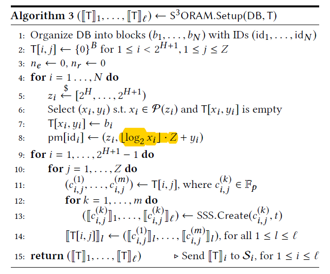

# 再看S3ORAM论文
1. 作者声称他达到了O(1)的client-server的blowup(相比于前人的系统的O(log N的带宽))，和O(1)的客户端存储。
2. 相比于Onion-ORAM的O(1)client通信，端到端的延迟降低了3个数量级；相比于Path-ORAM快了一个数量级。
3. Path-ORAM由于每个访问请求有O(logN)个块的传输所以会慢。   
    - 就是将一条路径上的块直接读到客户端的stash中
4. Onion-ORAM和bucket-ORAM依靠全同态和部分同态加密能达到O(1)的带宽消耗可客户端存储消耗，但是加密计算太过昂贵。
5. 不用HE加密的分布式ORAM能达到0(1)的client-server带宽和O(logN)的server-server通信消耗，但是有 &radic;2 的客户端存储。
    ## 4/11继续看文献

### 6.  **Onion oram: A constant bandwidth blowup oblivious ram.**      
    这篇论文得好好看看，看一下他所谓的优雅的驱逐策略

7. shamir share的方案的同态属性！！
8. T中一个节点就是一个桶，每个桶有Z个slots，能存储Z个真块（其中还有假块的）。
9. pID是每个真块绑定的叶节点号（这里的H树高不算叶节点的），pIdx是在路径pID中的块的位置索引；
10. client先用长度为B的串“0”初始化所有buckets，然后将数据块组织进ORAM——T中。
>这里论文说B的值可能大于log p，会影响素数域上的算法，要将T中的每个slot（也就是block）分成大小相等的chunks.     
---
##  检查下这里的索引部分的代码,就是位置映射map结构体初始化的代码
    
11.  