# 本笔记转自 http://blog.csdn.net/wuzhekai1985
# 工厂模式
工厂模式属于创建型模式，大致可以分为三类，简单工厂模式、工厂方法模式、抽象工厂模式。听上去差不多，都是工厂模式。下面一个个介绍，首先介绍简单工厂模式，它的主要特点是需要在工厂类中做判断，从而创造相应的产品。当增加新的产品时，就需要修改工厂类。有点抽象，举个例子就明白了。有一家生产处理器核的厂家，它只有一个工厂，能够生产两种型号的处理器核。客户需要什么样的处理器核，一定要显示地告诉生产工厂。下面给出一种实现方案。  
```
enum CTYPE {COREA, COREB};   
class SingleCore  
{  
public:  
    virtual void Show() = 0;
};  
//单核A  
class SingleCoreA: public SingleCore  
{  
public:  
    void Show() { cout<<"SingleCore A"<<endl; }  
};  
//单核B  
class SingleCoreB: public SingleCore  
{  
public:  
    void Show() { cout<<"SingleCore B"<<endl; }  
};  
//唯一的工厂，可以生产两种型号的处理器核，在内部判断  
class Factory  
{  
public:   
    SingleCore* CreateSingleCore(enum CTYPE ctype)  
    {  
        if(ctype == COREA) //工厂内部判断  
            return new SingleCoreA(); //生产核A  
        else if(ctype == COREB)  
            return new SingleCoreB(); //生产核B  
        else  
            return NULL;  
    }  
};  
```
 这样设计的主要缺点之前也提到过，就是要增加新的核类型时，就需要修改工厂类。这就违反了开放封闭原则：软件实体（类、模块、函数）可以扩展，但是不可修改。于是，工厂方法模式出现了。所谓工厂方法模式，是指定义一个用于创建对象的接口，让子类决定实例化哪一个类。Factory Method使一个类的实例化延迟到其子类。

听起来很抽象，还是以刚才的例子解释。这家生产处理器核的产家赚了不少钱，于是决定再开设一个工厂专门用来生产B型号的单核，而原来的工厂专门用来生产A型号的单核。这时，客户要做的是找好工厂，比如要A型号的核，就找A工厂要；否则找B工厂要，不再需要告诉工厂具体要什么型号的处理器核了。下面给出一个实现方案。
```
class SingleCore  
{  
public:  
    virtual void Show() = 0;
};  
//单核A  
class SingleCoreA: public SingleCore  
{  
public:  
    void Show() { cout<<"SingleCore A"<<endl; }  
};  
//单核B  
class SingleCoreB: public SingleCore  
{  
public:  
    void Show() { cout<<"SingleCore B"<<endl; }  
};  
class Factory  
{  
public:  
    virtual SingleCore* CreateSingleCore() = 0;
};  
//生产A核的工厂  
class FactoryA: public Factory  
{  
public:  
    SingleCoreA* CreateSingleCore() { return new SingleCoreA; }  
};  
//生产B核的工厂  
class FactoryB: public Factory  
{  
public:  
    SingleCoreB* CreateSingleCore() { return new SingleCoreB; }  
};  
```
工厂方法模式也有缺点，每增加一种产品，就需要增加一个对象的工厂。如果这家公司发展迅速，推出了很多新的处理器核，那么就要开设相应的新工厂。在C++实现中，就是要定义一个个的工厂类。显然，相比简单工厂模式，工厂方法模式需要更多的类定义。

既然有了简单工厂模式和工厂方法模式，为什么还要有抽象工厂模式呢？它到底有什么作用呢？还是举这个例子，这家公司的技术不断进步，不仅可以生产单核处理器，也能生产多核处理器。现在简单工厂模式和工厂方法模式都鞭长莫及。抽象工厂模式登场了。它的定义为提供一个创建一系列相关或相互依赖对象的接口，而无需指定它们具体的类。具体这样应用，这家公司还是开设两个工厂，一个专门用来生产A型号的单核多核处理器，而另一个工厂专门用来生产B型号的单核多核处理器，下面给出实现的代码。
```
//单核  
class SingleCore   
{  
public:  
    virtual void Show() = 0;
};  
class SingleCoreA: public SingleCore    
{  
public:  
    void Show() { cout<<"Single Core A"<<endl; }  
};  
class SingleCoreB :public SingleCore  
{  
public:  
    void Show() { cout<<"Single Core B"<<endl; }  
};  
//多核  
class MultiCore    
{  
public:  
    virtual void Show() = 0;
};  
class MultiCoreA : public MultiCore    
{  
public:  
    void Show() { cout<<"Multi Core A"<<endl; }  
  
};  
class MultiCoreB : public MultiCore    
{  
public:  
    void Show() { cout<<"Multi Core B"<<endl; }  
};  
//工厂  
class CoreFactory    
{  
public:  
    virtual SingleCore* CreateSingleCore() = 0;
    virtual MultiCore* CreateMultiCore() = 0;
};  
//工厂A，专门用来生产A型号的处理器  
class FactoryA :public CoreFactory  
{  
public:  
    SingleCore* CreateSingleCore() { return new SingleCoreA(); }  
    MultiCore* CreateMultiCore() { return new MultiCoreA(); }  
};  
//工厂B，专门用来生产B型号的处理器  
class FactoryB : public CoreFactory  
{  
public:  
    SingleCore* CreateSingleCore() { return new SingleCoreB(); }  
    MultiCore* CreateMultiCore() { return new MultiCoreB(); }  
}; 
```
至此，工厂模式介绍完了。利用Rational Rose 2003软件，给出三种工厂模式的UML图，加深印象。
    简单工厂模式的UML图：
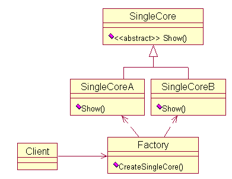
     工厂方法的UML图:
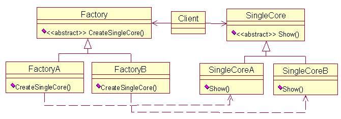
    抽象工厂模式的UML图：
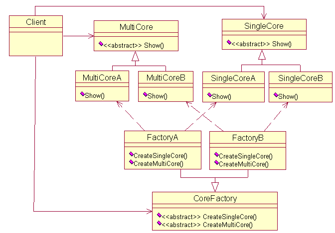
# 策略模式
策略模式是指定义一系列的算法，把它们一个个封装起来，并且使它们可相互替换。本模式使得算法可独立于使用它的客户而变化。也就是说这些算法所完成的功能一样，对外的接口一样，只是各自实现上存在差异。用策略模式来封装算法，效果比较好。下面以高速缓存（Cache）的替换算法为例，实现策略模式。

什么是Cache的替换算法呢？简单解释一下， 当发生Cache缺失时，Cache控制器必须选择Cache中的一行，并用欲获得的数据来替换它。所采用的选择策略就是Cache的替换算法。下面给出相应的UML图。
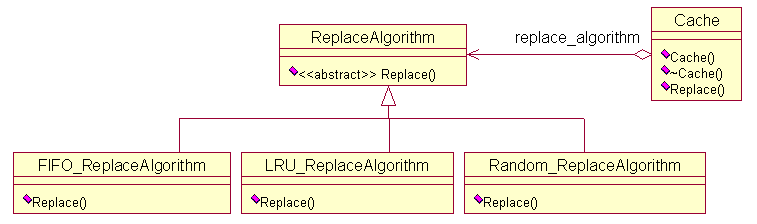
 ReplaceAlgorithm是一个抽象类，定义了算法的接口，有三个类继承自这个抽象类，也就是具体的算法实现。Cache类中需要使用替换算法，因此维护了一个  ReplaceAlgorithm的对象。这个UML图的结构就是策略模式的典型结构。下面根据UML图，给出相应的实现。

首先给出替换算法的定义。
```
//抽象接口
class ReplaceAlgorithm
{
public:
	virtual void Replace() = 0;
};
//三种具体的替换算法
class LRU_ReplaceAlgorithm : public ReplaceAlgorithm
{
public:
	void Replace() { cout<<"Least Recently Used replace algorithm"<<endl; }
};
 
class FIFO_ReplaceAlgorithm : public ReplaceAlgorithm
{
public:
	void Replace() { cout<<"First in First out replace algorithm"<<endl; }
};
class Random_ReplaceAlgorithm: public ReplaceAlgorithm
{
public:
	void Replace() { cout<<"Random replace algorithm"<<endl; }
};
```
接着给出Cache的定义，这里很关键，Cache的实现方式直接影响了客户的使用方式，其关键在于如何指定替换算法。      
方式一：直接通过参数指定，传入一个特定算法的指针。
```
//Cache需要用到替换算法
class Cache
{
private:
	ReplaceAlgorithm *m_ra;
public:
	Cache(ReplaceAlgorithm *ra) { m_ra = ra; }
	~Cache() { delete m_ra; }
	void Replace() { m_ra->Replace(); }
};
```
如果用这种方式，客户就需要知道这些算法的具体定义。只能以下面这种方式使用，可以看到暴露了太多的细节。
```
int main()
{
	Cache cache(new LRU_ReplaceAlgorithm()); //暴露了算法的定义
	cache.Replace();
	return 0;
}
```
方式二：也是直接通过参数指定，只不过不是传入指针，而是一个标签。这样客户只要知道算法的相应标签即可，而不需要知道算法的具体定义。
```
//Cache需要用到替换算法
enum RA {LRU, FIFO, RANDOM}; //标签
class Cache
{
private:
	ReplaceAlgorithm *m_ra;
public:
	Cache(enum RA ra) 
	{ 
		if(ra == LRU)
			m_ra = new LRU_ReplaceAlgorithm();
		else if(ra == FIFO)
			m_ra = new FIFO_ReplaceAlgorithm();
		else if(ra == RANDOM)
			m_ra = new Random_ReplaceAlgorithm();
		else 
			m_ra = NULL;
	}
	~Cache() { delete m_ra; }
	void Replace() { m_ra->Replace(); }
};
```
相比方式一，这种方式用起来方便多了。其实这种方式将简单工厂模式与策略模式结合在一起，算法的定义使用了策略模式，而Cache的定义其实使用了简单工厂模式。
```
int main()
{
	Cache cache(LRU); //指定标签即可
	cache.Replace();
	return 0;
}
```
上面两种方式，构造函数都需要形参。构造函数是否可以不用参数呢？下面给出第三种实现方式。
方式三：利用模板实现。算法通过模板的实参指定。当然了，还是使用了参数，只不过不是构造函数的参数。在策略模式中，参数的传递难以避免，客户必须指定某种算法。
```
//Cache需要用到替换算法
template <class RA>
class Cache
{
private:
	RA m_ra;
public:
	Cache() { }
	~Cache() { }
	void Replace() { m_ra.Replace(); }
};
```
使用方式如下：
```
int main()
{
	Cache<Random_ReplaceAlgorithm> cache; //模板实参
	cache.Replace();
	return 0;
}
```
# 适配器模式
DP上的定义：适配器模式将一个类的接口转换成客户希望的另外一个接口，使得原本由于接口不兼容而不能一起工作的那些类可以一起工作。它包括类适配器和对象适配器，本文针对的是对象适配器。举个例子，在STL中就用到了适配器模式。STL实现了一种数据结构，称为双端队列（deque），支持前后两段的插入与删除。STL实现栈和队列时，没有从头开始定义它们，而是直接使用双端队列实现的。这里双端队列就扮演了适配器的角色。队列用到了它的后端插入，前端删除。而栈用到了它的后端插入，后端删除。假设栈和队列都是一种顺序容器，有两种操作：压入和弹出。下面给出相应的UML图，与DP上的图差不多。
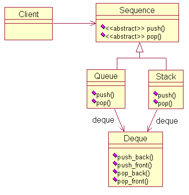
根据上面的UML图，很容易给出实现。
```
//双端队列
class Deque
{
public:
	void push_back(int x) { cout<<"Deque push_back"<<endl; }
	void push_front(int x) { cout<<"Deque push_front"<<endl; }
	void pop_back() { cout<<"Deque pop_back"<<endl; }
	void pop_front() { cout<<"Deque pop_front"<<endl; }
};
//顺序容器
class Sequence
{
public:
	virtual void push(int x) = 0;
	virtual void pop() = 0;
};
//栈
class Stack: public Sequence
{
public:
	void push(int x) { deque.push_back(x); }
	void pop() { deque.pop_back(); }
private:
	Deque deque; //双端队列
};
//队列
class Queue: public Sequence
{
public:
	void push(int x) { deque.push_back(x); }
	void pop() { deque.pop_front(); }
private:
	Deque deque; //双端队列
};
```
使用方法如下：
```
int main()
{
	Sequence *s1 = new Stack();
	Sequence *s2 = new Queue();
	s1->push(1); s1->pop();
	s2->push(1); s2->pop();
	delete s1; delete s2;
	return 0;
}
```
# 单例模式
1. 什么是单例模式？
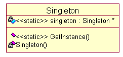
单例模式是设计模式中的一种，是设计模式中最简单，最常用的一种模式，这种模式用来保证某一个类的对象实例在应用中只有一个，即只被创建一次。在实际的开发中，我们经常会碰到只需要创建一个实例的情况，例如： 配置文件，日志对象，线程池，缓存等。这些实例为了保证一致性，在整个应用中只需要被创建一次，例如，如果日志对象被创建多次，那么很可能日志中的内容就不一致，还有就是有时候占用资源过多的一些对象被创建多次会浪费资源，比如线程池等。所以为了保证对象的单例，出现了单例模式。
2. 在C++中如何创建单例模式？
有两种具体创建单例模式的方法，分别是“饿汉模式”和“懒汉模式”。在讲解这两种方法之前，先介绍一下无论是C++,还是JAVA等OOP语言创建单例模式的一个整体思路： 
step1: 将构造函数声明为私有的。 
因为在创建一个对象的时候会去调用类的构造函数来完成对对象内存空间的分配以及成员的初始化，所以如果想限制对象的创建，首先应该禁止外界对象对构造函数的调用，通过这个办法就可以限制对象的创建。 
step2: 在类中声明一个私有的静态的类的对象(实例)。 
这个实例就是我们需要获得的，唯一的实例。之所以是static类型的是因为我们需要通过类直接获得而不通过对象获得，因为我们无法创建一个对象。同时从封装的角度，我们下面需要定义一个static类型的接口用来返回这个实例。 
step3: 定义一个static类型的public类型的事例获取函数。 
可以通过类直接调用这个函数获得类中定义的那个实例。 
下面我们分别就这两种来讲解。 
无论是通过“饿汉模式”还是“懒汉模式”上面的思路大致一样。
3. 饿汉模式。
饿汉模式，很形象，就是在类加载的时候已经创建好了类的实例，我们通过使用接口直接获得这个实例，所以我们可以看到，饿汉模式是一种线程安全的下面是我在C++中实现的： 
```
include <iostream>     
using namespace std;
class Singleton{
private:
    Singleton(){}  //将构造函数定义为私有的，避免直接创建外部对象。
    ~Singleton(){ delete sig;}
    static Singleton *sig;  //声明一个私有的静态数据成员sig用来作为为一个实例。
public:
    static Singleton *getInstance()  //声明一个static类型的接口获得实例
    {
        return sig;
    }
};
Singleton* Singleton::sig = new Singleton;  //在类外进行实例的定义和初始化
int main(void)
{
     Singleton *msg1 = Singleton::getInstance();  //创建两个实例
     Singleton *msg2 = Singleton::getInstance();   //判读实例是否相等
    if (msg1 == msg2)
        cout << "Same Instance!\n";
    else
        cout << "Error in Creating Single Instance!\n";
    return 0;

}
```
4. 懒汉模式
懒汉模式的整个设计思想和饿汉模式是一样的，只是懒汉模式在类中只给出实例的声明并未给出定义。所以是当多个线程去竞争的时候是线程不安全的，所以需要使用锁机制，需要操作系统的配合，这里就不给出懒汉模式的线程安全了。
```
include <iostream>     
using namespace std;
class Singleton2{
private:
    Singleton2(){}
    static Singleton2 *sig;   //只给出声明
public:
    static Singleton2* getInstance();
};
Singleton2* Singleton2::getInstance()
{
    if (sig == NULL)
    {
        sig = new Singleton2;
    }
    return sig;
}
Singleton2* Singleton2::sig;   //不初始化,和饿汉模式的区别。

int main(void)
{
    Singleton2 *msg1 = Singleton2::getInstance();  //创建两个实例
     Singleton2 *msg2 = Singleton2::getInstance();   //判读实例是否相等
    if (msg1 == msg2)
        cout << "Same Instance!\n";
    else
        cout << "Error in Creating Single Instance!\n";
    return 0;

}
```
5. 饿汉和懒汉的区别
饿汉是在类加载的时候就已经完成了类的事例话，所以在加载的时候会被比较慢，但运行起来比较快，而且是线程安全的。 
懒汉模式则和饿汉模式相反。 
By Lingtao Kong In Nanjing 2015/04/15 
http://blog.csdn.net/michael_kong_nju/article/details/45060527
# 原型模式、模板方法模式
DP书上的定义为：用原型实例指定创建对象的种类，并且通过拷贝这些原型创建新的对象。其中有一个词很重要，那就是拷贝。可以说，拷贝是原型模式的精髓所在。举个现实中的例子来介绍原型模式。找工作的时候，我们需要准备简历。假设没有打印设备，因此需手写简历，这些简历的内容都是一样的。这样有个缺陷，如果要修改简历中的某项，那么所有已写好的简历都要修改，工作量很大。随着科技的进步，出现了打印设备。我们只需手写一份，然后利用打印设备复印多份即可。如果要修改简历中的某项，那么修改原始的版本就可以了，然后再复印。原始的那份手写稿相当于是一个原型，有了它，就可以通过复印（拷贝）创造出更多的新简历。这就是原型模式的基本思想。下面给出原型模式的UML图，以刚才那个例子为实例。
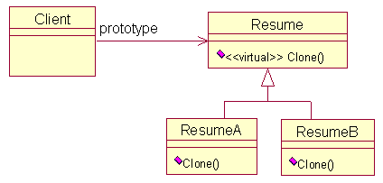
原型模式实现的关键就是实现Clone函数，对于C++来说，其实就是拷贝构造函数，需实现深拷贝，下面给出一种实现。
```
//父类
class Resume
{
protected:
	char *name;
public:
	Resume() {}
	virtual ~Resume() {}
	virtual Resume* Clone() { return NULL; }
	virtual void Set(char *n) {}
	virtual void Show() {}
};
```
```
class ResumeA : public Resume
{
public:
	ResumeA(const char *str);  //构造函数
	ResumeA(const ResumeA &r); //拷贝构造函数
	~ResumeA();                //析构函数
	ResumeA* Clone();          //克隆，关键所在
	void Show();               //显示内容
};
ResumeA::ResumeA(const char *str) 
{
	if(str == NULL) {
		name = new char[1]; 
		name[0] = '\0'; 
	}
	else {
		name = new char[strlen(str)+1];
		strcpy(name, str);
	}
}
ResumeA::~ResumeA() { delete [] name;}
ResumeA::ResumeA(const ResumeA &r) {
	name = new char[strlen(r.name)+1];
	strcpy(name, r.name);
}
ResumeA* ResumeA::Clone() {
	return new ResumeA(*this);
}
void ResumeA::Show() {
	cout<<"ResumeA name : "<<name<<endl; 
}
```
这里只给出了ResumeA的实现，ResumeB的实现类似。使用的方式如下：
```
int main()
{
	Resume *r1 = new ResumeA("A");
	Resume *r2 = new ResumeB("B");
	Resume *r3 = r1->Clone();
	Resume *r4 = r2->Clone();
	r1->Show(); r2->Show();
	//删除r1,r2
	delete r1; delete r2;	
	r1 = r2 = NULL;
	//深拷贝所以对r3,r4无影响
	r3->Show(); r4->Show();
	delete r3; delete r4;
	r3 = r4 = NULL;
}
```
最近有个招聘会，可以带上简历去应聘了。但是，其中有一家公司不接受简历，而是给应聘者发了一张简历表，上面有基本信息、教育背景、工作经历等栏，让应聘者按照要求填写完整。每个人拿到这份表格后，就开始填写。如果用程序实现这个过程，该如何做呢？一种方案就是用模板方法模式：定义一个操作中的算法的骨架，而将一些步骤延迟到子类中。模板方法使得子类可以不改变一个算法的结构即可重定义该算法的某些特定步骤。我们的例子中，操作就是填写简历这一过程，我们可以在父类中定义操作的算法骨架，而具体的实现由子类完成。下面给出它的UML图。
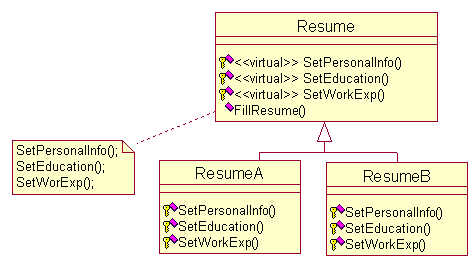
其中FillResume() 定义了操作的骨架，依次调用子类实现的函数。相当于每个人填写简历的实际过程。接着给出相应的C++代码。
```
//简历
class Resume
{
protected: //保护成员
	virtual void SetPersonalInfo() {}
	virtual void SetEducation() {}
	virtual void SetWorkExp() {}
public:
	void FillResume() 
	{
		SetPersonalInfo();
		SetEducation();
		SetWorkExp();
	}
};
class ResumeA: public Resume
{
protected:
	void SetPersonalInfo() { cout<<"A's PersonalInfo"<<endl; }
	void SetEducation() { cout<<"A's Education"<<endl; }
	void SetWorkExp() { cout<<"A's Work Experience"<<endl; }
};
class ResumeB: public Resume
{
protected:
	void SetPersonalInfo() { cout<<"B's PersonalInfo"<<endl; }
	void SetEducation() { cout<<"B's Education"<<endl; }
	void SetWorkExp() { cout<<"B's Work Experience"<<endl; }
};
```
使用方式如下：
```
int main()
{
	Resume *r1;
	r1 = new ResumeA();
	r1->FillResume();
	delete r1;
	r1 = new ResumeB();
	r1->FillResume();
	delete r1;
	r1 = NULL;
	return 0;
}
```
# 建造者模式
建造者模式的定义将一个复杂对象的构建与它的表示分离，使得同样的构建过程可以创建不同的表示（DP）。《大话设计模式》举了一个很好的例子——建造小人，一共需建造6个部分，头部、身体、左右手、左右脚。与工厂模式不同，建造者模式是在导向者的控制下一步一步构造产品的。建造小人就是在控制下一步步构造出来的。创建者模式可以能更精细的控制构建过程，从而能更精细的控制所得产品的内部结构。下面给出建造者模式的UML图，以建造小人为实例。

对于客户来说，只需知道导向者就可以了，通过导向者，客户就能构造复杂的对象，而不需要知道具体的构造过程。下面给出小人例子的代码实现。
```
class Builder  
{
public:
	virtual void BuildHead() {}
	virtual void BuildBody() {}
	virtual void BuildLeftArm(){}
	virtual void BuildRightArm() {}
	virtual void BuildLeftLeg() {}
	virtual void BuildRightLeg() {}
};
//构造瘦人
class ThinBuilder : public Builder
{
public:
	void BuildHead() { cout<<"build thin body"<<endl; }
	void BuildBody() { cout<<"build thin head"<<endl; }
	void BuildLeftArm() { cout<<"build thin leftarm"<<endl; }
	void BuildRightArm() { cout<<"build thin rightarm"<<endl; }
	void BuildLeftLeg() { cout<<"build thin leftleg"<<endl; }
	void BuildRightLeg() { cout<<"build thin rightleg"<<endl; }
};
//构造胖人
class FatBuilder : public Builder
{
public:
	void BuildHead() { cout<<"build fat body"<<endl; }
	void BuildBody() { cout<<"build fat head"<<endl; }
	void BuildLeftArm() { cout<<"build fat leftarm"<<endl; }
	void BuildRightArm() { cout<<"build fat rightarm"<<endl; }
	void BuildLeftLeg() { cout<<"build fat leftleg"<<endl; }
	void BuildRightLeg() { cout<<"build fat rightleg"<<endl; }
};
//构造的指挥官
class Director  
{
private:
	Builder *m_pBuilder;
public:
	Director(Builder *builder) { m_pBuilder = builder; }
	void Create(){
		m_pBuilder->BuildHead();
		m_pBuilder->BuildBody();
		m_pBuilder->BuildLeftArm();
		m_pBuilder->BuildRightArm();
		m_pBuilder->BuildLeftLeg();
		m_pBuilder->BuildRightLeg();
	}
};
```
客户的使用方式：
```
int main()
{
	FatBuilder thin;
	Director director(&thin);
	director.Create();
	return 0;
}
```
# 外观模式、组合模式
外观模式应该是用的很多的一种模式，特别是当一个系统很复杂时，系统提供给客户的是一个简单的对外接口，而把里面复杂的结构都封装了起来。客户只需使用这些简单接口就能使用这个系统，而不需要关注内部复杂的结构。DP一书的定义：为子系统中的一组接口提供一个一致的界面， 外观模式定义了一个高层接口，这个接口使得这一子系统更加容易使用。举个编译器的例子，假设编译一个程序需要经过四个步骤：词法分析、语法分析、中间代码生成、机器码生成。学过编译都知道，每一步都很复杂。对于编译器这个系统，就可以使用外观模式。可以定义一个高层接口，比如名为Compiler的类，里面有一个名为Run的函数。客户只需调用这个函数就可以编译程序，至于Run函数内部的具体操作，客户无需知道。下面给出UML图，以编译器为实例。
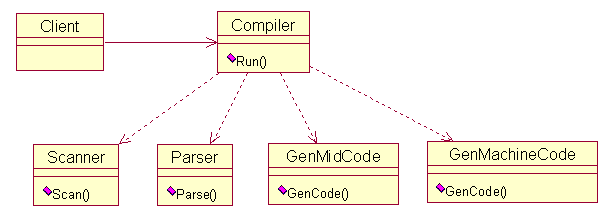
```
class Scanner
{
public:
	void Scan() { cout<<"词法分析"<<endl; }
};
class Parser
{
public:
	void Parse() { cout<<"语法分析"<<endl; }
};
class GenMidCode
{
public:
	void GenCode() { cout<<"产生中间代码"<<endl; }
};
class GenMachineCode
{
public:
	void GenCode() { cout<<"产生机器码"<<endl;}
};
//高层接口
class Compiler
{
public:
	void Run() 
	{
		Scanner scanner;
		Parser parser;
		GenMidCode genMidCode;
		GenMachineCode genMacCode;
		scanner.Scan();
		parser.Parse();
		genMidCode.GenCode();
		genMacCode.GenCode();
	}
};
```
客户使用方式：
```
int main()
{
	Compiler compiler;
	compiler.Run();
	return 0;
}
```
这就是外观模式，它有几个特点（摘自DP一书），（1）它对客户屏蔽子系统组件，因而减少了客户处理的对象的数目并使得子系统使用起来更加方便。（2）它实现了子系统与客户之间的松耦合关系，而子系统内部的功能组件往往是紧耦合的。（3）如果应用需要，它并不限制它们使用子系统类。   
结合上面编译器这个例子，进一步说明。对于（1），编译器类对客户屏蔽了子系统组件，客户只需处理编译器的对象就可以方便的使用子系统。对于（2），子系统的变化，不会影响到客户的使用，体现了子系统与客户的松耦合关系。对于（3），如果客户希望使用词法分析器，只需定义词法分析的类对象即可，并不受到限制。

外观模式在构建大型系统时非常有用。接下来介绍另一种模式，称为组合模式。感觉有点像外观模式，刚才我们实现外观模式时，在Compiler这个类中包含了多个类的对象，就像把这些类组合在了一起。组合模式是不是这个意思，有点相似，其实不然。

DP书上给出的定义：将对象组合成树形结构以表示“部分-整体”的层次结构。组合使得用户对单个对象和组合对象的使用具有一致性。注意两个字“树形”。这种树形结构在现实生活中随处可见，比如一个集团公司，它有一个母公司，下设很多家子公司。不管是母公司还是子公司，都有各自直属的财务部、人力资源部、销售部等。对于母公司来说，不论是子公司，还是直属的财务部、人力资源部，都是它的部门。整个公司的部门拓扑图就是一个树形结构。

下面给出组合模式的UML图。从图中可以看到，FinanceDepartment、HRDepartment两个类作为叶结点，因此没有定义添加函数。而ConcreteCompany类可以作为中间结点，所以可以有添加函数。那么怎么添加呢？这个类中定义了一个链表，用来放添加的元素。
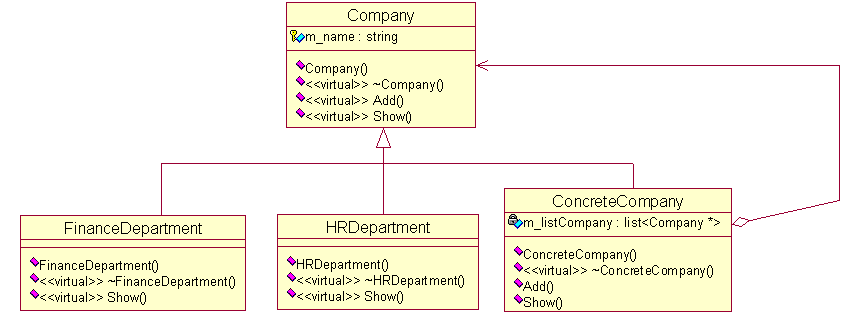
```
class Company  
{
public:
	Company(string name) { m_name = name; }
	virtual ~Company(){}
	virtual void Add(Company *pCom){}
	virtual void Show(int depth) {}
protected:
	string m_name;
};
//具体公司
class ConcreteCompany : public Company  
{
public:
	ConcreteCompany(string name): Company(name) {}
	virtual ~ConcreteCompany() {}
	void Add(Company *pCom) { m_listCompany.push_back(pCom); } //位于树的中间，可以增加子树
	void Show(int depth)
	{
		for(int i = 0;i < depth; i++)
			cout<<"-";
		cout<<m_name<<endl;
		list<Company *>::iterator iter=m_listCompany.begin();
		for(; iter != m_listCompany.end(); iter++) //显示下层结点
			(*iter)->Show(depth + 2);
	}
private:
	list<Company *> m_listCompany;
};
//具体的部门，财务部
class FinanceDepartment : public Company 
{
public:
	FinanceDepartment(string name):Company(name){}
	virtual ~FinanceDepartment() {}
	virtual void Show(int depth) //只需显示，无限添加函数，因为已是叶结点
	{
		for(int i = 0; i < depth; i++)
			cout<<"-";
		cout<<m_name<<endl;
	}
};
//具体的部门，人力资源部
class HRDepartment :public Company  
{
public:
	HRDepartment(string name):Company(name){}
	virtual ~HRDepartment() {}
	virtual void Show(int depth) //只需显示，无限添加函数，因为已是叶结点
	{
		for(int i = 0; i < depth; i++)
			cout<<"-";
		cout<<m_name<<endl;
	}
};
```
客户使用方式：
```
int main()
{
	Company *root = new ConcreteCompany("总公司");
	Company *leaf1=new FinanceDepartment("财务部");
	Company *leaf2=new HRDepartment("人力资源部");
	root->Add(leaf1);
	root->Add(leaf2);
 
	//分公司A
	Company *mid1 = new ConcreteCompany("分公司A");
	Company *leaf3=new FinanceDepartment("财务部");
	Company *leaf4=new HRDepartment("人力资源部");
	mid1->Add(leaf3);
	mid1->Add(leaf4);
	root->Add(mid1);
	//分公司B
	Company *mid2=new ConcreteCompany("分公司B");
	FinanceDepartment *leaf5=new FinanceDepartment("财务部");
	HRDepartment *leaf6=new HRDepartment("人力资源部");
	mid2->Add(leaf5);
	mid2->Add(leaf6);
	root->Add(mid2);
	root->Show(0);
 
	delete leaf1; delete leaf2;
	delete leaf3; delete leaf4;
	delete leaf5; delete leaf6;	
	delete mid1; delete mid2;
	delete root;
	return 0;
}
```
上面的实现方式有缺点，就是内存的释放不好，需要客户自己动手，非常不方便。有待改进，比较好的做法是让ConcreteCompany类来释放。因为所有的指针都是存在ConcreteCompany类的链表中。C++的麻烦，没有垃圾回收机制。
# 代理模式
[DP]上的定义：为其他对象提供一种代理以控制对这个对象的访问。有四种常用的情况：（1）远程代理，（2）虚代理，（3）保护代理，（4）智能引用。本文主要介绍虚代理和智能引用两种情况。

虑一个可以在文档中嵌入图形对象的文档编辑器。有些图形对象的创建开销很大。但是打开文档必须很迅速，因此我们在打开文档时应避免一次性创建所有开销很大的对象。这里就可以运用代理模式，在打开文档时，并不打开图形对象，而是打开图形对象的代理以替代真实的图形。待到真正需要打开图形时，仍由代理负责打开。这是[DP]一书上的给的例子。下面给出代理模式的UML图。
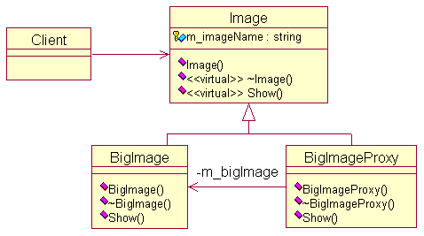
简单实现如下：
```
class Image
{
public:
	Image(string name): m_imageName(name) {}
	virtual ~Image() {}
	virtual void Show() {}
protected:
	string m_imageName;
};
class BigImage: public Image
{
public:
	BigImage(string name):Image(name) {}
	~BigImage() {}
	void Show() { cout<<"Show big image : "<<m_imageName<<endl; }
};
class BigImageProxy: public Image
{
private:
	BigImage *m_bigImage;
public:
	BigImageProxy(string name):Image(name),m_bigImage(0) {}
	~BigImageProxy() { delete m_bigImage; }
	void Show() 
	{
		if(m_bigImage == NULL)
			m_bigImage = new BigImage(m_imageName);
		m_bigImage->Show();
	}
};
```
客户调用：
```
int main()
{
	Image *image = new BigImageProxy("proxy.jpg"); //代理
	image->Show(); //需要时由代理负责打开
	delete image;
	return 0;
}
```
在这个例子属于虚代理的情况，下面给两个智能引用的例子。一个是C++中的auto_ptr，另一个是smart_ptr。自己实现了一下。先给出auto_ptr的代码实现：
```
template<class T>  
class auto_ptr {  
public:  
    explicit auto_ptr(T *p = 0): pointee(p) {}  
    auto_ptr(auto_ptr<T>& rhs): pointee(rhs.release()) {}  
    ~auto_ptr() { delete pointee; }  
    auto_ptr<T>& operator=(auto_ptr<T>& rhs)  
    {  
        if (this != &rhs) reset(rhs.release());  
        return *this;  
    }  
    T& operator*() const { return *pointee; }  
    T* operator->() const { return pointee; }  
    T* get() const { return pointee; }  
    T* release()  
    {  
        T *oldPointee = pointee;  
        pointee = 0;  
        return oldPointee;  
    }  
    void reset(T *p = 0)  
    {  
        if (pointee != p) {  
               delete pointee;  
               pointee = p;  
            }  
        }  
private:  
    T *pointee;  
};  
```
阅读上面的代码，我们可以发现 auto_ptr 类就是一个代理，客户只需操作auto_prt的对象，而不需要与被代理的指针pointee打交道。auto_ptr 的好处在于为动态分配的对象提供异常安全。因为它用一个对象存储需要被自动释放的资源，然后依靠对象的析构函数来释放资源。这样客户就不需要关注资源的释放，由auto_ptr 对象自动完成。实现中的一个关键就是重载了解引用操作符和箭头操作符，从而使得auto_ptr的使用与真实指针类似。

我们知道C++中没有垃圾回收机制，可以通过智能指针来弥补，下面给出智能指针的一种实现，采用了引用计数的策略。
```
template <typename T>
class smart_ptr
{
public:
    smart_ptr(T *p = 0): pointee(p), count(new size_t(1)) { }  //初始的计数值为1
	smart_ptr(const smart_ptr &rhs): pointee(rhs.pointee), count(rhs.count) { ++*count; } //拷贝构造函数，计数加1
	~smart_ptr() { decr_count(); }              //析构，计数减1，减到0时进行垃圾回收，即释放空间
    smart_ptr& operator= (const smart_ptr& rhs) //重载赋值操作符
	{
		//给自身赋值也对，因为如果自身赋值，计数器先减1，再加1，并未发生改变
		++*count;
        decr_count();
        pointee = rhs.pointee;
        count = rhs.count;
        return *this;
    }  
	//重载箭头操作符和解引用操作符，未提供指针的检查
    T *operator->() { return pointee; }
    const T *operator->() const { return pointee; }
    T &operator*() { return *pointee; }
    const T &operator*() const { return *pointee; }
	size_t get_refcount() { return *count; } //获得引用计数器值
private: 
    T *pointee;       //实际指针，被代理  
    size_t *count;    //引用计数器
	void decr_count() //计数器减1
	{
		if(--*count == 0) 
		{
			delete pointee;
			delete count;
		}
	}
};
```
# 享元模式
享元模式（Flyweight)主要体现在“享”上，即共享。设想这么一种情况，现在有编号为A、B三栋房子，现在外面有9只大熊过来了，编号为1~9。现在规定，编号为1~3的熊只能居住在编号为A的房子中，编号为4~6的大熊只能居住在编号为B的大熊中，编号为7~9的大熊只能居住在编号为C的房子中。假如大熊非常笨，没有受过教育，它们只知道自己住的房子的编号。之所以大熊笨，是因为它们一来就建房子，然后在所建的房子墙上写上自己对应的住房编号。这样到最后的结果必然是：建造了9栋房子，3栋编号为A的房子、3栋编号为B的房子、3栋编号为C的房子。

为了防止上述现象的发生，我们可以这么做：每只大熊在建房之前看下自己所对应编号的住房是否存在，如果存在就直接住在里面，如果不存在，就开始建房。这样一来，最终的结果便是：编号为1~3的大熊一起住在原有的A栋房子里面，编号为4~6的大熊一起住在原有的B栋房子里面，编号为7~9的大熊一起住在新建的C栋房子里。这样，最后的结果必然是：总共有3栋房子，编号为A、B和C的房子各仅有一栋。

显然，两种结果对比：后者的结果要比前者好得多，因为效率要高于前者，而且也不会浪费那么大的空间。我们可以称后者采用的就是“享元模式”。

享元模式的定义：运用共享技术有效地支持大量细粒度的对象。    
享元模式结构：
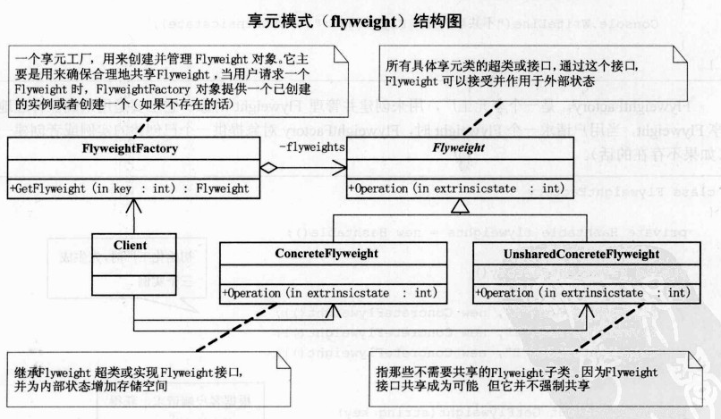
```
#include<iostream>
#include<map>
#include<string>
using namespace std;
class Flyweight//抽象的享元类
{
public:
	virtual void Operation(int i)=0;
};

class ConcreteFlyWeight:public Flyweight//共享的子类
{
public:
	void Operation(int i)
	{
		cout<<"共享的FlyWeight:"<<i<<endl;
	}
};

class UnsharedConcreteFlyweight:public Flyweight//不共享的子类
{
	void Operation(int i)
	{
		cout<<"不共享的FlyWeight:"<<i<<endl;
	}
};

class FlyweightFactory//享元工厂
{
private:
	map<string,Flyweight*>flyweights;//模块名列表
public:
	FlyweightFactory()//初始共享模块列表
	{
		flyweights["X"]=new ConcreteFlyWeight();//这里需要用堆，因为这是给客户程序返回的，如果不用堆，则会返回局部对象的引用
		flyweights["Y"]=new ConcreteFlyWeight();
		flyweights["Z"]=new ConcreteFlyWeight();//所有的属性为“Z”的模块都只对应这个一个实例，这正是享元模式的精髓所在呀
	}
	
	Flyweight* GetFlyWeight(string key)//工厂返回享元对象，而这些对象的属性都存放在一个该工厂的模块名列表中
	{
		if(!flyweights.count(key) )//先检查下是否在列表中，如果不在则新建该列表项
		{
			flyweights[key]=new ConcreteFlyWeight();//这里只能返回堆空间，否则在主函数中将出处
		}
		return flyweights[key];
	}
	map<string,Flyweight*>::size_type countN()//返回当前有多少个可供共享的模块
	{
		return flyweights.size();
	}
};
int main()
{
	int i=100;
	FlyweightFactory f;//整个过程值采用一个工厂
 
	Flyweight *px=f.GetFlyWeight("X");//获取X对应的模块，相当于用属性列表给固定部分穿上衣服
	px->Operation(--i);
 
	Flyweight *py=f.GetFlyWeight("Y");//获取Y对应的模块
	py->Operation(--i);
	
	Flyweight *pd=f.GetFlyWeight("D");//D不在初始化列表中，但会自动加入到列表中
	pd->Operation(--i);
 
	cout<<"可供共享的模块有:"<<f.countN()<<"个!"<<endl;
	/*******C++的哪些繁琐事儿!!!防止内存泄露*********/
	delete px;
	delete py;
	delete pd;
 
	return 0;
}
```
测试结果：  
共享的FlyweightFactory:99   
共享的FlyweightFactory:98   
共享的FlyweightFactory:97   
可供共享的模块有:4个!
# 桥接模式
[DP]书上定义：将抽象部分与它的实现部分分离，使它们都可以独立地变化。考虑装操作系统，有多种配置的计算机，同样也有多款操作系统。如何运用桥接模式呢？可以将操作系统和计算机分别抽象出来，让它们各自发展，减少它们的耦合度。当然了，两者之间有标准的接口。这样设计，不论是对于计算机，还是操作系统都是非常有利的。下面给出这种设计的UML图，其实就是桥接模式的UML图。
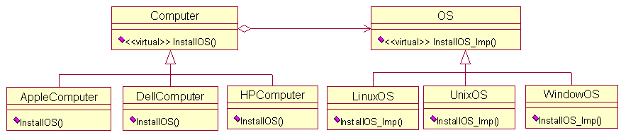
```//操作系统
class OS
{
public:
	virtual void InstallOS_Imp() {}
};
class WindowOS: public OS
{
public:
	void InstallOS_Imp() { cout<<"安装Window操作系统"<<endl; } 
};
class LinuxOS: public OS
{
public:
	void InstallOS_Imp() { cout<<"安装Linux操作系统"<<endl; } 
};
class UnixOS: public OS
{
public:
	void InstallOS_Imp() { cout<<"安装Unix操作系统"<<endl; } 
};
//计算机
class Computer
{
public:
	virtual void InstallOS(OS *os) {}
};
class DellComputer: public Computer
{
public:
	void InstallOS(OS *os) { os->InstallOS_Imp(); }
};
class AppleComputer: public Computer
{
public:
	void InstallOS(OS *os) { os->InstallOS_Imp(); }
};
class HPComputer: public Computer
{
public:
	void InstallOS(OS *os) { os->InstallOS_Imp(); }
};
```
客户使用方式：
```
int main()
{
	OS *os1 = new WindowOS();
	OS *os2 = new LinuxOS();
	Computer *computer1 = new AppleComputer();
	computer1->InstallOS(os1);
	computer1->InstallOS(os2);
}
```
# 装饰模式
装饰模式：动态地给一个对象添加一些额外的职责。就增加功能来说，装饰模式相比生成子类更为灵活。有时我们希望给某个对象而不是整个类添加一些功能。比如有一个手机，允许你为手机添加特性，比如增加挂件、屏幕贴膜等。一种灵活的设计方式是，将手机嵌入到另一对象中，由这个对象完成特性的添加，我们称这个嵌入的对象为装饰。这个装饰与它所装饰的组件接口一致，因此它对使用该组件的客户透明。下面给出装饰模式的UML图。
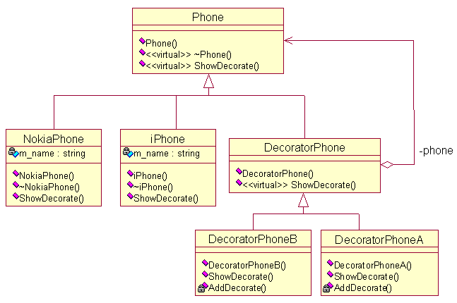
在这种设计中，手机的装饰功能被独立出来，可以单独发展，进而简化了具体手机类的设计。下面给出Phone类的实现：
```
//公共抽象类
class Phone
{
public:
	Phone() {}
	virtual ~Phone() {}
	virtual void ShowDecorate() {}
};
```
具体的手机类的定义：
```
//具体的手机类
class iPhone : public Phone
{
private:
	string m_name; //手机名称
public:
	iPhone(string name): m_name(name){}
	~iPhone() {}
	void ShowDecorate() { cout<<m_name<<"的装饰"<<endl;}
};
//具体的手机类
class NokiaPhone : public Phone
{
private:
	string m_name;
public:
	NokiaPhone(string name): m_name(name){}
	~NokiaPhone() {}
	void ShowDecorate() { cout<<m_name<<"的装饰"<<endl;}
};
```
装饰类的实现：
```
//装饰类
class DecoratorPhone : public Phone
{
private:
	Phone *m_phone;  //要装饰的手机
public:
	DecoratorPhone(Phone *phone): m_phone(phone) {}
	virtual void ShowDecorate() { m_phone->ShowDecorate(); }
};
//具体的装饰类
class DecoratorPhoneA : public DecoratorPhone
{
public:
	DecoratorPhoneA(Phone *phone) : DecoratorPhone(phone) {}
	void ShowDecorate() { DecoratorPhone::ShowDecorate(); AddDecorate(); }
private:
	void AddDecorate() { cout<<"增加挂件"<<endl; } //增加的装饰
};
//具体的装饰类
class DecoratorPhoneB : public DecoratorPhone
{
public:
	DecoratorPhoneB(Phone *phone) : DecoratorPhone(phone) {}
	void ShowDecorate() { DecoratorPhone::ShowDecorate(); AddDecorate(); }
private:
	void AddDecorate() { cout<<"屏幕贴膜"<<endl; } //增加的装饰
};
```
客户使用方式：
```
int main()
{
	Phone *iphone = new NokiaPhone("6300");
	Phone *dpa = new DecoratorPhoneA(iphone); //装饰，增加挂件
	Phone *dpb = new DecoratorPhoneB(dpa);    //装饰，屏幕贴膜
	dpb->ShowDecorate();
	delete dpa;
	delete dpb;
	delete iphone;
	return 0;
}
```
装饰模式提供了更加灵活的向对象添加职责的方式。可以用添加和分离的方法，用装饰在运行时刻增加和删除职责。装饰模式提供了一种“即用即付”的方法来添加职责。它并不试图在一个复杂的可定制的类中支持所有可预见的特征，相反，你可以定义一个简单的类，并且用装饰类给它逐渐地添加功能。可以从简单的部件组合出复杂的功能。[DP]

在本文的例子中，我们定义了两个具体的手机类，iPhone类和NokiaPhone类，通过单独的装饰类为它们添加特性，从而组合出复杂的功能。
# 备忘录模式
备忘录模式：在不破坏封装性的前提下，捕获一个对象的内部状态，并在该对象之外保存这个状态。这样以后就可将该对象恢复到原先保存的状态[DP]。举个简单的例子，我们玩游戏时都会保存进度，所保存的进度以文件的形式存在。这样下次就可以继续玩，而不用从头开始。这里的进度其实就是游戏的内部状态，而这里的文件相当于是在游戏之外保存状态。这样，下次就可以从文件中读入保存的进度，从而恢复到原来的状态。这就是备忘录模式。  

给出备忘录模式的UML图，以保存游戏的进度为例。
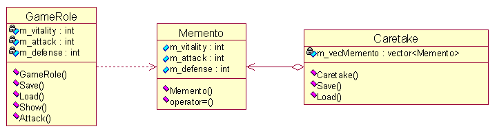
Memento类定义了内部的状态，而Caretake类是一个保存进度的管理者，GameRole类是游戏角色类。可以看到GameRole的对象依赖于Memento对象，而与Caretake对象无关。下面给出一个简单的是实现。
```
//需保存的信息
class Memento  
{
public:
	int m_vitality; //生命值
	int m_attack;   //进攻值
	int m_defense;  //防守值
public:
	Memento(int vitality, int attack, int defense): 
	  m_vitality(vitality),m_attack(attack),m_defense(defense){}
	Memento& operator=(const Memento &memento) 
	{
		m_vitality = memento.m_vitality;
		m_attack = memento.m_attack;
		m_defense = memento.m_defense;
		return *this;
	}
};
//游戏角色
class GameRole  
{
private:
	int m_vitality;
	int m_attack;
	int m_defense;
public:
	GameRole(): m_vitality(100),m_attack(100),m_defense(100) {}
	Memento Save()  //保存进度，只与Memento对象交互，并不牵涉到Caretake
	{ 
		Memento memento(m_vitality, m_attack, m_defense);
		return memento;
	}
	void Load(Memento memento)  //载入进度，只与Memento对象交互，并不牵涉到Caretake
	{
		m_vitality = memento.m_vitality;
		m_attack = memento.m_attack; 
		m_defense = memento.m_defense;
	}
	void Show() { cout<<"vitality : "<< m_vitality<<", attack : "<< m_attack<<", defense : "<< m_defense<<endl; }
	void Attack() { m_vitality -= 10; m_attack -= 10;  m_defense -= 10; }
};
//保存的进度库
class Caretake  
{
public:
	Caretake() {}
	void Save(Memento menento) { m_vecMemento.push_back(menento); }
	Memento Load(int state) { return m_vecMemento[state]; }
private:
	vector<Memento> m_vecMemento;
};
```
客户使用方式:
```
//测试案例
int main()
{	
	Caretake caretake;
	GameRole role; 
	role.Show();   //初始值
	caretake.Save(role.Save()); //保存状态
	role.Attack();   
	role.Show();  //进攻后
	role.Load(caretake.Load(0)); //载入状态 
	role.Show();  //恢复到状态0
	return 0;
}
```
# 中介者模式
中介者模式：用一个中介对象来封装一系列的对象交互。中介者使各对象不需要显式地相互引用，从而使其耦合松散，而且可以独立地改变它们之间的交互。中介者模式的例子很多，大到联合国安理会，小到房屋中介，都扮演了中间者的角色，协调各方利益。

本文就以租房为例子，如果没有房屋中介，那么房客要自己找房东，而房东也要自己找房客，非常不方便。有了房屋中介机构就方便了，房东可以把要出租的房屋信息放到中介机构，而房客可以去中介机构咨询。在软件中，就是多个对象之间需要通信，如果没有中介，对象就需要知道其他对象，最坏情况下，可能需要知道所有其他对象，而有了中介对象就方便多了，对象只需与中介对象通信，而不用知道其他的对象。这就是中介者模式，下面以租房为例，给出中介者模式的UML图。
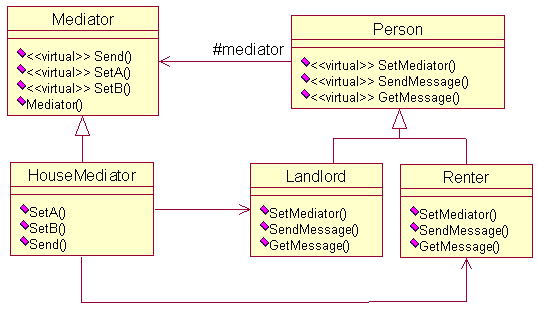
```
class Mediator;
//抽象人
class Person
{
protected:
	Mediator *m_mediator; //中介
public:
	virtual void SetMediator(Mediator *mediator){} //设置中介
	virtual void SendMessage(string message) {}    //向中介发送信息
	virtual void GetMessage(string message) {}     //从中介获取信息
};
//抽象中介机构
class Mediator
{
public:
	virtual void Send(string message, Person *person) {}
	virtual void SetA(Person *A) {}  //设置其中一方
	virtual void SetB(Person *B) {}
};
//租房者
class Renter: public Person
{
public:
	void SetMediator(Mediator *mediator) { m_mediator = mediator; }
	void SendMessage(string message) { m_mediator->Send(message, this); }
	void GetMessage(string message) { cout<<"租房者收到信息"<<message; }
};
//房东
class Landlord: public Person
{
public:
	void SetMediator(Mediator *mediator) { m_mediator = mediator; }
	void SendMessage(string message) { m_mediator->Send(message, this); }
	void GetMessage(string message) { cout<<"房东收到信息："<<message; }
};
//房屋中介
class HouseMediator : public Mediator
{
private:
	Person *m_A; //租房者
	Person *m_B; //房东
public:
	HouseMediator(): m_A(0), m_B(0) {}
	void SetA(Person *A) { m_A = A; }
	void SetB(Person *B) { m_B = B; }
	void Send(string message, Person *person) 
	{
		if(person == m_A) //租房者给房东发信息
			m_B->GetMessage(message); //房东收到信息
		else
			m_A->GetMessage(message);
	}
};
```
客户使用方式如下：
```
int main()
{	
	Mediator *mediator = new HouseMediator();
	Person *person1 = new Renter();    //租房者
	Person *person2 = new Landlord();  //房东
	mediator->SetA(person1);
	mediator->SetB(person2);
	person1->SetMediator(mediator);
	person2->SetMediator(mediator);
	person1->SendMessage("我想在南京路附近租套房子，价格800元一个月\n");
	person2->SendMessage("出租房子：南京路100号，70平米，1000元一个月\n");
	delete person1; delete person2; delete mediator;
	return 0;
}
```
# 职责链模式
职责链模式：使多个对象都有机会处理请求，从而避免请求的发送者和接收者之间的耦合关系。将这些对象连成一条链，并沿着这条链传递该请求，直到有一个对象处理它为止。其思想很简单，考虑员工要求加薪。公司的管理者一共有三级，总经理、总监、经理，如果一个员工要求加薪，应该向主管的经理申请，如果加薪的数量在经理的职权内，那么经理可以直接批准，否则将申请上交给总监。总监的处理方式也一样，总经理可以处理所有请求。这就是典型的职责链模式，请求的处理形成了一条链，直到有一个对象处理请求。给出这个例子的UML图。
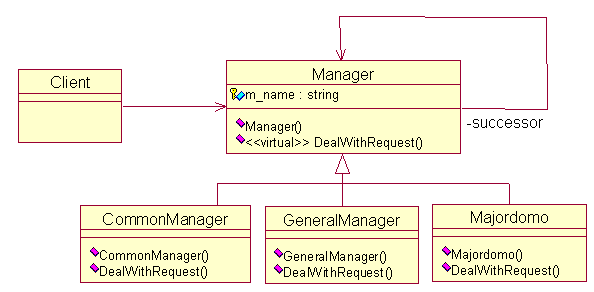
代码的实现比较简单，如下所示：
```
//抽象管理者
class Manager
{
protected:
	Manager *m_manager;
	string m_name;
public:
	Manager(Manager *manager, string name):m_manager(manager), m_name(name){}
	virtual void DealWithRequest(string name, int num)  {}
};
//经理
class CommonManager: public Manager
{
public:
	CommonManager(Manager *manager, string name):Manager(manager,name) {}
	void DealWithRequest(string name, int num) 
	{
		if(num < 500) //经理职权之内
		{
			cout<<"经理"<<m_name<<"批准"<<name<<"加薪"<<num<<"元"<<endl<<endl;
		}
		else
		{
			cout<<"经理"<<m_name<<"无法处理，交由总监处理"<<endl;
			m_manager->DealWithRequest(name, num);
		}
	}
};
//总监
class Majordomo: public Manager
{
public:
	Majordomo(Manager *manager, string name):Manager(manager,name) {}
	void DealWithRequest(string name, int num) 
	{
		if(num < 1000) //总监职权之内
		{
			cout<<"总监"<<m_name<<"批准"<<name<<"加薪"<<num<<"元"<<endl<<endl;
		}
		else
		{
			cout<<"总监"<<m_name<<"无法处理，交由总经理处理"<<endl;
			m_manager->DealWithRequest(name, num);
		}
	}
};
//总经理
class GeneralManager: public Manager
{
public:
	GeneralManager(Manager *manager, string name):Manager(manager,name) {}
	void DealWithRequest(string name, int num)  //总经理可以处理所有请求
	{
		cout<<"总经理"<<m_name<<"批准"<<name<<"加薪"<<num<<"元"<<endl<<endl;
	}
};
```
客户调用方式为：
```
//测试案例
int main()
{	
	Manager *general = new GeneralManager(NULL, "A"); //设置上级，总经理没有上级
	Manager *majordomo = new Majordomo(general, "B"); //设置上级
	Manager *common = new CommonManager(majordomo, "C"); //设置上级
	common->DealWithRequest("D",300);   //员工D要求加薪
	common->DealWithRequest("E", 600);
	common->DealWithRequest("F", 1000);
	delete common; delete majordomo; delete general;
	return 0;
}
```
# 观察者模式
观察者模式：定义对象间的一种一对多的依赖关系，当一个对象的状态发生改变时，所有依赖于它的对象都得到通知并被自动更新。它还有两个别名，依赖(Dependents)，发布-订阅(Publish-Subsrcibe)。可以举个博客订阅的例子，当博主发表新文章的时候，即博主状态发生了改变，那些订阅的读者就会收到通知，然后进行相应的动作，比如去看文章，或者收藏起来。博主与读者之间存在种一对多的依赖关系。下面给出相应的UML图设计。

可以看到博客类中有一个观察者链表（即订阅者），当博客的状态发生变化时，通过Notify成员函数通知所有的观察者，告诉他们博客的状态更新了。而观察者通过Update成员函数获取博客的状态信息。代码实现不难，下面给出C++的一种实现。
```
//观察者
class Observer  
{
public:
	Observer() {}
	virtual ~Observer() {}
	virtual void Update() {} 
};
//博客
class Blog  
{
public:
	Blog() {}
	virtual ~Blog() {}
	void Attach(Observer *observer) { m_observers.push_back(observer); }	 //添加观察者
	void Remove(Observer *observer) { m_observers.remove(observer); }        //移除观察者
	void Notify() //通知观察者
	{
		list<Observer*>::iterator iter = m_observers.begin();
		for(; iter != m_observers.end(); iter++)
			(*iter)->Update();
	}
	virtual void SetStatus(string s) { m_status = s; } //设置状态
	virtual string GetStatus() { return m_status; }    //获得状态
private:
	list<Observer* > m_observers; //观察者链表
protected:
	string m_status; //状态
};
```
以上是观察者和博客的基类，定义了通用接口。博客类主要完成观察者的添加、移除、通知操作，设置和获得状态仅仅是一个默认实现。下面给出它们相应的子类实现。     
```
//具体博客类
class BlogCSDN : public Blog
{
private:
	string m_name; //博主名称
public:
	BlogCSDN(string name): m_name(name) {}
	~BlogCSDN() {}
	void SetStatus(string s) { m_status = "CSDN通知 : " + m_name + s; } //具体设置状态信息
	string GetStatus() { return m_status; }
};
//具体观察者
class ObserverBlog : public Observer   
{
private:
	string m_name;  //观察者名称
	Blog *m_blog;   //观察的博客，当然以链表形式更好，就可以观察多个博客
public: 
	ObserverBlog(string name,Blog *blog): m_name(name), m_blog(blog) {}
	~ObserverBlog() {}
	void Update()  //获得更新状态
	{ 
		string status = m_blog->GetStatus();
		cout<<m_name<<"-------"<<status<<endl;
	}
};
```
客户的使用方式：
```
//测试案例
int main()
{
	Blog *blog = new BlogCSDN("wuzhekai1985");
	Observer *observer1 = new ObserverBlog("tutupig", blog);
	blog->Attach(observer1);
	blog->SetStatus("发表设计模式C++实现（15）——观察者模式");
	blog->Notify();
	delete blog; delete observer1;
	return 0;
}
```
# 状态模式
状态模式：允许一个对象在其内部状态改变时改变它的行为。对象看起来似乎修改了它的类。它有两种使用情况：（1）一个对象的行为取决于它的状态, 并且它必须在运行时刻根据状态改变它的行为。（2）一个操作中含有庞大的多分支的条件语句，且这些分支依赖于该对象的状态。本文的例子为第一种情况，以战争为例，假设一场战争需经历四个阶段：前期、中期、后期、结束。当战争处于不同的阶段，战争的行为是不一样的，也就说战争的行为取决于所处的阶段，而且随着时间的推进是动态变化的。下面给出相应的UML图。
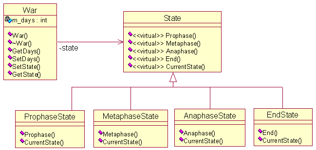
实现的代码比较简单，给出War类和State类，War类中含State对象（指针形式）。
```
class War;
class State 
{
public:
	virtual void Prophase() {}
	virtual void Metaphase() {}
	virtual void Anaphase() {}
	virtual void End() {}
	virtual void CurrentState(War *war) {}
};
//战争
class War
{
private:
	State *m_state;  //目前状态
	int m_days;      //战争持续时间
public:
	War(State *state): m_state(state), m_days(0) {}
	~War() { delete m_state; }
	int GetDays() { return m_days; }
	void SetDays(int days) { m_days = days; }
	void SetState(State *state) { delete m_state; m_state = state; }
	void GetState() { m_state->CurrentState(this); }
};
```
给出具体的状态类：
```
//战争结束
class EndState: public State
{
public:
	void End(War *war) //结束阶段的具体行为
	{
		cout<<"战争结束"<<endl;
	}
	void CurrentState(War *war) { End(war); }
};
//后期
class AnaphaseState: public State
{
public:
	void Anaphase(War *war) //后期的具体行为
	{
		if(war->GetDays() < 30)
			cout<<"第"<<war->GetDays()<<"天：战争后期，双方拼死一搏"<<endl;
		else
		{
			war->SetState(new EndState());
			war->GetState();
		}
	}
	void CurrentState(War *war) { Anaphase(war); }
};
//中期
class MetaphaseState: public State
{
public:
	void Metaphase(War *war) //中期的具体行为
	{
		if(war->GetDays() < 20)
			cout<<"第"<<war->GetDays()<<"天：战争中期，进入相持阶段，双发各有损耗"<<endl;
		else
		{
			war->SetState(new AnaphaseState());
			war->GetState();
		}
	}
	void CurrentState(War *war) { Metaphase(war); }
};
//前期
class ProphaseState: public State
{
public:
	void Prophase(War *war)  //前期的具体行为
	{
		if(war->GetDays() < 10)
			cout<<"第"<<war->GetDays()<<"天：战争初期，双方你来我往，互相试探对方"<<endl;
		else
		{
			war->SetState(new MetaphaseState());
			war->GetState();
		}
	}
	void CurrentState(War *war) { Prophase(war); }
};
```
使用方式：
```
//测试案例
int main()
{
	War *war = new War(new ProphaseState());
	for(int i = 1; i < 40;i += 5)
	{
		war->SetDays(i);
		war->GetState();
	}
	delete war;
	return 0;
}
```