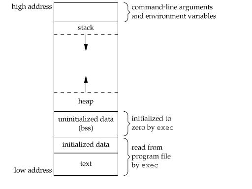

## 如何在main函数执行之前和之后
```
#include <iostream>

using namespace::std;

int fun(void);

__attribute__((constructor)) void before_main()
{
    int a = 1;
    int b = 2;
    cout <<a+b <<endl;
    cout << "first" << endl;
}

__attribute__((destructor)) void after_main()
{
    int a = 4;
    int b = 5;
    cout <<a+b << endl;
    cout << "last" << endl;
}

class A {
public:
    A() {
        std::cout << "A constructor!" << std::endl;
    }
    ~A() {
        std::cout << "A destructor!" << std::endl;
    }
};

/* 全局对象，在main函数之前，A的构造函数被调用 */
A a;

int main() {

    _onexit(fun);
    std::cout << "main begins" << std::endl;
    return 0;
}

int fun()
{
    cout << "main is executed!" << endl;
}
```
```
结果如下：
A constructor!
3
first
main begins
main is executed!
9
last
A destructor!
```
方法如下：
- gcc为函数提供了几种类型的属性，其中包含：构造函数(constructors)和析构函数(destructors)。 
程序员应当使用类似下面的方式来指定这些属性：

    __attribute__((constructor)) // 在main函数被调用之前调用
    __attribute__((destructor)) // 在main函数被调用之后调
- 自己声明一个全局对象，在内部实现函数
- 使用_onexit注册函数，在mian函数结束时调用
>ps: 可以看到，全局对象的构造是先于自己申明的构造函数的，反之析构会最后
## 内存分配：堆、栈、全局变量/静态变量、代码区
C++中，内存分为5个区：堆、栈、自由存储区、全局/静态存储区和常量存储区。

1、栈：是由编译器在需要时自动分配，不需要时自动清除的变量存储区。通常存放局部变量、函数参数等。

2、堆：是由new分配的内存块，由程序员释放（编译器不管），一般一个new与一个delete对应，一个new[]与一个delete[]对应。如果程序员没有释放掉，资源将由操作系统在程序结束后自动回收 。                           
自由存储区：是由malloc等分配的内存块，和堆十分相似，用free来释放。（注意：堆和自由存储区其实不过是同一块区域，new底层实现代码中调用了malloc，new可以看成是malloc智能化的高级版本）

3、全局/静态存储区：全局变量和静态变量被分配到同一块内存中（在C语言中，全局变量又分为初始化的和未初始化的，C++中没有这一区分）。

4、常量存储区：这是一块特殊存储区，里边存放常量，不允许修改。

堆与栈的讨论：

    管理方式：
    堆中资源由程序员控制（容易产生memory leak）。
    栈资源由编译器自动管理，无需手工控制。

系统响应：

    对于堆，应知道系统有一个记录空闲内存地址的链表，当系统收到程序申请时，遍历该链表，寻找第一个空间大于申请空间的堆结点，删除空闲结点链表中的该结点，并将该结点空
    间分配给程序（大多数系统会在这块内存空间首地址记录本次分配的大小，这样delete才能
    正确释放本内存空间，另外系统会将多余的部分重新放入空闲链表中）。

    对于栈，只要栈的剩余空间大于所申请空间，系统为程序提供内存，否则报异常提示栈溢出。

空间大小：

    堆是不连续的内存区域（因为系统是用链表来存储空闲内存地址，自然不是连续的），堆大
    小受限于计算机系统中有效的虚拟内存（32bit系统理论上是4G），所以堆的空间比较灵
    活，比较大。

    栈是一块连续的内存区域，大小是操作系统预定好的，windows下栈大小是2M（也有是1M，
    在编译时确定，VC中可设置）。

碎片问题：

    对于堆，频繁的new/delete会造成大量碎片，使程序效率降低。
    对于栈，它是一个先进后出的队列，进出一一对应，不会产生碎片。

生长方向：（这决定了栈在高地址区、堆在底地址区）

    堆向上，向高地址方向增长。
    栈向下，向低地址方向增长。

分配方式：

    堆都是动态分配（没有静态分配的堆）。
    栈有静态分配和动态分配，静态分配由编译器完成（如局部变量分配），动态分配由alloca
    函数分配，但栈的动态分配的资源由编译器进行释放，无需程序员实现。

分配效率：

    堆由C/C++函数库提供，机制很复杂。所以堆的效率比栈低很多。
    栈是机器系统提供的数据结构，计算机在底层对栈提供支持，分配专门寄存器存放栈地址，
    栈操作有专门指令。
 
## C与C++之间的相互调用（混合编程）
C和C++各自有自身的重要功能，为了能够做到充分利用，避免重复造轮子，有的时候，我们会用到混合编程。然而，我们知道，代码从编写到能执行之前，仍需要经过编译、链接阶段。通常，编译每一个单元文件会生成目标文件，然后链接器会把各个目标文件链接起来生成可执行性文件。链接器之所以能把目标文件相互之间链接起来，就是通过查找目标文件中的唯一函数符号（即经过编译器去编译修饰后，重新得到的函数符号）。但是C和C++编译器对编译函数符号的生成规则是不一样的，为什么呢？因为C只有单一的命名空间，不支持函数重载之类的特性，例如对于函数void fun(int a, int b),经过编译后生成的符号为_fun, C链接器链接的时候就会去找_fun这样的函数符号；C++为了支持函数重载（即函数名字可以相同，参数类型或个数不同），允许存在同名的函数，这一点在C中是做不到的。其实，C++甚至可以存在相同的类型、变量等，因为在C++中命名空间的存在。在C++中，对于函数void fun(int a, int b)，经过编译后，生成的类似为_fun_int_int， 新生成的符号名不仅带有函数名，还有参数类型。正因为他们两者编译函数的时候，生成的符号规则不一样，所以，在混合编程中，如果我们不进行任何处理，而相互效用的话，必然会出现在链接的时候，找不到符号链接的情况。

为实现混合编程，我们不得不提到extern "C" ， extern "C"是C++的特性，是一种链接约定，通过它可以实现兼容C与C++之间的相互调用，即对调用函数能够达成一致的意见，使用统一的命名规则，使得实现方提供的接口和调用方需要的接口经按照指定规则编译后，得到的都是一致的函数符号命名。具体用法，请看如下实例。

1. C++调用C函数实例（关键是让C++调用的C接口按照C规范走即可）
```
// --------------cfun.h
#ifndef __C_FUN
#define __C_FUN
 
#ifdef __cplusplus
extern "C"{
#endif // __cplusplus

void cfun();
#ifdef __cplusplus
}
#endif
```
cfun.h头文件中，使用了条件编译#ifdef __cplusplus， 表示如果是C++来调用该接口，则该函数接口经编译后的函数符号生成规则按照C风格走, 否则没有extern "C" ， 这样提供的接口同时支持C和C++两者的调用。
```
// --------------cfun.c
#include "cfun.h"
#include <stdio.h>

void cfun()
{
    printf("hello world.\n");
}
```
```
// --------------main.cpp
#include <iostream>
#include "cfun.h"

int main()
{
    cfun();
    system("pause");
    return 0;
}
```
2. C调用C++函数实例（关键是让C调用的C++函数接口按照C规范走即可）
```
// --------------cppfun.h
#ifndef _CPP_FUN
#define _CPP_FUN

extern "C" void cppfun();

#endif
```
```
// --------------cppfun.cpp
#include "cppfun.h"
#include <iostream>

void cppfun()
{
    std::cout << "hello world." << std::endl;
}
```
```
// --------------main.c
#include <stdio.h>
extern void cppfun();
int main()
{
    cppfun();
    system("pause");
    return 0;
}
```
## 二叉树中两个节点的最近公共祖先节点
一、该二叉树为搜索二叉树
搜索二叉树的特点：
任意一个节点的左子树的所有节点值都比该节点的值小，其右子树的所有节点值都比该节点的值大。

解决该问题方法：

    从树的根节点开始和两个节点作比较，如果当前节点的值比两个节点的值都大，则这两个节
    点的最近公共祖先节点一定在该节点的左子树中，则下一步遍历当前节点的左子树；

    如果当前节点的值比两个节点的值都小，则这两个节点的最近公共祖先节点一定在该节点的
    右子树中，下一步遍历当前节点的右子树；这样直到找到第一个值是两个输入节点之间的值
    的节点，该节点就是两个节点的最近公共祖先节点。
二、该二叉树为一般二叉树
1. 二叉树节点中包含指向父节点的指针
首先给出node1的父节点node1->_parent，然后将node1的所有父节点依次和node2->parent作比较，如果发现两个节点相等，则该节点就是最近公共祖先，直接将其返回。如果没找到相等节点，则将node2的所有父节点依次和node1->_parent->_parent作比较......直到node1->_parent==NULL。

或者将2个节点看做头结点，根节点看做尾结点，转换成求2个链表的第一个公共节点

2. 二叉树节点**不**包含指向父节点的指针
以根节点为头结点，求链表交集

如果不用辅助空间，就从根节点开始遍历，如果node1和node2中的任一个和root匹配，那么root就是最低公共祖先。 如果都不匹配，则分别递归左、右子树，如果有一个节点出现在左子树，并且另一个节点出现在右子树，则root就是最低公共祖先.  如果两个节点都出现在左子树，则说明最低公共祖先在左子树中，否则在右子树。
## C++三大特性——继承，多态，封装
1. 封装
隐藏对象的属性和实现细节，仅仅对外提供接口和方法。
优点： 1）隔离变化；2）便于使用； 3）提高重用性； 4）提高安全性
缺点： 1）如果封装太多，影响效率； 2）使用者不能知道代码具体实现。
2. 继承
一个对象直接使用另一个对象的属性和方法。

优点：

    1.减少重复的代码。
    2.继承是多态的前提。
    3.继承增加了类的耦合性。

缺点：

    1.继承在编译时刻就定义了，无法在运行时刻改变父类继承的实现；
    2.父类通常至少定义了子类的部分行为，父类的改变都可能影响子类的行为；
    3.如果继承下来的子类不适合解决新问题，父类必须重写或替换，那么这种依赖关系就限制
    了灵活性，最终限制了复用性。

虚继承：为了解决多重继承中的二义性问题，它维护了一张虚基类表。
3. 多态
C++中有两种多态，称为动多态（运行期多态）和静多态（编译期多态），而静多态主要通过模板来实现，宏也是实现静多态的一种途径。动多态在C++中是通过虚函数实现的，即在基类中存在一些接口（一般为纯虚函数），子类必须重载这些接口。这样通过使用基类的指针或者引用指向子类的对象，就可以实现调用子类对应的函数的功能。动多态的函数调用机制是执行期才能进行确定，所以它是动态的。  
接口的多种不同实现方式即为多态。可以举个例子加深记忆，比如电脑的USB接口，既可以插优盘，又可以插鼠标，USB接口就类似类的接口。

静态多态的设计思想：对于相关的对象类型，直接实现它们各自的定义，不需要共有基类，甚至可以没有任何关系。只需要各个具体类的实现中要求相同的接口声明，这里的接口称之为隐式接口。客户端把操作这些对象的函数定义为模板，当需要操作什么类型的对象时，直接对模板指定该类型实参即可（或通过实参演绎获得）。  
静态多态本质上就是模板的具现化。静态多态中的接口调用也叫做隐式接口，相对于显示接口由函数的签名式（也就是函数名称、参数类型、返回类型）构成，隐式接口通常由有效表达式组成

4. 动态多态和静态多态的比较
#### 静态多态
优点：  
- 由于静多态是在编译期完成的，因此效率较高，编译器也可以进行优化；
- 有很强的适配性和松耦合性，比如可以通过偏特化、全特化来处理特殊类型；
- 最重要一点是静态多态通过模板编程为C++带来了泛型设计的概念，比如强大的STL库。
缺点：
- 由于是模板来实现静态多态，因此模板的不足也就是静多态的劣势，比如调试困难、编译耗时、代码膨胀、编译器支持的兼容性
- 不能够处理异质对象集合
#### 动态多态
优点：
- OO设计，对是客观世界的直觉认识；
- 实现与接口分离，可复用
- 处理同一继承体系下异质对象集合的强大威力
缺点：
- 运行期绑定，导致一定程度的运行时开销；
- 编译器无法对虚函数进行优化
- 笨重的类继承体系，对接口的修改影响整个类层次；

**不同点**：
- 本质不同，静态多态在编译期决定，由模板具现完成，而动态多态在运行期决定，由继承、虚函数实现；
- 动态多态中接口是显式的，以函数签名为中心，多态通过虚函数在运行期实现，静态多台中接口是隐式的，以有效表达式为中心，多态通过模板具现在编译期完成    
**相同点**：    
- 都能够实现多态性，静态多态/编译期多态、动态多态/运行期多态；
- 都能够使接口和实现相分离，一个是模板定义接口，类型参数定义实现，一个是基类虚函数定义接口，继承类负责实现；


# 类和对象

## 什么时候需要重写拷贝构造函数
当类里面有指针成员时，为了避免拷贝后对象销毁导致的指针空悬，要重写，在里面进行深拷贝（额外申请空间构造其指向的对象）

## 虚析构函数，构造函数可以是虚函数吗
虚函数调用只需要“部分的”信息，即只需要知道函数接口，而不需要对象的具体类型。但是构建一个对象，却必须知道具体的类型信息。如果你调用一个虚拟构造函数，编译器怎么知道你想构建是继承树上的哪种类型呢？所以这在逻辑上是一个悖论。Bjarne建议的解决方案是factory pattern，也就是为每一个要构建的类型再创建一个对应的factory，把问题放到factory的make方法中去解决。这也是C++中的通用解决方案。

总结一下关于虚函数的一些常见问题：

1) 虚函数是动态绑定的，也就是说，使用虚函数的指针和引用能够正确找到实际类的对应函数，而不是执行定义类的函数。这是虚函数的基本功能，就不再解释了。 

2) 构造函数不能是虚函数。而且，在构造函数中调用虚函数，实际执行的是父类的对应函数，因为自己还没有构造好, 多态是被disable的。 

3) 析构函数可以是虚函数，而且，在一个复杂类结构中，这往往是必须的。
 
4) 将一个函数定义为纯虚函数，实际上是将这个类定义为抽象类，不能实例化对象。 

5) 纯虚函数通常没有定义体，但也完全可以拥有。

6)  析构函数可以是纯虚的，但纯虚析构函数必须有定义体，因为析构函数的调用是在子类中隐含的。 

7) 非纯的虚函数必须有定义体，不然是一个错误。 

8) 派生类的override虚函数定义必须和父类完全一致。除了一个特例，如果父类中返回值是一个指针或引用，子类override时可以返回这个指针（或引用）的派生。例如，在上面的例子中，在Base中定义了 virtual Base* clone(); 在Derived中可以定义为 virtual Derived* clone()。可以看到，这种放松对于Clone模式是非常有用的。 


## 三种继承方式
1、公有继承

当类的继承方式为公有继承时，基类的公有和保护成员的访问属性在派生类中保持不变，而基类的私有成员不可访问。    
即基类的公有成员和保护成员被继承到派生类中仍作为派生类的公有和保护成员，派生类的其他成员可以直接访问它们；  
其他外部使用者只能通过派生类的对象访问继承来的公有成员；    
而无论派生类的成员还是对象都无法访问基类的私有成员。

2. 私有继承

当类的继承方式为私有继承时，基类的公有和保护成员都以私有成员身份出现在派生类中，而基类的私有成员在派生类中不可访问。    
即基类的公有成员和保护成员被继承到派生类中作为派生类的私有成员，派生类的其他成员可以直接访问它们；
但是在类外部通过派生类的对象无法访问；  
而无论派生类的成员还是对象都无法访问基类的私有成员。

3. 保护继承

当类的继承方式为保护继承时，基类的公有和保护成员都以保护成员身份出现在派生类中，而基类的私有成员在派生类中不可访问。    
即基类的公有成员和保护成员被继承到派生类中作为派生类的保护成员，派生类的其他成员可以直接访问它们；  
但是在类外部通过派生类的对象无法访问；  
而无论派生类的成员还是对象都无法访问基类的私有成员。

    无论哪种继承方式，基类的公有和保护成员都可以被派生类的成员访问。 
    无论哪种继承方式，基类的私有成员都不可以被派生类的成员和对象访问。
    只有公有继承时，基类的公有成员才可以被派生类的对象访问。
    在被继承时，基类的保护成员及和公有成员行为一致。
    在被类的对象访问时，保护成员和私有成员的行为一致。


# 内存管理


## malloc/free与new/delete异同点
### 相同点
malloc/free与new/delete都可以用于申请动态内存和释放内存，他们申请的空间都在堆上分配。

### 不同点
1）操作对象不同

malloc/free是C++/C语言的标准库文件，new/delete是C++的运算符；

对非内部数据对象，malloc/free无法满足动态对象要求。对象在创建时要自动执行构造函数，对象消亡之前要自动执行析构函数，而malloc/free是库函数，不是运算符，故不在编译器控制权限之内，不能够将执行构造函数和析构函数强加于malloc/free身上。而由于new/delete是C++语言，能够完成动态内存分配和初始化工作，并能够完成清理与释放内存工作，即能够自动执行构造函数和析构函数；

2）用法不同

malloc分配内存空间前需要计算分配内存大小；而new能够自动分配内存空间；

malloc是底层函数，其函数返回值类型为void *；而new运算符调用无参构造函数，故返回值为对应对象的指针；

malloc函数类型不是安全的，编译器不对其进行类型转换、类型安全的相关检查。malloc申请空间后，不会对其初始化，要单独初始化；而new类型是安全的，因为它内置了sizeof、类型转换和类型安全检查功能，且在创建对象时，就完成了初始化工作，一般初始化调用无参构造函数；

operator new对应于malloc，且operator new可以重载，可以自定义内存分配策略，甚至不做内存分配，甚至分配到非内存设备上；但malloc不能。

free只进行释放空间；而delete则释放空间的同时调用析构函数。此外delete使用是注意释放数组的方法为delete []数组名。

### 联系

new和delete功能覆盖了malloc/free，但因C++程序常会用到C函数，而C函数只能使用malloc/free管理动态内存。此外，使用是malloc和free搭配使用，new和delete搭配使用，不能混乱使用。

# STL


# C++语法细节


# C++关键字