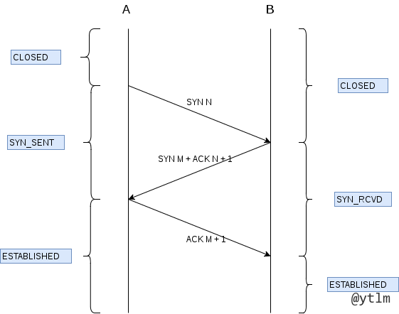
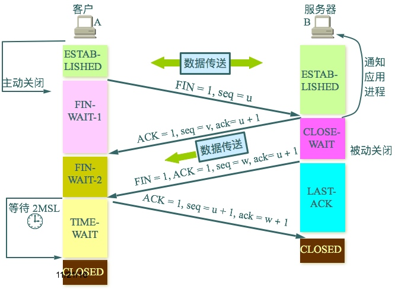
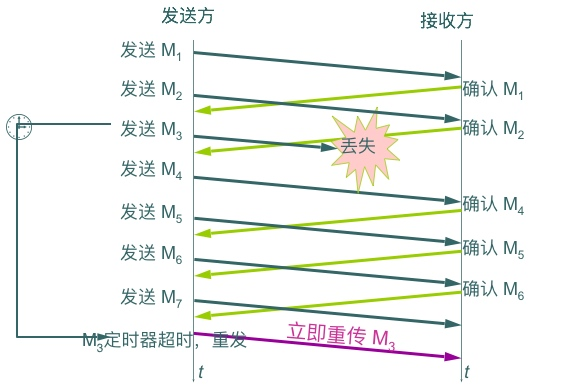
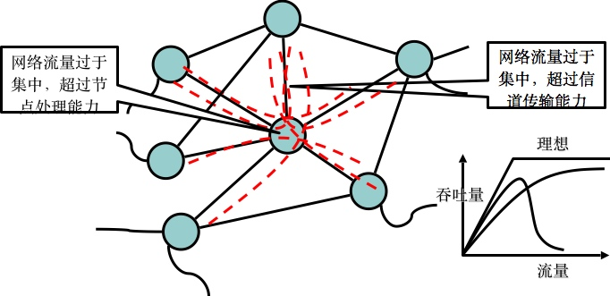
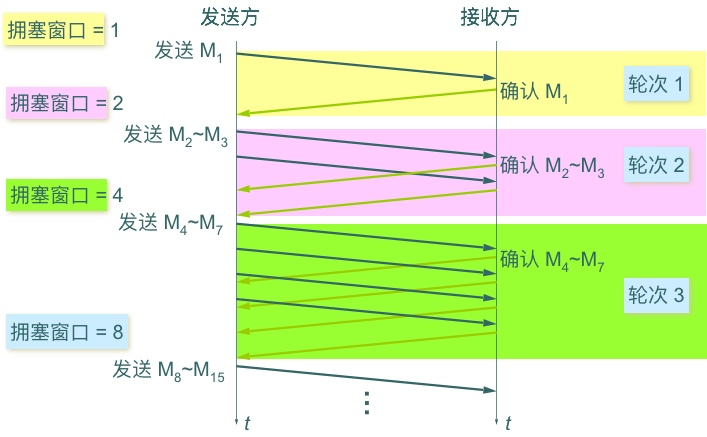
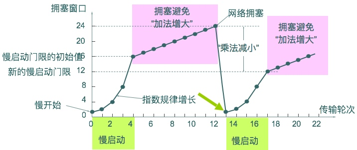
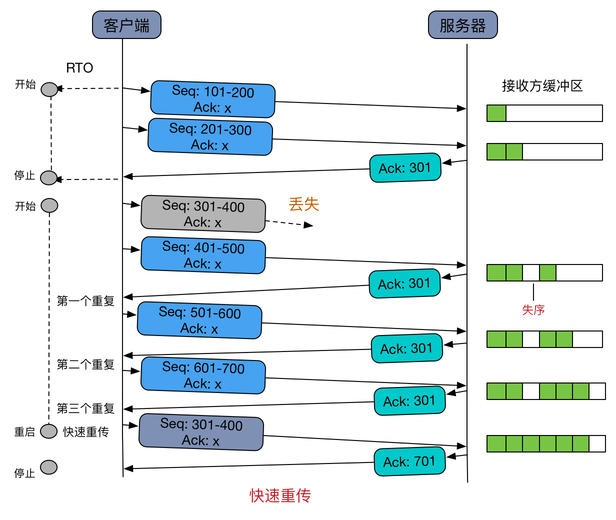
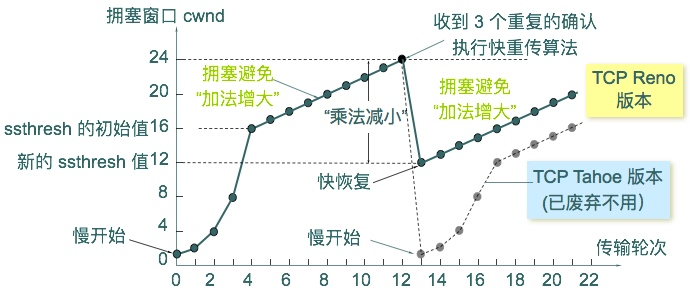

# OSI，TCP/IP，五层协议的体系结构
OSI（Open System Interconnect）：开放系统互联，是一个七层的计算机网络模型，分别为：物理层、数据链路层、网络层、传输层、会话层、表示层和应用层。

TCP/IP（Transmission Control Protocol/Internet Protocol）：传输控制协议/因特网互联协议，是一个四层的计算机网络模型，分别为：网络接口层、网络层、传输层和应用层。
结合OSI和TCP/IP产生了一个五层结构，分别为：物理层、数据链路层、网络层、传输层和应用层。Internet就是采用的TCP/IP协议。
# 物理层
激活、维持、关闭通信端点之间的机械特性、电气特性、功能特性以及过程特性。该层为上层协议提供了一个传输数据的物理媒体。
常见物理层设备：网卡；光纤；CAT-5线；RJ-45接头；集线器有整波作用。Repeater加强信号。串口；并口

# 数据链路层
数据链路层在不可靠的物理介质上提供可靠的传输。该层的作用包括：物理地址寻址、数据的成帧、流量控制、数据的检错、重发等。
(功能主要有：如何将数据组合成数据块，在数据链路层中称这种数据块为帧（frame），帧是数据链路层的传送单位；如何控制帧在物理信道上的传输，包括如何处理传输差错，如何调节发送速率以使与接收方相匹配；以及在两个网络实体之间提供数据链路通路的建立、维持和释放的管理。)
帧同步：字节计数；特殊字符t填充；比特填充（如01111110）；w违法编码法（曼彻斯特编码）
差错控制：校验码；超时计数器；帧序号——其中又有反馈检测发，自动请求发，空闲重发法,连续重发法（其中包含back-to-N和重发表）
流量控制：窗口机制
```
数据链路层的主要协议有： 
1、Point-to-Point Protocal——PPP点到点。
2、Ethernet——以太网。
3、High-Level Data Link Control Protocal——高级链路控制协议。
4、Frame Relay——帧中继。
5、Asynchronous Transfer Mode——异步传输模式。
```
# 网络层
网络层是OSI参考模型中的第三层，介于传输层和数据链路层之间，它在数据链路层提供的两个相邻端点之间的数据帧的传送功能上，进一步管理网络中的数据通信，将数据设法从源端经过若干个中间节点传送到目的端，从而向运输层提供最基本的端到端的数据传送服务。主要内容有：虚电路分组交换和数据报分组交换、路由选择算法、阻塞控制方法、X.25协议、综合业务数据网（ISDN）、异步传输模式（ATM）及网际互连原理与实现。——**路径选择、路由及逻辑寻址**
```
路由选择：在数据报方式中网络节点要为每个分组路由做出选择；而在虚电路方式中，只需在连接建立时确定路由
静态路由：
    泛射路由选择法：一个网络节点从某条线路收到一个分组后，再向除该条线路外的所有线路 
    重复发送收到的分组。结果，最先到达目的节点的一个或若干个分组肯定经过了最短的路
    线，而且所有可能的路径都被同时尝试过。这种方法可用于诸如军事网络等强壮性要求很高
    的场合，即使有的网络节点遭到破坏，只要源、目间有一条信道存在则泛射路由选择仍能保
    证数据的可靠传送。另外，这种方法也可用于将一条分组从数据源传送到所有其它节点的广
    播式数据交换中，它还可用来进行网络的最短传输延迟的测试。

    固定路由选择：这是一种使用较多的简单算法。每个网络节点存储一张表格，表格中每一项
    记录对应着某个目的节点或链路。当一个分组到达某节点时，该节点只要根据分组的地址信
    息便可从固定的路由表中查出对应的目的节点及所应选择的下一节点。固定路由选择法的优
    点是简便易行，在负载稳定，拓扑结构变化不大的网络中运行效果很好。它的缺点是灵活性
    差，无法应付网络中发生的阻塞和故障。

    随机路由选择：在这种方法中，收到分组的节点，在所有与之相邻的节点中为分组随机选择
    一个出路节点。方法虽然简单，也较可靠，但实际路由不是最佳路由，增加了不必要的负
    担，而且分组传输延迟也不可预测，故此法应用不广。

动态路由：节点路由选择要依靠网络当前的状态信息来决定的策略称动态路由选择策略，这种
策略能较好地适应网络流量、拓扑结构的变化，有利于改善网络的性能。但由于算法复杂，会增
加网络的负担，有时会因反应太快引起振荡或反应太慢不起作用。独立路由选择、集中路由选择
和分布路由选择是三种动态路由选择策略的具体算法。

    独立路由选择：在这类路由算法中，节点仅根据自己搜到的有关信息作出路由选择的决定，
    与其它节点不交换路由选择信息，虽然不能正确确定距离本节点较远的路由选择，但还是能
    较好地适应网络流量和拓扑结构的变化。一种简单的独立路由选择算法是Baran在1964年提
    出的热土豆（Hot Potato）算法。当一个分组到来时，节点必须尽快脱手，将其放入输出
    列最短的方向上排队，而不管该方向通向何方。

    集中路由选择：集中路由选择也象固定路由选择一样，在每个节点上存储一张路由表。不同
    的是，固定路由选择算法中的节点路由表由手工制作，而在集中路由选择算法中的节点路由
    表由路由控制中心RCC（Routing Control Center）定时根据网络状态计算、生成并分送
    各相应节点。由于RCC利用了整个网络的信息，所以得到的路由选择是完美的，同时也减轻了
    各节点计算路由选择的负担。

    分布路由选择：采用分布路由选择算法的网络，所有节点定期地与其每个相邻节点交换路由
    选择信息。每个节点均存储一张以网络中其它每个节点为索引的路由选择表，网络中每个节
    点占用表中一项，每一项又分为两个部分，即所希望使用的到目的节点的输出线路和估计到
    目的节点所需要的延迟或距离。度量标准可以是毫秒或链路段数、等待的分组数、剩余的线
    路和容量等。对于延迟，节点可以直接发送一个特殊的称作“回声”（echo）的分组，接收该
    分组的节点将其加上时间标记后尽快送回，这样便可测出延迟。有了以上信息，节点可由此
    确定路由选择。
```
**距离向量算法和链路状态算法**
```
距离向量算法：**路由信息协议RIP**
各节点周期性地向所有相邻节点发送路由刷新报文，报文由一组(V，D)有序数据对组成，V表示该
节点可以到达的节点，D表示到达该节点的距离(跳数)。收到路由刷新报文的节点重新计算和修改
它的路由表。
距离向量路由算法具有简单，易于实现的优点。但它不适用于路由剧烈变化的或大型的网络环
境。因为某个节点的路由变化像波动一样从相邻节点传播出去，其过程是非常缓慢的，称之为“慢
收敛”。因此，在距离向量路由选择算法的路由刷新过程中，可能会出现路由不一致问题。距离向
量路由选择算法的另一个缺陷是它需要大量的信息交换，但很多都可能是与当前路由刷新无关的。

链路状态算法：**开放最短路径优先（OSPF）**
⑴ 每个节点必须找出它的所有邻居当一个节点启动后，通过在每一条点到点的链路上发送一个特
殊的HELLO报文，并通过链路另一端的节点发送一个应答报文告诉它自己是谁。

⑵ 每个节点测量到它的每个邻居的时延或其他参数
链路-状态路由选择算法要求每个节点都知道到它的每个邻居的时延。
测量这种时延的最直接的方法是在它们之间的链路上发送一个特殊的ECHO响应报文，并且要求对
方收到后立即再将其发送回来。将测量得到的来回时间除以2，即可得到一个比较合理的估计。为
了得到更准确的结果，可以将测试重复多次，取平均值。

⑶ 建立链路-状态报文
收集齐了用于交换的信息后，下一步就为每一个节点建立一个包含所有数据的报文。报文以发送
者的标识符开始，随后为顺序号以及它的所有邻居的列表。对于每一个邻居，给出到此邻居的时
延。
建立链路-状态报文很容易，困难是决定何时建立它们。一种可行的方法是每隔一段规律的时间间
隔周期性地建立它们。另一种可行的方法是当节点检测到了某些重要事件的发生时建立它们。例
如，一条链路或一个邻居崩溃或恢复时，建立它们。

⑷ 分发链路-状态报文
基本的分发算法是使用顺序号的洪泛法。这种分发算法由于循环使用顺序号、某个节点曾经崩溃
或某个顺序号曾经被误用过等原因，可能会使不同的节点使用不同版本的拓扑结构，这将导致不
稳定、循环、到达不了目的机器及其他问题。为了防止这类错误的发生，需要在每个报文中包含
一个年龄域，年龄每秒减1，当年龄减到0时，丢弃此报文。

⑸ 计算新路由
一旦一个节点收集齐了所有来自于其他节点的链路-状态报文，它就可以据此构造完整的网络拓扑
结构图，然后使用Dijkstra算法在本地构造到所有可能的目的地的最短通路。

链路-状态路由选择算法具有各节点独立计算最短通路、能够快速适应网络变化、交换的路由信息
少等优点，但相对于距离向量路由选择算法，它较复杂、难以实现。
```
## 网络层主要协议
    TCP/IP网络层的核心是IP协议，它是TCP/IP协议族中最主要的协议之一。IP协议非常简
    单，仅仅提供不可靠、无连接的传送服务。
    IP协议的主要功能有：无连接数据报传输、数据报路由选择和差错控制。
    与IP协议配套使用实现其功能的还有地址解析协议ARP、逆地址解析协议RARP、因特网报文
    协议ICMP、因特网组管理协议IGMP。
## IP
IP地址是网络层使用的地址，它是分层次等级的。硬件地址是数据链路层使用的地址（如MAC地址），它是平面式的。在网络层及网络层之上使用IP地址，IP地址放在IP数据报的首部，而MAC地址放在MAC帧的首部。通过数据封装，把IP数据报分组封装成为MAC帧之后，数据链路层看不见数据报分组中的IP地址。
1. IP地址分类

TCP/IP网络使用32位长度的地址以标识一台计算机和同它相连的网络，它的格式为：IP地址=网
络地址+主机地址。IP地址是通过它的格式分类的，它有四种格式：A类、B类、C类、D类

A类0网络（7位）主机地址（24位）、B类10网络（14位）主机地址（16位）、C类110网络（21位）主机地址（8位）、D类1110多路通信地址（28位）、未来的格式11110将来使用。   
这样，A类地址空间为0-127，最大网络数为126，最大主机数为16,777,124； 
B类地址空间为128-191，最大网络数为16384，最大主机数为65,534；   
C类地址空间为192-223，最大网络数为2,097,152，最大主机数为254；  
D类地址空间为224-254。  
 C类地址空间分配概况。分配区域地址空间：多区域192.0.0.0~193.255.255.255、欧洲：194.0.0.0~195.255.255.255、其他：196.0.0.0~197.255.255.255、北美：197.0.0.0~199.255.255.255、中南美：200.0.0.0~201.255.255.255、太平洋地区：202.0.0.0~203.255.255.255、其他：204.0.0.0~205.255.255.255、其他：206.0.0.0~207.255.255.255。注：其中“多区域”表示执行该计划前已经分配的地址空间；“其他”表示已指定名称的地区之外的地理区划

特殊格式的IP地址：广播地址：当网络或主机标志符字段的每位均设置为1时，这个地址编码标识着该数据报是一个广播式的通信，该数据报可以被发送到网络中所有的子网和主机。例如，地址128.2.255.255意味着网络128.2上所有的主机。本网络地址：IP地址的主机标识符字段也可全部设置为0，表示该地址作为“本主机”地址。网络标识符字段也可全部设置为0，表示“本网络”。如，128.2.0.0表示网络地址为128.2的网络。使用网络标识符字段全部设置为0的IP地址在一台主机不知道网络的IP地址时时是很有用的。私有的IP地址：在有些情况下，一个机构并不需要连接到Internet或另一个专有的网络上，因此，无须遵守对IP地址进行申请和登记的规定。该机构可以使用任何的地址。在RFC1597中，有些IP地址是用作私用地址的：A类地址：10.0.0.0到10.255.255.255。B类地址：172.16.0.0到172.31.255.255.255。C类地址：192.168.0.0到192.168.255.255。
**特殊地质总结**
```
•   127.0.0.1：回环地址。该地址指电脑本身，主要预留测试本机的TCP/IP协议是否正常。只要使用这个地址发送数据，则数据包不会出现在网络传输过程中。
•   10.x.x.x、172.16.x.x～172.31.x.x、192.168.x.x：这些地址被用做内网中。用做私网地址，这些地址不与外网相连。
•   255.255.255.255：广播地址
•   0.0.0.0：这个IP地址在IP数据报中只能用作源IP地址，这发生在当设备启动时但又不知道自己的IP地址情况下。
由此看，两个都属于特殊地址。IPV4中，0.0.0.0地址被用于表示一个无效的，未知的或者不可用的目标。 

* 在服务器中，0.0.0.0指的是本机上的所有IPV4地址，如果一个主机有两个IP地址，192.168.1.1 和 10.1.2.1，并且该主机上的一个服务监听的地址是0.0.0.0,那么通过两个ip地址都能够访问该服务。 
* 在路由中，0.0.0.0表示的是默认路由，即当路由表中没有找到完全匹配的路由的时候所对应的路由。
    用途：
    1、DHCP分配前，表示本机。
    2、用做默认路由，表示任意主机。
    3、用做服务端，表示本机的任意IPV4地址。
```

总结localhost、127.0.0.1和本机地址：

    •  localhost 是个域名，不是地址，它可以被配置为任意的 IP 地址，不过通常情况下都指向 127.0.0.1(ipv4)和 [::1](ipv6)

    •  整个127.* 网段通常被用作 loopback 网络接口的默认地址，按惯例通常设置为 127.0.0.1。这个地址在其他计算机上不能访问，就算你想访问，访问的也是自己，因为每台带有TCP/IP协议栈的设备基本上都有 localhost/127.0.0.1。

    •  本机地址通常指的是绑定在物理或虚拟网络接口上的IP地址，可供其他设备访问到。

    •  最后，从开发度来看
    •	localhost是个域名，性质跟 “www.baidu.com” 差不多。不能直接绑定套接字，必须先gethostbyname转成IP才能绑定。
    •	127.0.0.1 是绑定在 loopback 接口上的地址，如果服务端套接字绑定在它上面，你的客户端程序就只能在本机访问。
    •	如果主机中存在多个网卡，分别连接不同的物理网络，比如 192.168.0.1/255.255.255.0 和 192.168.1.1/255.255.255.0，那么当你的服务端套接字绑到 192.168.0.1 这个地址上时，位于 192.168.1.* 网段的其他计算机是无法连接的，只有位于192.168.0.* 网段的计算机才能访问你的服务端程序。

2. 三级IP地址

两级IP地址的问题：空间利用率低，给每个物理网络分配一个网络号会使路由表变得太大而使网络性能变坏，不够灵活。

划分子网：一个拥有很多物理网络的单位，可将所属的物理网络划分为若干个子网，划分子网属于一个单位内部的事情，外面的网络看不见，这个单位对外仍表现为一个网络。

划分的方法是从网络的主机号借用若干位作为子网号。两级IP在单位内部变成了三级IP：
{网络号，子网号，主机号}

凡是从其他网络发送给本单位某个主机的IP数据报，仍然根据IP数据报的目的网络号找到连接在本单位网络上的路由器。但路由器收到IP数据报后再按目的网络号和子网号找到目的子网，把IP数据报交付给目的主机。

例如：一个单位拥有一个B类的IP地址145.13.0.0；网络号是145.13，目的地址为145.13.x.x的数据报都被发送到这个网络上的路由器。现在把这个网络划分三个子网，假设子网号占用8位，则三个子网为：145.13.3.0,145.13.7.0,145.13.21.0，对外仍表现为一个网络。
路由器通过子网掩码来确定转发到哪一个子网。子网掩码也是32位，由1和0组成，0对应主机号，其他全为1，比如145.13.3.0的子网掩码是11111111111111111111111100000000，将目的IP地址和子网掩码进行与操作，立马得到子网号。在不划分子网的时候使用子网掩码是为了便于查找路由器。路由器之间交换信息时必须告诉对方自己所在网络的子网掩码，不用查找地址类别位就能知道是哪一类IP地址。

3. 构造超网CIDR无分类编址

CIDR中文全称是无分类域间路由选择，英文全称是Classless Inter-Domain Routing，在平常，大家多称之为无分类编址，它也是构成超网的一种技术实现。CIDR在一定程度上解决了路由表项目过多过大的问题。CIDR之所以称为无分类编址，就是因为CIDR完全放弃了之前的分类IP地址表示法，它真正消除了传统的A类、B类、C类地址以及划分子网的概念，它使用如下的IP地址表示法：
{网络前缀，主机号}，网络前缀并不代表网络号
CIDR仅将IP地址划分为网络前缀和主机号两个部分，可以说又回到了二级IP地址的表示，不过大家要注意，最后面用“/”斜线分隔，在其后写上了网络前缀所占的位数，这样就不需要告知路由器地址掩码，仅需要通过网络前缀所占的位数就可以得到地址掩码，为了统一，CIDR中的地址掩码依然称为子网掩码。
128.14.35.7/20前20位为网络前缀，掩码为11111111111111111111000000000000.
CIDR表示法给出任何一个IP地址，就相当于给出了一个CIDR地址块，这是由连续的IP地址组成的，所以CIDR表示法构成了超网，实现了路由聚合，即从一个IP地址就可以得知一个CIDR地址块。例如：已知一个IP地址是：128.14.35.7/20，那么这个已知条件告诉大家的并不仅仅是一个IP地址这么简单。
在CIDR表示法中也可以进行进一步的子网划分，和前面的子网划分类似，我们只需要从主机号中借走一定的位数即可，这里与前面的基本子网划分不同，借走2位时可以划分成4个子网，不用减2，其他位数类似。
最长前缀匹配
使用二叉线索树查找路由表

## IPV4到IPV6
过渡技术：双栈操作（IPV6节点即运行IPV6也运行IPV4，使用版本字段来决定哪个栈来处理到达的分组）和隧道技术（IP隧道技术：是路由器把一种网络层协议封装到另一个协议中以跨过网络传送到另一个路由器的处理过程。隧道技术是一种数据包封装技术，它是将原始IP包（其报头包含原始发送者和最终目的地）封装在另一个数据包（称为封装的IP包）的数据净荷中进行传输。）为了过渡，隧道只用在IPV4发送IPV6分组中，IPV6分组被封装在一个IPV4的首部内，首部有隧道断点地址，穿过只支持IPV4的网段，然后在端点解封，端点必须有能力处理解封后的IPV6分组。

**区别**
一、扩展了路由和寻址的能力 
IPv6 把 IP 地址由 32 位增加到 128 位，从而能够支持更大的地址空间，估计在地球表面每平米有 4*10^18 个 IPv6 地址，使 IP 地址在可预见的将来不会用完。 
IPv6 地址的编码采用类似于 CIDR 的分层分级结构，如同电话号码。简化了路由， 加快了路由速度。 
IPv6中取消了ARP广播，取而代之的是用多播的方式，又称为any-cast.
在多点传播地址中增加了一个“范围”域，从而使多点传播不仅仅局限在子网 内，可以横跨不同的子网，不同的局域网。 
二、报头格式的简化 
IPv 4 报头格式中一些冗余的域或被丢弃或被列为扩展报头，从而降低了包处理和 报头带宽的开销。虽然 IPv6 的地址是 IPv4 地址的 4 倍。但报头只有它的 2 倍大。 
三、对可选项更大的支持 
IPv6 的可选项不放入报头，而是放在一个个独立的扩展头部。如果不指定路由器不会打开处理扩展头部 . 这大大改变了路由性能。 IPv6 放宽了对可选项长度的严 格要 求 (IPv4 的可选项总长最多为 40 字节 ) ，并可根据需要随时引入新选项。 IPV6 的很多新的特点就是由选项来提供的，如对 IP 层安全 (IPSEC) 的支持，对巨报 (jumbogram) 的支持以及对 IP 层漫游 (Mobile-IP) 的支持等。 
四、 QoS 的功能 
因特网不仅可以提供各种信息，缩短人们的距离 . 还可以进行网上娱乐。网上 VOD 现正被商家炒得热火朝天，而大多还只是准 VOD 的水平，且只能在局域网上实现， 因特网上的 VOD 都很不理想 . 问题在于 IPv4 的报头虽然有服务类型的字段，实际上 现在的路由器实现中都忽略了这一字段。在 IPv6 的头部，有两个相应的优先权和 流标识字段，允许把数据报指定为某一信息流的组成部分，并可对这些数据报进 行流量控制。如对于实时通信即使所有分组都丢失也要保持恒速，所以优先权最 高，而一个新闻分组延迟几秒钟也没什么感觉，所以其优先权较低。 IPv6 指定这 两字段是每一 IPv6 节点都必须实现的。 
五、身份验证和保密 
在 IPv6 中加入了关于身份验证、数据一致性和保密性的内容。

## IP头部

头部长度：通常20字节，有选项时更长，总共不超过60字节。 
IP数据报长度：65535字节。

    4位版本号：IP协议（IPv4）版本号位4
    4位头部长度：标识头部有多少个4字节，即最大共15*4个字节
    8位服务类型：包含一个4位优先权字段：最小延时，最大吞吐量，最高可靠性和最小费用。
    16位总长度：表示整个IP数据报的长度，最大表示65535，但由于MTU限制，一般无法到达这个值。
    16位标识：唯一的标识数据报。系统采用加1的式边发送边赋值。
    3位标识（保留，DF禁止分片，MF更多分片）：所以这个标志是为分片存在，DF设置时禁止分片所以如果数据报太大则发送失败。MF设置时，如果产生分片，除了最后一个分片，其他此片置1。
    13位分片偏移：分片相对原始IP数据报开始处的偏移。
    8位生存时间（TTL）：数据报到达目的地之前允许经过的路由跳跳数。跳一下减1，得0丢弃。
    8位协议：用来区分上层协议（ICMP为1，TCP为6，UDP为17）。
    16位头部校验和：仅以CRC算法检验数据报头部在传输过程中是否损坏。
    32位源端口IP地址和目的端口地址很明白。
    选项（可变长）：记录路由，告诉途径得所有路由把IP填进来。 时间戳，告诉每个路由器都将数据报被转发的时间传进来。松散路由选择，指定一个路由器IP地址列表，必须按这个表发送，严格路由选择，数据报经过路由表。

## 地址解析协议ARP
无论网络层使用什么协议，在实际网络的链路上传送数据帧时，最终必须使用硬件地址。所以需要一种方法来完成**IP地址到MAC地址的映射**，这就是地址解析协议ARP。每个主机都设有一个ARP高速缓存，存放本局域网上各主机和路由器的IP地址到MAC地址的映射，称ARP表。使用ARP协议来动态维护此ARP表。（工作在网络层）。

工作原理：当主机A欲向本局域网上的某个主机B发送IP数据报时，就先在其ARP高速缓存中查看有无主机B的IP地址。如有，就可查出其对应的硬件地址，再将此硬件地址写入MAC帧，然后通过局域网将该MAC帧发往此硬件地址。如果没有，就通过使用目的MAC地址为FF-FF-FF-FF-FF-FF的帧来封装并广播ARP请求分组，可以使同一个局域网里的所有主机收到ARP请求。当主机B收到该ARP请求后，就会向主机A发出相应ARP分组，分组中包含主机B的IP与MAC地址的映射关系，主机A在收到后将此映射写入ARP缓存中，然后按照查询到的硬件地址发送MAC帧。

    （1）首先，每个主机都会在自己的ARP缓冲区中建立一个ARP列表，以表示IP地址和MAC地址之间的对应关系。
    （2）当源主机要发送数据时，首先检查ARP列表中是否有对应IP地址的目的主机的MAC地址，如果有，则直接发送数据，如果没有，就向本网段的所有主机发送ARP数据包，该数据包包括的内容有：源主机IP地址，源主机MAC地址，目的主机的IP地址。
    （3）当本网络的所有主机收到该ARP数据包时，首先检查数据包中的IP地址是否是自己的IP地址，如果不是，则忽略该数据包，如果是，则首先从数据包中取出源主机的IP和MAC地址写入到ARP列表中，如果已经存在，则覆盖，然后将自己的MAC地址写入ARP响应包中，告诉源主机自己是它想要找的MAC地址。
    （4）源主机收到ARP响应包后。将目的主机的IP和MAC地址写入ARP列表，并利用此信息发送数据。如果源主机一直没有收到ARP响应数据包，表示ARP查询失败。

    广播发送ARP请求，单播发送ARP响应。
## 逆地址解析协议RARP
现在的DHCP协议已经包括RARP协议了，现在没有人单独使用RARP。
## 动态主机配置协议DHCP
动态主机配置协议常用于给主机动态地分配IP地址，它提供了即插即用联网的机制，这种机制允许一台计算机加入新的网络和获取IP地址而不用手工参与。**DHCP是应用层协议，基于UDP的。**
工作原理：它使用客户/服务器方式。需要IP地址的主机在启动时就向DHCP服务器广播发送发现报文，这时该主机就称为DHCP客户。本地网络上所有主机都能收到此广播报文，但只有DHCP服务器才回答此广播报文。DHCP服务器先在其数据库中查找该计算机的配置信息。若找到，则返回找到的信息。若找不到，则从服务器的IP地址池中取一个地址分配给该计算机。DHCP服务器的回答报文叫做提供报文。
## 网际控制报文协议ICMP
为了提高IP数据报交付成功的机会，在网络层使用了网际控制报文协议ICMP来允许主机或路由器报告差错和异常情况。ICMP报文作为IP层数据报的数据，加上数据报的首部，组成IP数据报发送出去。ICMP协议是IP层协议。

ICMP报文的种类有两种，即ICMP差错报告报文和ICMP询问报文。
ICMP差错报告报文用于目标主机或到目标主机路径上的路由器向源主机报告差错和异常情况，共有五种类型：
1）终点不可达
2）源点抑制(当路由器或者主机因拥塞而丢弃一个分组时，要发送源主机抑制报文给源主机)
3）时间超时
4）参数问题
5）改变路由（重定向）

ICMP询问报文有四种类型：
回应请求和回答报文——由主机使用，以检查另一个主机是否可达，例如Ping，Tracert
时间戳请求和回答报文——由主机使用，以检查另一个主机是否可达，例如Ping，Tracert
掩码地址请求和回答报文——查找与主机所连接的网络的子网掩码
路由器询问和通告报文——查找与主机所连接的本地路由器地址
最常用的是前两类PING工作在应用层，它直接使用网络层的ICMP协议，而没有使用传输层的TCP或UDP协议。
>Ping原理
Ping用于测试目的主机是否能够到达，主机调用ping时，发送了回应请求ICMP报文（ICMP echo request），目的主机接受到后，返回应答ICMP报文（ICMP echo reply） 

>Tracert原理
Tracert可以获得从命令主机到达目的主机的完整路径（路由器的跳转），也叫做“路由跟踪命令”。命令主机每一次发送回应请求ICMP报文（ICMP echo request），路由器会返回ICMP超时报文（ICMP time exceeded）
工作流程： 
1.源主机给目的主机发送一个跳数限制为1的ICMP echo request，第1个接受到的路由器将跳步限制值1减1为0的分组丢弃，并向源主机发送一个超时报文，这样源主机就得到了第1个路由器的地址 
2.然后发送跳数限制为2的报文，第1个接受到的路由器将跳步限制值2减1为1，转发到第2个路由器，第2个路由器将跳步值减1为0，并向源主机发送一个超时报文，这样源主机就得到了第2个路由器的地址 
3.然后发送跳数限制为3的报文……… 
4.然后发送跳数限制为4的报文……… 
…….. 
直到目的主机接受到后，返回应答ICMP报文（ICMP echo reply），这样就能得到完整路径
# 传输层
传输层（Transport Layer）是ISO OSI协议的第四层协议，实现端到端的数据传输。该层是两台计算机经过网络进行数据通信时，第一个端到端的层次，具有缓冲作用。当网络层服务质量不能满足要求时，它将服务加以提高，以满足高层的要求；当网络层服务质量较好时，它只用很少的工作。传输层还可进行复用，即在一个网络连接上创建多个逻辑连接。
传输层在终端用户之间提供透明的数据传输，向上层提供可靠的数据传输服务。传输层在给定的链路上通过流量控、分段/重组和差错控制。一些协议是面向链接的。这就意味着传输层能保持对分段的跟踪，并且重传那些失败的分段。

1. 数据单位
运输协议数据单元TPDU（Transport Protocol Data Unit）：两个对等运输实体在通信时传送的数据单元。
TCP报文段（segment）：TCP传送的数据单位协议。
UDP报文（or用户数据报）：UDP传送的数据单位协议。

2. 主要区别：
a、UDP：在传送数据之前不需要先建立连接。对方的传输层再上到UDP报文后，不需要给出任何确认。虽然UDP不替考可靠服务，但在某些情况下UDP是一种最有效的工作方式。
b、TCP：TCP则提供面向连接的服务。TCP不提供广播or多播服务。由于TCP需要提供可靠的、面向连接的运输服务，因此不可避免地增加了许多的开销。这不仅使协议数据单元的首部增大很多，还要占用许多的处理机资源。

3. 端口：
端口的概念：
传输层TCP和UDP数据结构中的一个字段。以银行为例，每个窗口就是一个“端口”，处理不同的业务，有的窗口处理存取钱，有的处理挂失，有的处理贷款，还有的给VIP窗口等等。   
端口用一个16bit端口号进行标志。端口号只具有本地意义，在网络传输过程中无意义，即端口号只是为了标志本计算机应用层中的各进程。在因特网中不同计算机相同端口号是没有联系的。   
端口的作用：让应用层的各种应用进程都能将其数据通过端口向下交付给传输层，以及让传输层知道应将其报文段中的数据向上通过端口交付给应用层相应的进程。从这个意义上讲，端口是用来标志应用层的进程。 

4. 两类端口：
1、熟知端口，数值一般是0~1023。当一种新的应用程序出现时，必须为它指派一个熟知端口。一般不支持用户自定义。
2、一般端口，用来随时分配给请求通信的客户进程。
>注1：端口号范围：0~65535；熟知端口号：0~1024；用户自定义端口号：大于1023。
注2：0~1023端口在Linux下，只有root可以启动，其他用户没有权限。

5. 网络中socket的概念：
TCP使用“连接”（而不仅仅是“端口”）作为最基本的抽象，同事将TCP连接的端点成为插口（socket）or套接字or套接口。

socket和端口、IP的关系：    
socket的组成为目的IP、源IP、目的端口号、源端口号、协议类型（TCPorUDP）。

    注：socket的多种不同意思：（以下是编程中的socket）
    1、应用编程接口API成为socketAPI，简称socket；
    2、socketAPI中使用的一个函数名也叫作socket；
    3、调用socket函数的端点成为socket；
    4、调用socket函数时其返回值成为socket描述符，简称socket；
    5、在操作系统内核中联网协议的Berkele实现，称为socket实现。 
## UDP
UDP 是User Datagram Protocol的简称， 中文名是用户数据报协议.
UDP提供了无连接通信，且不对传送数据包进行可靠性保证，适合于一次传输少量数据，UDP传输的可靠性由应用层负责。

### DNS
DNS提供的服务是用来将域名转换为IP地址的工作。

当DNS客户机需要在程序中使用名称时，它会查询DNS服务器来解析该名称。客户机发送的每条查询信息包括三条信息：    
包括：指定的DNS域名，指定的查询类型，DNS域名的指定类别。    
基于UDP服务，端口53. 该应用一般不直接为用户使用，而是为其他应用服务，如HTTP，SMTP等在其中需要完成主机名到IP地址的转换。

    	在浏览器中输入www.qq.com域名，操作系统会先检查自己本地的hosts文件是否有这个网址映射关系，如果有，就先调用这个IP地址映射，完成域名解析。 
    	如果hosts里没有这个域名的映射，则查找本地DNS解析器缓存，是否有这个网址映射关系，如果有，直接返回，完成域名解析。 
    	如果hosts与本地DNS解析器缓存都没有相应的网址映射关系，首先会找TCP/IP参数中设置的首选DNS服务器，在此我们叫它本地DNS服务器，此服务器收到查询时，如果要查询的域名，包含在本地配置区域资源中，则返回解析结果给客户机，完成域名解析，此解析具有权威性。 
    	如果要查询的域名，不由本地DNS服务器区域解析，但该服务器已缓存了此网址映射关系，则调用这个IP地址映射，完成域名解析，此解析不具有权威性。 
    	如果本地DNS服务器本地区域文件与缓存解析都失效，则根据本地DNS服务器的设置(是否设置转发器)进行查询，如果未用转发模式，本地DNS就把请求发至13台根DNS，根DNS服务器收到请求后会判断这个域名(.com)是谁来授权管理，并会返回一个负责该顶级域名服务器的一个IP。本地DNS服务器收到IP信息后，将会联系负责.com域的这台服务器。这台负责.com域的服务器收到请求后，如果自己无法解析，它就会找一个管理.com域的下一级DNS服务器地址(qq.com)给本地DNS服务器。当本地DNS服务器收到这个地址后，就会找qq.com域服务器，重复上面的动作，进行查询，直至找到www.qq.com主机。 
    	如果用的是转发模式，此DNS服务器就会把请求转发至上一级DNS服务器，由上一级服务器进行解析，上一级服务器如果不能解析，或找根DNS或把转请求转至上上级，以此循环。不管是本地DNS服务器用的是转发，还是根提示，最后都是把结果返回给本地DNS服务器，由此DNS服务器再返回给客户机。
## TCP
TCP的全称是Transmission Control Protocol,传输控制协议。TCP并不是基于UDP协议构建的，和UDP协议一样是基于IP协议构建的。

TCP主要解决下面的三个问题:
数据的可靠传输。发送方如何知道发出的数据，接收方已经收到。
接收方的流量控制。因为各种原因，接收方可能来不及处理发送方发送的数据，而造成没有及时回应发送方，造成发送方不断的重发数据，最后造成接收方的主机宕机。
计算机网络的拥塞控制。数据在计算机网络之上传输，当出现数据拥塞时如何进行处理(有疑问的你，意思是现实生活中不堵车哦?)
### 概述
#### TCP头部介绍


    16位源端口号和16位目的端口号。
    32位序号：一次TCP通信过程中某一个传输方向上的字节流的每个字节的编号，通过这个来确认发送的数据有序，比如现在序列号为1000，发送了1000，下一个序列号就是2000。
    32位确认号：用来响应TCP报文段，给收到的TCP报文段的序号加1，三握时还要携带自己的序号。
    4位头部长度：标识该TCP头部有多少个4字节，共表示最长15*4=60字节。同IP头部。
    6位保留。6位标志。URG（紧急指针是否有效）ACK（表示确认号是否有效）PSH（提示接收端应用程序应该立即从TCP接收缓冲区读走数据）RST（表示要求对方重新建立连接）SYN（表示请求建立一个连接）FIN（表示通知对方本端要关闭连接）
    16位窗口大小：TCP流量控制的一个手段，用来告诉对端TCP缓冲区还能容纳多少字节。
    16位校验和：由发送端填充，接收端对报文段执行CRC算法以检验TCP报文段在传输中是否损坏。
    16位紧急指针：一个正的偏移量，它和序号段的值相加表示最后一个紧急数据的下一字节的序号。
#### 数据的可靠传输(可靠交付)
现实生活中，我们在打电话的时候，当我们自己根对方说了一句话或者一段话之后，我们都会等待对方的回应，譬如她们会回答"哦"、"嗯"、"知道了"，这时我们就会知道对方已经听到我们自己刚才说的话，如果她们不给予回应则会以为她们没有在听我讲话，也就是没有收到我发送的消息。

TCP可靠传输的实现正是基于这样的例子，对于发送方发送的数据，接收方在接受到数据之后必须要给予确认，确认它收到了数据。如果在规定时间内，没有给予确认则意味着接收方没有接受到数据，然后发送方对数据进行重发。

重发
当用户交给TCP传输的数据量很大时，如果使用简单的重发机制，即重发所有的数据，势必会严重占用和浪费带宽资源，甚至造成网络拥塞。因此TCP会将用户需要传输的数据进行分组，即将数据进行切割，分成多个数据段(data segment)，并给每个数据段编号。

TCP报文段首部中通过长度为32bit的字段来表示这个TCP报文段的序号，另外通过长度为32bit的字段来表示确认报文段要确认的报文段的序号。
#### 流量控制
现实生活中，我们去一些热门的景点或者游乐园的某个娱乐项目时，都会需要进行排队，如果是小长假，则会出现人山人海的场景，这是这些机构就会控制每一次参观该景点的人数。
网络应用程序也是如此，当数据到达主机之后，TCP会将该数据放入相应的队列(又称为缓冲区)(如果让你自己基于UDP实现一个TCP模块供自己的应用程序使用，你也会采用这种方式)，等待监听该端口的应用程序从队列中获取数据，应用程序一次所能处理的数据有限，因此不可能一次性取出队列中的所有数据，当队列已经满了，则无法再存放新的数据，只能将接受到的数据丢弃，**因此TCP协议需要提供流量控制的能力，控制发送方每次发送数据的大小。**
#### 拥塞控制
现实生活中，高速公路也会堵车，在一段高速公路上，每辆车都在以很快的速度在运行，彼此并没有慢下来，但是为什么还是会出现堵车呢？通常都是因为每段道路的承载能力不一样，譬如当一段8车道公路上的汽车行驶到4车道公路上时，在这两段道路交汇的地方就会出现堵车。

计算机网络是由无数的数据链路组成的，每一段链路的承载能力不一样，也会出现数据拥堵的情况，这通常是由路由器和交换机的处理能力不同造成的。我们还需要知道，这种情况下的拥塞是不能避免的，因为我们无法要求所有链路的承载能力一样，因此我们只能对拥塞进行控制。TCP协议对拥塞控制也提出了响应的解决方案，这也是为什么TCP叫做传输控制协议而不叫做可靠传输协议的原因吧，同时也解释了为什么在计算机网络可靠性能大大提供的今天，TCP还继续发挥着其作用的原因。
### TCP连接管理
我们都说TCP是面向连接的，UDP不是面向连接的。那么什么是连接呢?为什么TCP需要面向连接呢？

连接是一个动作。现实生活中，我们想和一个通话，我们需要先拨打她的电话，等待她接听我们的打电话之后就可以进行通话了，当我们通话结束之后还需要挂断电话。

电话的连接会接通通信双方之间的电路，是一条真实存在的电路，在拆除这条电路之前，第三方是不能和两者之中的任何一方建立通信电路。和电话不同，**TCP连接产生的通道是虚拟的**，任何第三方端口都可以和两者之中的任何一个端口建立通道。**我们称建立虚拟通道的过程为连接的建立。**

**连接是可靠传输的前提，而不是可靠传输的保证。**在QQ这些聊天软件支持离线消息之前，人们在发送消息之前总要确保对方在线，因为如果对方不在线，消息根本就不会被对方收到，也就不存在对你发送的消息进行回应。TCP通过在连接这个动作让接收方知道发送方想要发送数据给它，如果接收方允许，则连接建立，这时双方之间便可以进行数据传输，接收到数据之后须确认数据收到。如果不建立连接，则无法实现可靠传输，因为对于发送方发送的数据，可能接收方的主机根本就没有在监听该端口。例如，在采用UDP的P2P实现中中仍然需要信令服务器，为什么需要信令服务器呢?因为对方可能根本就没有启动该P2P程序或者其它原因无法跟你进行通讯。简而言之，**连接的作用就是让通讯双方知道并准备好通讯。**

#### 连接的建立－三次握手
##### TCP报文段的类型
TCP属于全双工通信，连接建立之后，任何一方都可以随时发送数据，而不需要理会另外一方是否也在发送数据。加上TCP的确认机制，因此TCP的报文段存在传输有效数据(即用户数据)的报文段，和存在确认数据收到的报文段(ACK,Acknowledgment)。此外还有其他类型的报文段，用来控制连接的建立和拆除TCP连接以及表示紧急数据段。TCP协议通过TCP数据段首部中控制位字段来表示这些报文段的类型，并且采用按位表示，使得一个数据段可以有多种类型。
|控制字段取值 |	控制字段的含义|
| - | - | 
|00000	|URG,紧急指针是否有效|
|010000	|ACK,Acknowledgment，确认报文段|
|001000	|PSH|
|000100	|RST,Rest 表示TCP连接中出现差错必须断开连接，然后再重新建立连接|
|000010	|SYN,|
|000001|	FIN,Finally 表示发送此报文段的发送方已经发送完了所有数据，以后不会也不能再发送数据，当另外一方也发送FIN时，则连接断开|
实际上，TCP是通过一个或多个控制位来表示TCP报文段的类型。
##### TCP报文段的序号
TCP的可靠传输是通过确认和重传来实现的，因此

##### 连接的建立过程
TCP连接的建立采用的是C/S(Client/Server,客户端/服务器)模型。由客户端发出建立连接的请求。

下面我们使用'ACK=1'这种方式来表示控制位中的相应位是否置1，'ACK=0'或者不说明则都为0。并使用'ack=1'这种方式表示TCP数据段首部中的确认序号，使用'seq=1'来表示TCP数据段首部中的发送序号。

Client首先向Server发出建立连接的TCP报文段(SYN=1,seq=x(表示随机产生一个值,我们假设为100))，并等待Server的确认(确认收到该建立连接的请求)
Server收到该建立连接的请求之后，如果同意建立连接，则发送TCP报文段(SYN=1,seq=y(也是随机产生一个值，我们假设为21),ACK=1,ack=x+1(这里表示发送方的x号数据段已经收到,这里为101))给Client表示确认接收到该TCP报文，并等待Client确认该TCP报文已经收到
Client收到Server的确认报文段之后，再次向Server发送TCP报文段(seq=x+1(这里为101),ACK=1,ack=y(这里为22))，确认Server的确认报文已经收到。

我们可以看到，控制字段中的SYN是用来建立一个TCP连接的，只在前两次"握手"中置为1，第三次"握手"置为0."我想和你谈话(SYN),我愿意和你谈话(SYN,ACK),那我们开始吧(ACK)".
```
为什么要使用三次握手?
在《计算机网络》一书中其中有提到，三次握手的目的是“为了防止已经失效的连接请求报文段突
然又传到服务端，因而产生错误”，这种情况是：一端(client)A发出去的第一个连接请求报文并
没有丢失，而是因为某些未知的原因在某个网络节点上发生滞留，导致延迟到连接释放以后的某
个时间才到达另一端(server)B。本来这是一个早已失效的报文段，但是B收到此失效的报文之
后，会误认为是A再次发出的一个新的连接请求，于是B端就向A又发出确认报文，表示同意建立连
接。如果不采用“三次握手”，那么只要B端发出确认报文就会认为新的连接已经建立了，但是A端
并没有发出建立连接的请求，因此不会去向B端发送数据，B端没有收到数据就会一直等待，这样B
端就会白白浪费掉很多资源。如果采用“三次握手”的话就不会出现这种情况，B端收到一个过时失
效的报文段之后，向A端发出确认，此时A并没有要求建立连接，所以就不会向B端发送确认，这个
时候B端也能够知道连接没有建立。
```
```
超时重传机制
(1) 如果第一个包，A发送给B请求建立连接的报文(SYN)如果丢掉了，A会周期性的超时重传，直到B发出确认(SYN+ACK)；
(2) 如果第二个包，B发送给A的确认报文(SYN+ACK)如果丢掉了，B会周期性的超时重传，直到A发出确认(ACK)；
(3) 如果第三个包，A发送给B的确认报文(ACK)如果丢掉了，

A在发送完确认报文之后，单方面会进入ESTABLISHED的状态，B还是SYN_RCVD状态
如果此时双方都没有数据需要发送，B会周期性的超时发送(SYN+ACK)，直到收到A的确认报文(ACK)，此时B也进入ESTABLISHED状态，双方可以发送数据；
如果A有数据发送，A发送的是(ACK+DATA)，B会在收到这个数据包的时候自动切换到ESTABLISHED状态，并接受数据(DATA)；
如果这个时候B要发送数据，B是发送不了数据的，会周期性的超时重传(SYN+ACK)直到收到A的确认(ACK)B才能发送数据。
```
```
三次握手的状态转换
** LISTEN ** 表示socket已经处于listen状态了，可以建立连接；
** SYN_SENT ** 表示socket在发出connect连接的时候，会首先发送SYN报文，然后等待另一端发送的确认报文(ACK)，表示这端已经发送完SYN报文了；
** SYN_RCVD ** 表示一端已经接收到SYN报文了；
** ESTABLISHED ** 表示已经建立连接了，可以发送数据了。
```


##### 连接的断开
通过TCP三次握手建立的通信属于全双工通信，因此每个方向都必须单独地进行关闭。关闭的原则就是当其中一方A完成数据的传输并且不再传输数据时，发送一个控制位FIN=1的TCP数据段来告知另一方B"我的数据已经传输完毕，并且不再传输数据"，另一方B收到数据之后依旧发送确认TCP数据段，来表示A=>B方向的一条连接已经断开，此时TCP连接处于半关闭状态。需要注意的是，这里的不再传输数据是指A不再传输用户数据，对于B传输的数据,A仍然要接收并给予确认。

当B发送完数据之后并准备断开连接时，发送一个控制位FIN=1,ACK=1(ack=A的FIN报文段的序号)的TCP报文段，并等待A的确认，A收到B的FIN报文段后给予确认，至此整个TCP连接关闭。

为了防止因为数据传输延时造成B的FIN报文段比B的有效数据传输报文段(用户数据)提前到达，因A会等待2MSL之后才真正关闭TCP连接。
#### TCP的有限状态机
|状态|描述|
|-|-|
|CLOSED	|呈阻塞，关闭状态，表示当前主机没有活动的传输连接或没有正在进行传输连接
|LISTEN	|呈监听状态，表示服务器正在等待新的传输连接进入
|SYNRCVD|	表示服务器已经收到一个传输连接请求，但尚未确认
|SYNSENT|	表示客户端已经发出一个传输连接请求，等待服务器的确认
|ESTABLISHED|	传输连接建立
|FIN_WAIT_1	|主动关闭方的主机已经发送关闭连接请求，等待对方确认
|CLOSE_WAIT	|被动关闭方的主机收到主动关闭方的关闭连接请求，并已确认
|FIN_WAIT_2	|主动关闭方的主机已经收到对方对主动关闭连接请求的确认，等待对方发送关闭传输连接请求
|LAST_ACT	|被动关闭方的主机已经发送关闭连接请求，等到主动方确认
|TIME_WAIT	|主动关闭方的主机收到对方发送的关闭连接请求

    TIME_WAIT的作用 
    实现TCP全双工连接的可靠释放
    由TCP转换图可知，假设发起主动关闭的一方（client）最后发送的ACK在网络中丢失，由于
    TCP协议的重传机制，执行被动关闭的一方（server）将会重发其FIN，在该FIN到达client
    之前，client必须维护这条连接状态，也就是说这条TCP所连接的对应资源（client方的
    local_ip,local_port）不能被立即释放或重新分配，直到另一方重发的FIN到达 之后，
    client重发ACK之后，经过2MSL时间周期没有再收到另一方的FIN之后该TCP连接才能恢复到
    初始的closed状态。如果主动关闭的一方不去维护这个time_wait状态，那么当被关闭一方
    重发的FIN到达时，主动关闭一方的TCP传输层会用RST包响应对方，这会被对方认为是有错
    误发生，然而这些事实上只是正常的关闭连接的过程，并非异常。

    为了使旧的数据包在网络中因过期而消失
    我们先假设TCP协议中不存在TIME_WAIT状态的额限制，再假设当前有一条TCP连接：
    （local_ip, local_port, remote_ip,remote_port）,因为某些原因，我们先关闭，接
    着很快以相同的四元组建立一条新的连接。本文前面介绍过，TCP连接由四元组唯一标识，因
    此，在我们假设的情况中，TCP协议栈是无法区分连接的不同的，在它看来，这根本就是同一
    条连接，中间先释放再连接的过程它也是“感知”不到的。这样就可能发生这样的情况：前一
    条TCP连接由local peer发送的数据到达remote peer后，会被该remot peer的TCP传输层
    当做当前TCP连接的正常数据接收并向上传递至应用层（而事实上，在我们假设的场景下，这
    些旧数据到达remote peer前，旧连接已断开且一条由相同四元组构成的新TCP连接已建
    立，因此，这些旧数据是不应该被向上传递至应用层的），从而引起数据错乱进而导致各种
    无法预知的诡异现象。作为一种可靠的传输协议，TCP必须在协议层面考虑并避免这种情况的
    发生，这正是TIME_WAIT状态存在的第2个原因。

### TCP的可靠传输
TCP的可靠传输是通过确认和超时重传的机制来实现的，而确认和超时重传的具体的实现是通过以字节为单位的滑动窗口机制来完成。

#### 滑动窗口机制
虽然上层应用和TCP的交互是一次一个数据快(大小不等)，但是TCP把上层应用程序交付下来的数据看成仅仅是一串连续的无结构字节流。

- 发送窗口:在为收到对方的ACK确认的情况下，只有发送窗口内的数据才能连续地发送出去。凡事已经发送过的数据，在未收到ACK确认之间都必须暂时保留在发送窗口内，以便超时重传使用。
- 接收窗口:缓冲区，用来接收发送方的TCP数据段。

**停止-等待协议**
发送方和接收方都采用窗口大小为1的滑动窗口,即发送窗口和接受窗口都为1个最大TCP数据段的大小。停止等待协议的规则是:
- 发送方发完1个分组并收到接收方ACK确认之后才能发送下一个分组;
- 如果接收方收到一个错误的分组，则给发送方发送一个否认分组NAK,发送方收到NAK分组后重发，并继续等待发送方的ACK确认
- 如果发送方在规定的时限内(发送完一个分组，就开启一个定时器)没有收到接收方的ACK确认分组，则重新发送该分组。

**后退N协议**
后退N协议思想的是流水线传输，即可以连续发送多个分组,而不必每发完一个分组就等待接收方的ACK确认。规则如下:

- 发送窗口的大小为n,接收窗口的大小为1
- 发送方在发送完一个数据分组之后，不是停下来等待接收方的ACK确认，而是可以连续再发送若干个分组。
- 接收方在收到发送方发送的分组之后发送ACK确认分组,并移动接收窗口。
- 如果发送方发送一共连续发送了5个分组，中间的第3个分组丢失，则接收方要求发送方重传后面的3个分组(第3个、第4个、第5个分组)。(因为第4个和第5个分组不接序)这也说明了该协议为什么叫做后退N协议。

**选择重传**
选择重传协议是对后退N协议的一种优化，其只是选择性重发那些确实丢失的分组。规则:

- 发送窗口的大小为m,接收窗口的大小为n
- 接收方先接收序号不连续的分组，并发送ACK确认，然后等待发送方重发丢失的分组(发送方每收到一个ACK确认就会关闭相应的定时器，最终没有收到ACK确认的分组的定时器超时，发送方会再次重发)
- 收到重发的分组后给予ACK确认，再对全部分组进行排序，最后交给上层应用。

#### 通知窗口
TCP采用通知窗口实现对发送端的流量控制，通知窗口大小的单位是字节。TCP通过在TCP数据段首部的窗口字段中填入当前设定的接收窗口(即通知窗口)的大小，用来告知对方'我方当前的接收窗口大小'，以实现流量控制。

通信双方的发送窗口大小由双方在连接建立是商定，在通信过程，双方可以动态地根据自己的情况调整对方的发送窗口大小。

### TCP拥塞控制

TCP协议通过慢启动机制、拥塞避免机制、加速递减机制、快重传和快恢复机制来共同实现拥塞控制。

在拥塞控制中还有一个"拥塞窗口"的概念，该窗口由发送方根据当前计算机网络的拥塞情况来计算，和通知窗口共通作用于发送窗口，"拥塞窗口"的单位也是字节，通常拥塞窗口的初始值为一个最大TCP报文段的大小,但下面我们以每个传输轮次所能发送TCP数据段(用户数据)的次数作为其单位来描述。

TCP的慢启动机制、拥塞避免机制和加速递减机制都是通过改变拥塞窗口的大小来时对发送方的发送窗口进行控制。
#### 拥塞控制与流量控制的关系
拥塞控制是一个全局性的控制，涉及到计算机网络中所有的主机、路由器以及降低网络传输性能的相关因素。而流量控制只涉及到通信双方之间的收发平衡。

TCP在控制数据传输时，既要考虑接收端的接收能力，又要避免网络拥塞，**因而发送方的发送窗口大小为通知窗口和拥塞窗口的最小值**。

#### 传输轮次
在TCP的拥塞避免中，我们规定:每发送拥塞窗口值个数的TCP数据段(有效数据承载)，并且全部收到发送方对这些数据的ACK确认,我们就称完成了1个传输轮次。

例如，拥塞窗口＝4，当发送方发送了4个TCP报文段，并收到这4个TCP报文段的ACK确认，我们就称完成了一个传输轮次。

#### 慢启动机制
慢启动通过逐步增大拥塞窗口的值来控制网络拥塞。

慢启动机制规定:
- 拥塞窗口的初始值为1
- 每收到一个对发出的数据段的ACK确认，便将拥塞窗口的值增加1

我们可以发现，每完成一次传输轮次，拥塞窗口的值就翻倍，即拥塞窗口随着传输轮次的增加成指数增长。

随着传输轮次的增加，拥塞窗口的值会变得很大，因此TCP拥塞控制給慢启动增加一个阈值(又称慢启动门限)，当拥塞窗口>阈值时，就要进行尝试拥塞避免。

当 拥塞窗口 < 阈值 时，使用慢启动算法
当 拥塞窗口 > 阈值 时，使用拥塞避免算法
当 拥塞窗口 ＝ 阈值时，既可以使用慢启动算法，也可时使用拥塞避免算法。

随着网络拥塞的出现和变化，阈值也会不断变化。TCP拥塞控制中，阈值的初始值为16
#### 拥塞避免
拥塞避免算法的思路是让拥塞窗口缓慢地增大，呈线性增长，即每完成一个传输轮次，拥塞窗口增加1。

拥塞避免是指在拥塞避免阶段把拥塞窗口控制为按线性规律增长，使网络比较不容易出现拥塞，而不是完全能够避免拥塞。

#### 加速递减机制
如果在使用慢启动机制或者拥塞避免机制中，发送数据时，出现了定时器超时，便执行加速递减机制:
- 立刻将慢启动门限置为当前拥塞窗口大小的一般，然后拥塞窗口的值重置为1
- 执行使用慢启动机制
#### 快重传
如果发送方设置定时器超时，那么很可能是网络出现了拥塞，致使TCP报文段在网络中的某处被丢弃。在这种情况下，TCP马上把拥塞窗口减少到1，并执行慢开始算法，同时慢开始门限值减半。这是不采用快重传机制的情况:

快重传机制要求接收方每收到一个失序的TCP报文段后就立即发出重复确认(为了使发送方及早知道没有到达对方)而不要等待自己发送数据时才进行确认。

快重传算法规定:发送方只要连续收到3个重复确认就应当立即重传未被确认的报文段。

#### 快恢复
当发送端收到连续三个重复的确认时，就执行“乘法减小”算法，把慢开始门限 ssthresh 减半。但接下去不执行慢开始算法。

由于发送方现在认为网络很可能没有发生拥塞，因此现在不执行慢开始算法，即拥塞窗口 cwnd 现在不设置为 1，而是设置为慢开始门限 ssthresh 减半后的数值，然后开始执行拥塞避免算法（“加法增大”），使拥塞窗口缓慢地线性增大。

# 会话层
会话层(Session)是建立在传输层之上，利用传输层提供的服务，使应用建立和维持会话，并能使会话获得同步。会话层使用校验点可使通信会话在通信失效时从校验点继续恢复通信。这种能力对于传送大的文件极为重要

# 表示层
表示层向上对应用层服务，向下接受来自会话层的服务。表示层为在应用过程之间传送的信息提供表示方法的服务，它只关心信息发出的语法和语义。

# 应用层
为操作系统或网络应用程序提供访问网络服务的接口。

# 在浏览器中输入www.baidu.com后执行的全部过程

https://blog.csdn.net/qq_16681169/article/details/50866290

1. 客户端浏览器通过DNS解析到www.baidu.com的IP地址220.181.27.48，通过这个IP地址找到客户端到服务器的路径。客户端浏览器发起一个HTTP会话到220.161.27.48，然后通过TCP进行封装数据包，输入到网络层。
2. 在客户端的传输层，把HTTP会话请求分成报文段，添加源和目的端口，如服务器使用80端口监听客户端的请求，客户端由系统随机选择一个端口如5000，与服务器进行交换，服务器把相应的请求返回给客户端的5000端口。然后使用IP层的IP地址查找目的端。
3. 客户端的网络层不用关系应用层或者传输层的东西，主要做的是通过查找路由表确定如何到达服务器，期间可能经过多个路由器，这些都是由路由器来完成的工作，我不作过多的描述，无非就是通过查找路由表决定通过那个路径到达服务器。
4. 客户端的链路层，包通过链路层发送到路由器，通过邻居协议查找给定IP地址的MAC地址，然后发送ARP请求查找目的地址，如果得到回应后就可以使用ARP的请求应答交换的IP数据包现在就可以传输了，然后发送IP数据包到达服务器的地址。

# tcp与udp区别
TCP提供面向连接的、可靠的数据流传输，而UDP提供的是非面向连接的、不可靠的数据流传输。TCP传输单位称为TCP报文段，UDP传输单位称为用户数据报。TCP注重数据安全性，UDP数据传输快，因为不需要连接等待，少了许多操作，但是其安全性却一般。

TCP提供IP环境下的数据可靠传输，提供的是面向连接、可靠的字节流服务。当客户和服务器彼此交换数据前，必须先在双方之间建立一个TCP连接，之后才能传输数据。TCP提供超时重发，丢弃重复数据，检验数据，流量控制等功能，保证数据能从一端传到另一端。通俗说，它是事先为所发送的数据开辟出连接好的通道，然后再进行数据发送；

UDP是一个简单的面向数据报的运输层协议，即面向非连接。UDP不提供可靠性，它只是把应用程序传给IP层的数据报发送出去，但是并不能保证它们能到达目的地。由于UDP在传输数据报前不用在客户和服务器之间建立一个连接，且没有超时重发等机制，故而传输速度很快。

    TCP对应的协议：
    （1） FTP：定义了文件传输协议，使用21端口。
    （2） Telnet：一种用于远程登陆的端口，使用23端口，用户可以以自己的身份远程连接到计算机上，可提供基于DOS模式下的通信服务。
    （3） SMTP：邮件传送协议，用于发送邮件。服务器开放的是25号端口。
    （4） POP3：它是和SMTP对应，POP3用于接收邮件。POP3协议所用的是110端口。
    （5） HTTP：是从Web服务器传输超文本到本地浏览器的传送协议。

    UDP对应的协议：
    （1） DNS：用于域名解析服务，将域名地址转换为IP地址。DNS用的是53号端口。
    （2） SNMP：简单网络管理协议，使用161号端口，是用来管理网络设备的。由于网络设备很多，无连接的服务就体现出其优势。
    （3） TFTP(Trival File Transfer  Protocal)，简单文件传输协议，该协议在熟知端口69上使用UDP服务。

# 长连接和短连接
长连接，指在一个TCP连接上可以连续发送多个数据包，在TCP连接保持期间，如果没有数据包发送，需要双方发检测包以维持此连接，一般需要自己做在线维持。

短连接是指通信双方有数据交互时，就建立一个TCP连接，数据发送完成后，则断开此TCP连接，一般银行都使用短连接。

（1）TCP与长连接和短连接
TCP协议中有长连接和短连接之分。短连接在数据包发送完成后就会自己断开。而长连接在发包完毕后，会在一定的时间内保持连接，并且可以继续后续的读写操作，即我们通常所说的Keep alive（存活定时器）功能。它的功效和用户自己实现的心跳机制是一样的。开启Keep alive功能需要消耗额外的宽带和流量，尽管这微不足道，但在按流量计费的环境下增加了费用，另一方面，Keep alive设置不合理时可能会因为短暂的网络波动而断开健康的TCP连接。
但keepalive并不是TCP规范的一部分。在Host Requirements RFC罗列有不使用它的三个理由：
- 在短暂的故障期间，它们可能引起一个良好连接（good connection）被释放（dropped）
- 它们消费了不必要的宽带
- 在以数据包计费的互联网上它们（额外）花费金钱。然而，在许多的实现中提供了存活定时器。

UDP是面向非连接的，所以没有长连接和短连接可言。

（2）长/短连接的应用场景
长连接多用于操作频繁，点对点的通讯，而且连接数不能太多情况。每个TCP连接都需要三步握手，这需要时间，如果每个操作都是先连接，再操作的话那么处理速度会降低很多，所以每个操作完后都不断开，再次处理时直接发送数据包就OK了，不用建立TCP连接。例如：数据库的连接用长连接，如果用短连接频繁的通信会造成socket错误，而且频繁的socket 创建也是对资源的浪费。

而像WEB网站的http服务一般都用短链接，因为长连接对于服务端来说会耗费一定的资源，而像WEB网站这么频繁的成千上万甚至上亿客户端的连接用短连接会更省一些资源，如果用长连接，而且同时有成千上万的用户，如果每个用户都占用一个连接的话，那后果可想而知。所以并发量大，但每个用户无需频繁操作情况下需用短连好。

（3）基于TCP协议的HTTP协议到底是长连接还是短连接（重点）？
在HTTP/1.0中，默认使用的是短连接。也就是说，浏览器和服务器每进行一次HTTP操作，就建立一次连接，但任务结束就中断连接。如果客户端浏览器访问的某个HTML或其他类型的Web页中包含有其他的Web资源，如JavaScript文件、图像文件、CSS文件等；当浏览器每遇到这样一个Web资源，就会建立一个HTTP会话。

但从HTTP/1.1起，默认使用长连接，用以保持连接特性。使用长连接的HTTP协议，会在响应头有加入这行代码：

Connection:keep-alive

在使用长连接的情况下，当一个网页打开完成后，客户端和服务器之间用于传输HTTP数据的 TCP连接不会关闭，如果客户端再次访问这个服务器上的网页，会继续使用这一条已经建立的连接。Keep-Alive不会永久保持连接，它有一个保持时间，可以在不同的服务器软件（如Apache）中设定这个时间。实现长连接要客户端和服务端都支持长连接。

注意，TCP的keep alive和HTTP的Keep-alive不是同一个东西，TCP的keep alive是检查当前TCP连接是否活着；HTTP的Keep-alive是要让一个TCP连接活久点。它们是不同层次的概念。
#### HTTP协议的长连接和短连接，实质上是TCP协议的长连接和短连接。

# http协议
HTTP协议是面向事务的应用层协议，能在万维网上可靠地交换文件。每个万维网网点都有一个服务进程，不断监听TCP的80端口，以便发现是否有浏览器向它发出连接建立请求。一旦监听到连接请求并建立了TCP连接之后，浏览器就向万维网服务器发出浏览某个页面的请求，服务器就返回所请求的页面作为响应，最后TCP连接被释放。在浏览器和服务器之间的请求和响应的交互必须按照规定的格式和遵循一定的规则，这些规则和格式就是超文本传输协议HTTP。

HTTP是一个属于**应用层**的面向事务的协议，由于其简捷、快速的方式，适用于分布式超媒体信息系统。

	HTTP协议的主要特点可概括如下：
    1.支持客户/服务器模式。
    2.简单快速：客户向服务器请求服务时，只需传送请求方法和路径。请求方法常用的有
    GET、HEAD、POST。每种方法规定了客户与服务器联系的类型不同。由于HTTP协议简单，使
    得HTTP服务器的程序规模小，因而通信速度很快。
    3.灵活：HTTP允许传输任意类型的数据对象。正在传输的类型由Content-Type加以标记。
    4.无连接：无连接的含义是限制每次连接只处理一个请求。服务器处理完客户的请求，并收
    到客户的应答后，即断开连接。采用这种方式可以节省传输时间。HTTP使用了面向连接的
    TCP作为传输层协议，保证了数据的可靠传输，但HTTP本身是无连接的。
    5.无状态：HTTP协议是无状态协议。无状态是指协议对于事务处理没有记忆能力。缺少状态
    意味着如果后续处理需要前面的信息，则它必须重传，这样可能导致每次连接传送的数据量
    增大。另一方面，在服务器不需要先前信息时它的应答就较快。

HTTP 协议是以 ASCII 码传输，建立在 TCP/IP 协议之上的应用层规范。规范把 HTTP 请求分为三个部分：状态行、请求头、消息主体。类似于下面这样：
```
<method><request-URL><version>
<headers>

<entity-body>
```

>常见的状态码：
200 OK      //客户端请求成功
400 Bad Request  //客户端请求有语法错误，不能被服务器所理解
401 Unauthorized //请求未经授权，这个状态代码必须和WWW-Authenticate报头域一起使用 
403 Forbidden  //服务器收到请求，但是拒绝提供服务
404 Not Found  //请求资源不存在，eg：输入了错误的URL
500 Internal Server Error //服务器发生不可预期的错误
503 Server Unavailable  //服务器当前不能处理客户端的请求，一段时间后可能恢复正常

HTTP定义了与服务器交互的不同方法，最基本的方法有4种，分别是GET，POST，PUT，DELETE。URL全称是资源描述符，我们可以这样认为：一个URL地址，它用于描述一个网络上的资源，而 HTTP 中的GET，POST，PUT，DELETE就对应着对这个资源的查，增，改，删4个操作。

GET用于信息获取，而且应该是安全的 和 幂等的。
所谓安全的意味着该操作用于获取信息而非修改信息。换句话说，GET 请求一般不应产生副作用。就是说，它仅仅是获取资源信息，就像数据库查询一样，不会修改，增加数据，不会影响资源的状态。
幂等的意味着对同一URL的多个请求应该返回同样的结果。
GET请求报文示例：
```
 GET /books/?sex=man&name=Professional HTTP/1.1
 Host: www.example.com
 User-Agent: Mozilla/5.0 (Windows; U; Windows NT 5.1; en-US; rv:1.7.6)
 Gecko/20050225 Firefox/1.0.1
 Connection: Keep-Alive

```
POST表示可能修改变服务器上的资源的请求。
```
 POST / HTTP/1.1
 Host: www.example.com
 User-Agent: Mozilla/5.0 (Windows; U; Windows NT 5.1; en-US; rv:1.7.6)
 Gecko/20050225 Firefox/1.0.1
 Content-Type: application/x-www-form-urlencoded
 Content-Length: 40
 Connection: Keep-Alive

 sex=man&name=Professional 
```
注意:
GET 可提交的数据量受到URL长度的限制，HTTP 协议规范没有对 URL 长度进行限制。这个限制是特定的浏览器及服务器对它的限制
理论上讲，POST 是没有大小限制的，HTTP 协议规范也没有进行大小限制，出于安全考虑，服务器软件在实现时会做一定限制
参考上面的报文示例，可以发现 GET 和 POST 数据内容是一模一样的，只是位置不同，一个在URL里，一个在 HTTP 包的包体里

## httpde 安全性
http://www.wxtlife.com/2016/03/27/%E8%AF%A6%E8%A7%A3https%E6%98%AF%E5%A6%82%E4%BD%95%E7%A1%AE%E4%BF%9D%E5%AE%89%E5%85%A8%E7%9A%84%EF%BC%9F/
