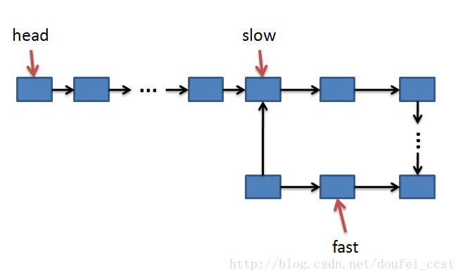
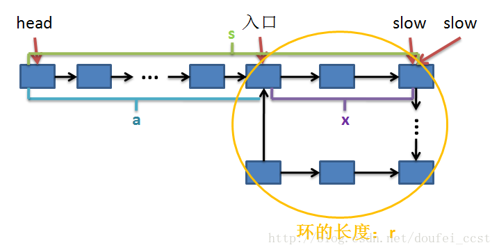
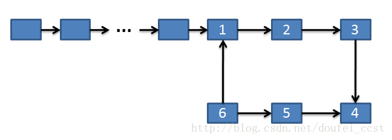
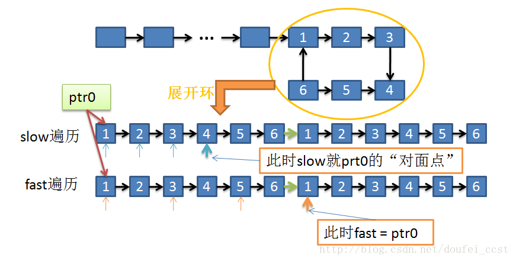
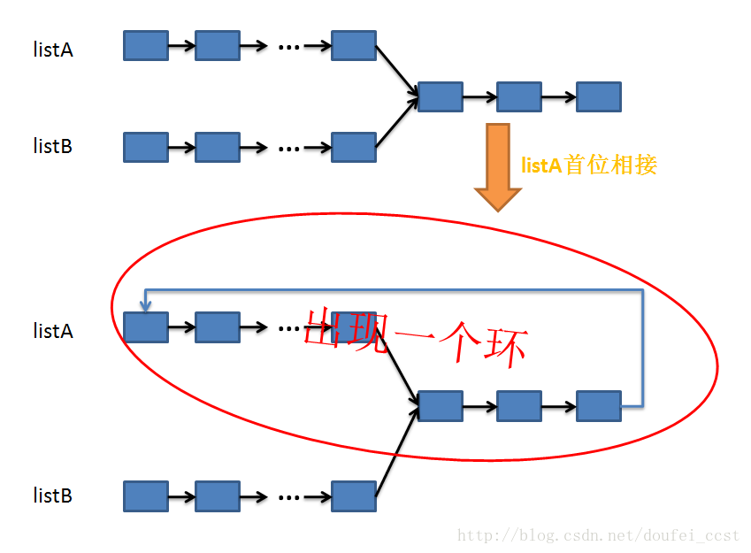

# 一二面视频面问的都挺基础的就不记录了
## top命令的各个字符状态

top命令是Linux下常用的性能分析工具，能够实时显示系统中各个进程的资源占用状况，类似于Windows的任务管理器。top是一个动态显示过程,即可以通过用户按键来不断刷新当前状态.如果在前台执行该命令,它将独占前台,直到用户终止该程序为止.比较准确的说,top命令提供了实时的对系统处理器的状态监视.它将显示系统中CPU最“敏感”的任务列表.该命令可以按CPU使用.内存使用和执行时间对任务进行排序；而且该命令的很多特性都可以通过交互式命令或者在个人定制文件中进行设定。
```
$top
    top - 09:14:56 up 264 days, 20:56,  1 user,  load average: 0.02, 0.04, 0.00
    Tasks:  87 total,   1 running,  86 sleeping,   0 stopped,   0 zombie
    Cpu(s):  0.0%us,  0.2%sy,  0.0%ni, 99.7%id,  0.0%wa,  0.0%hi,  0.0%si,  0.2%st
    Mem:    377672k total,   322332k used,    55340k free,    32592k buffers
    Swap:   397308k total,    67192k used,   330116k free,    71900k cached
    PID USER    PR  NI  VIRT  RES  SHR S %CPU %MEM    TIME+  COMMAND
    1 root      20   0  2856  656  388 S  0.0  0.2   0:49.40 init
    2 root      20   0     0    0    0 S  0.0  0.0   0:00.00 kthreadd
    3 root      20   0     0    0    0 S  0.0  0.0   7:15.20 ksoftirqd/0
    4 root      RT   0     0    0    0 S  0.0  0.0   0:00.00 migration/0
```
- 第一行
09:14:56 ： 系统当前时间
264 days, 20:56 ： 系统开机到现在经过了多少时间
1 users ： 当前2用户在线
load average: 0.02, 0.04, 0.00： 系统1分钟、5分钟、15分钟的CPU负载信息
- 第二行
Tasks：任务;
87 total：很好理解，就是当前有87个任务，也就是87个进程。
1 running：1个进程正在运行
86 sleeping：86个进程睡眠
0 stopped：停止的进程数
0 zombie：僵死的进程数
- 第三行
Cpu(s)：表示这一行显示CPU总体信息
0.0%us：用户态进程占用CPU时间百分比，不包含renice值为负的任务占用的CPU的时间。
0.7%sy：内核占用CPU时间百分比
0.0%ni：改变过优先级的进程占用CPU的百分比
99.3%id：空闲CPU时间百分比
0.0%wa：等待I/O的CPU时间百分比
0.0%hi：CPU硬中断时间百分比
0.0%si：CPU软中断时间百分比
注：这里显示数据是所有cpu的平均值，如果想看每一个cpu的处理情况，按1即可；折叠，再次按1；
```
st 的全称是 Steal Time ，就是 Xen Hypervisor 分配给运行在其它虚拟机上的任务的实际 CPU 时间。
%st(Steal time) 是当 hypervisor 服务另一个虚拟处理器的时候，虚拟 CPU 等待实际 CPU 的时间的百分比。
Steal 值比较高的话，需要向主机供应商申请扩容虚拟机。服务器上的另一个虚拟机拥有更大更多的 CPU 时间片，需要申请升级以与之竞
争。另外，高 steal 值也可能意味着主机供应商在服务器上过量地出售虚拟机。如果升级了虚拟机， steal 值还是不降的话，应该寻找另一家服务供应商。
低 steal 值意味着应用程序在目前的虚拟机上运作良好。因为虚拟机不会经常地为了 CPU 时间与其它虚拟机激烈竞争，虚拟机会更快地响应。主机供应商没有过量地出售虚拟服务，绝对是一件好事情。
```
- 第四行
Men：内存的意思
8175320kk total：物理内存总量
8058868k used：使用的物理内存量
116452k free：空闲的物理内存量
283084k buffers：用作内核缓存的物理内存量
- 第五行
Swap：交换空间
6881272k total：交换区总量
4010444k used：使用的交换区量
2870828k free：空闲的交换区量
4336992k cached：缓冲交换区总量
- 进程信息
再下面就是进程信息：
PID：进程的ID
USER：进程所有者
PR：进程的优先级别，越小越优先被执行
NInice：值
VIRT：进程占用的虚拟内存
RES：进程占用的物理内存
SHR：进程使用的共享内存
S：进程的状态。S表示休眠，R表示正在运行，Z表示僵死状态，N表示该进程优先值为负数
%CPU：进程占用CPU的使用率
%MEM：进程使用的物理内存和总内存的百分比
TIME+：该进程启动后占用的总的CPU时间，即占用CPU使用时间的累加值。
COMMAND：进程启动命令名称
### 8.1. top命令交互操作指令
下面列出一些常用的 top命令操作指令
```
q：退出top命令
<Space>：立即刷新
s：设置刷新时间间隔
c：显示命令完全模式
t:：显示或隐藏进程和CPU状态信息
m：显示或隐藏内存状态信息
l：显示或隐藏uptime信息
f：增加或减少进程显示标志
S：累计模式，会把已完成或退出的子进程占用的CPU时间累计到父进程的MITE+
P：按%CPU使用率排行
T：按MITE+排行
M：按%MEM排行
u：指定显示用户进程
r：修改进程renice值
kkill：进程
i：只显示正在运行的进程
W：保存对top的设置到文件^/.toprc，下次启动将自动调用toprc文件的设置。
h：帮助命令。
q：退出
```
注：强调一下，使用频率最高的是P、T、M，因为通常使用top，我们就想看看是哪些进程最耗cpu资源、占用的内存最多； 注：通过”shift + >”或”shift + <”可以向右或左改变排序列 如果只需要查看内存：可用free命令。只查看uptime信息（第一行），可用uptime命令；

### 8.2. 实例
实例1：多核CPU监控
在top基本视图中，按键盘数字“1”，可监控每个逻辑CPU的状况；
```
[rdtfr@bl685cb4-t ^]$ top
top - 09:10:44 up 20 days, 16:51,  4 users,  load average: 3.82, 4.40, 4.40
Tasks: 1201 total,  10 running, 1189 sleeping,   0 stopped,   2 zombie
Cpu0  :  1.3%us,  2.3%sy,  0.0%ni, 96.4%id,  0.0%wa,  0.0%hi,  0.0%si,  0.0%st
Cpu1  :  1.3%us,  2.6%sy,  0.0%ni, 96.1%id,  0.0%wa,  0.0%hi,  0.0%si,  0.0%st
Cpu2  :  1.0%us,  2.0%sy,  0.0%ni, 92.5%id,  0.0%wa,  0.0%hi,  4.6%si,  0.0%st
Cpu3  :  3.9%us,  7.8%sy,  0.0%ni, 83.2%id,  0.0%wa,  0.0%hi,  5.2%si,  0.0%st
Cpu4  :  4.2%us, 10.4%sy,  0.0%ni, 63.8%id,  0.0%wa,  0.0%hi, 21.5%si,  0.0%st
Cpu5  :  6.8%us, 12.7%sy,  0.0%ni, 80.5%id,  0.0%wa,  0.0%hi,  0.0%si,  0.0%st
Cpu6  :  2.9%us,  7.2%sy,  0.0%ni, 85.3%id,  0.0%wa,  0.0%hi,  4.6%si,  0.0%st
Cpu7  :  6.2%us, 13.0%sy,  0.0%ni, 75.3%id,  0.0%wa,  0.0%hi,  5.5%si,  0.0%st
Mem:  32943888k total, 32834216k used,   109672k free,   642704k buffers
Swap: 35651576k total,  5761928k used, 29889648k free, 16611500k cached
```
实例2：高亮显示当前运行进程
```
在top基本视图中,按键盘“b”（打开/关闭加亮效果）；
````
实例3：显示完整的程序命令
命令：top -c
```
[rdtfr@bl685cb4-t ^]$ top -c
top - 09:14:35 up 20 days, 16:55,  4 users,  load average: 5.77, 5.01, 4.64
Tasks: 1200 total,   5 running, 1192 sleeping,   0 stopped,   3 zombie
Cpu(s):  4.4%us,  6.0%sy,  0.0%ni, 83.8%id,  0.2%wa,  0.0%hi,  5.5%si,  0.0%st
Mem:  32943888k total, 32842896k used,   100992k free,   591484k buffers
Swap: 35651576k total,  5761808k used, 29889768k free, 16918824k cached
PID USER      PR  NI  VIRT  RES  SHR S %CPU %MEM    TIME+  COMMAND
2013 apache    18   0  403m  88m 5304 S 25.0  0.3   6:37.44 /usr/sbin/httpd
18335 pubtest   22   0 65576  996  728 R  7.8  0.0   0:00.24 netstat -naltp
16499 rdtfare   15   0 13672 2080  824 R  2.6  0.0   0:00.38 top -c
29684 rdtfare   15   0 1164m 837m  14m S  2.3  2.6 148:47.54 ./autodata data1.txt
12976 pubtest   18   0  238m 9000 1932 S  1.6  0.0 439:28.44 tscagent -s TOEV_P
```
实例4：显示指定的进程信息
命令：top -p pidid
```
/opt/app/tdv1/config#top -p 17265
top - 09:17:34 up 455 days, 17:55,  2 users,  load average: 3.76, 4.56, 4.46
Tasks:   1 total,   0 running,   1 sleeping,   0 stopped,   0 zombie
Cpu(s):  7.8%us,  1.9%sy,  0.0%ni, 89.2%id,  0.0%wa,  0.1%hi,  1.0%si,  0.0%st
Mem:   8175452k total,  8103988k used,    71464k free,   268716k buffers
Swap:  6881272k total,  4275424k used,  2605848k free,  6338184k cached
PID USER      PR  NI  VIRT  RES  SHR S %CPU %MEM    TIME+  COMMAND
17265 tdv1      15   0 56504  828  632 S  0.0  0.0 195:53.25 redis-server
```
指定进程信息有多个时，需要结合其它工具将回车替换为,（-p 支持pid,pid,pid语法）

命令：top -p pgrep MULTI_PROCESS | tr “\n” ”,” | sed ‘s/,$//’
```
/opt/app/tdv1$top -p `pgrep java | tr "\\n" "," | sed 's/,$//'`
top - 14:05:31 up 53 days,  2:43,  9 users,  load average: 0.29, 0.34, 0.22
Tasks:   3 total,   0 running,   3 sleeping,   0 stopped,   0 zombie
Cpu(s):  5.9%us,  8.2%sy,  0.0%ni, 86.0%id,  0.0%wa,  0.0%hi,  0.0%si,  0.0%st
Mem:  66082088k total, 29512860k used, 36569228k free,   756352k buffers
Swap: 32767992k total,  1019900k used, 31748092k free, 15710284k cached

  PID USER      PR  NI  VIRT  RES  SHR S %CPU %MEM    TIME+  COMMAND                                          27855 rdtfare   20   0 4454m 1.3g 5300 S  0.7  2.0 338:31.37 java
 2034 jenkins   20   0 18.3g 5.2g 5284 S  0.3  8.2  56:02.38 java                                             12156 rdtfare   20   0 4196m 1.2g  12m S  0.3  2.0  86:34.62 java
```
### 8.3. 更强大的工具
htop
htop 是一个 Linux 下的交互式的进程浏览器，可以用来替换Linux下的top命令。

与Linux传统的top相比，htop更加人性化。它可让用户交互式操作，支持颜色主题，可横向或纵向滚动浏览进程列表，并支持鼠标操作。

与top相比，htop有以下优点：

可以横向或纵向滚动浏览进程列表，以便看到所有的进程和完整的命令行。
在启动上，比top 更快。
杀进程时不需要输入进程号。
htop 支持鼠标操作。
## 链表有环的问题，环入口节点，环大小，环包含的节点（O(N)时间复杂度）
>首先，关于单链表中的环，一般涉及到一下问题：
1.给一个单链表，判断其中是否有环的存在；
2.如果存在环，找出环的入口点；
3.如果存在环，求出环上节点的个数；
4.如果存在环，求出链表的长度；
5.如果存在环，求出环上距离任意一个节点最远的点（对面节点）；
6.（扩展）如何判断两个无环链表是否相交；
7.（扩展）如果相交，求出第一个相交的节点；

1.判断时候有环（链表头指针为head）

对于这个问题我们可以采用“快慢指针”的方法。就是有两个指针fast和slow，开始的时候两个指针都指向链表头head，然后在每一步

操作中slow向前走一步即：slow = slow->next，而fast每一步向前两步即：fast = fast->next->next。

由于fast要比slow移动的快，如果有环，fast一定会先进入环，而slow后进入环。当两个指针都进入环之后，经过一定步的操作之后

二者一定能够在环上相遇，并且此时slow还没有绕环一圈，也就是说一定是在slow走完第一圈之前相遇。

```
if (slow != NULL && fast->next != NULL)  
{  
         slow = slow -> next ;  
         fast = fast -> next -> next ;  
}  
```
也就是说，slow每次向前走一步，fast向前追了两步，因此每一步操作后fast到slow的距离缩短了1步，这样继续下去就会使得
两者之间的距离逐渐缩小：...、5、4、3、2、1、0 -> 相遇。又因为在同一个环中fast和slow之间的距离不会大于换的长度，因此

到二者相遇的时候slow一定还没有走完一周（或者正好走完以后，这种情况出现在开始的时候fast和slow都在环的入口处）。

下面给出问题1的完整代码：
```
typedef struct node{  
    char data ;  
    node * next ;  
}Node;  
bool exitLoop(Node *head)  
{  
    Node *fast, *slow ;  
    slow = fast = head ;  
  
    while (slow != NULL && fast -> next != NULL)  
    {  
        slow = slow -> next ;  
        fast = fast -> next -> next ;  
        if (slow == fast)  
            return true ;  
    }  
    return false ;  
}  
```
2. 找出环的入口点：
下面看问题2，找出环的入口点：


从上面的分析知道，当fast和slow相遇时，slow还没有走完链表，假设fast已经在环内循环了n(1<= n)圈。假设slow走了s步，则fast走了2s步，又由于fast走过的步数 = s + n*r（s + 在环上多走的n圈），则有下面的等式：

    2*s = s + n  * r ; (1)
    => s = n*r (2)

如果假设整个链表的长度是L，入口和相遇点的距离是x（如上图所示），起点到入口点的距离是a(如上图所示)，则有：

    a + x = s = n * r; (3)  由（2）推出

    a + x = (n - 1) * r + r  = (n - 1) * r + (L - a) (4) 由环的长度 = 链表总长度 - 起点到入口点的距离求出

    a = (n - 1) * r + (L -a -x) (5)


集合式子（5）以及上图我们可以看出，从链表起点head开始到入口点的距离a,与从slow和fast的相遇点（如图）到入口点的距离相等。

因此我们就可以分别用一个指针（ptr1, prt2），同时从head与slow和fast的相遇点出发，每一次操作走一步，直到ptr1 == ptr2，此时的位置也就是入口点！

到此第二个问题也已经解决。
```
Node* findLoopStart(Node *head)  
{  
    Node *fast, *slow ;  
    slow = fast = head ;  
  
    while (slow != NULL && fast -> next != NULL)  
    {  
        slow = slow -> next ;  
        fast = fast -> next -> next ;  
        if (slow == fast) break ;  
    }  
    if (slow == NULL || fast -> next == NULL) return NULL ; //没有环，返回NULL值  
  
    Node * ptr1 = head ; //链表开始点  
    Node * ptr2 = slow ; //相遇点  
    while (ptr1 != ptr2)   
    {  
        ptr1 = ptr1 -> next ;  
        ptr2 = ptr2 -> next ;  
    }  
    return ptr1 ; //找到入口点  
}  
```
3. 如果存在环，求环上节点的个数：

对于这个问题，我这里有两个思路（肯定还有其它跟好的办法）：

思路1：记录下相遇节点存入临时变量tempPtr，然后让slow(或者fast，都一样)继续向前走slow = slow -> next；一直到slow == tempPtr; 此时经过的步数就是环上节点的个数；

思路2： 从相遇点开始slow和fast继续按照原来的方式向前走slow = slow -> next; fast = fast -> next -> next；直到二者再次项目，此时经过的步数就是环上节点的个数 。


第一种思路很简单，其实就是一次遍历链表的环，从而统计出点的个数，没有什么可以详细解释的了。

对于第二种思路，我们可以这样想，结合上面的分析，fast和slow没一次操作都会使得两者之间的距离较少1。我们可以把两者相遇的时候看做两者之间的距离正好是整个环的

长度r。因此，当再次相遇的时候所经过的步数正好是环上节点的数目。

由于这两种思路都比较简单，代码也很容易实现，这里就不给出了。


4. 是如果存在环，求出链表的长度：

到这里，问题已经简单的多了，因为我们在问题1、2、3中已经做得足够的”准备工作“。

我们可以这样求出整个链表的长度：

链表长度L = 起点到入口点的距离 + 环的长度r;

已经知道了起点和入口点的位置，那么两者之间的距离很好求了吧！环的长度也已经知道了，因此该问题也就迎刃而解了！

5. 求出环上距离任意一个节点最远的点（对面节点）
如下图所示，点1和4、点2和5、点3和6分别互为”对面节点“ ，也就是换上最远的点，我们的要求是怎么求出换上任意一个点的最远点。

对于换上任意的一个点ptr0, 我们要找到它的”对面点“，可以这样思考：同样使用上面的快慢指针的方法，让slow和fast都指向ptr0，每一步都执行与上面相同的操作（slow每次跳一步，fast每次跳两步），

当fast = ptr0或者fast = prt0->next的时候slow所指向的节点就是ptr0的”对面节点“。

为什么是这样呢？我们可以这样分析：

如上图，我们想像一下，把环从ptro处展开，展开后可以是无限长的（如上在6后重复前面的内容）如上图。

现在问题就简单了，由于slow移动的距离永远是fast的一般，因此当fast遍历玩整个环长度r个节点的时候slow正好遍历了r/2个节点，

也就是说，此时正好指向距离ptr0最远的点。

6. 对于问题6（扩展）如何判断两个无环链表是否相交，和7（扩展）如果相交，求出第一个相交的节点，其实就是做一个问题的转化：

假设有连个链表listA和listB，如果两个链表都无环，并且有交点，那么我们可以让其中一个链表（不妨设是listA）的尾部节点连接到其头部，这样在listB中就一定会出现一个环。

因此我们将问题6和7分别转化成了问题1和2.

看看下图就会明白了：


## 对于求环内节点
面试官说可以牺牲空间，那么就用一个map保存节点，进行访问计数，环入口节点肯定是第一个变成2的，然后从该节点开始后面所有的节点都是环内节点
## 两个链表做栈，求push，pop操作以及保存当前栈的最小值

这里贴一个2个栈的实现方法（其实单链表就能做栈了）
```
class Solution {
public:
    stack <int> stack1,stack2;
    void push(int value) {
        stack1.push(value);
        if(stack2.empty())
            stack2.push(value);
        else if(value<=stack2.top())
            stack2.push(value);
    }
    void pop() {
        if(stack1.empty())
            return;
        if(stack1.top()==stack2.top())
            stack2.pop();
        stack1.pop();
    }
    int top() {
        return stack1.top();
    }
    int min() {
        return stack2.top();  
    }
};
```
## 算法求平方根
设double low=0,double up=x
double mid = (low + up) / 2
如果mid * mid > x,则up = mid;如果mid * mid < x,则low = mid;如果fabs(mid * mid - x) <= 1e-6,则返回mid,否则继续迭代计算
```
double sqrt(double x)
{
    double low = 0;
    double up = x;
    double mid = (low + up) / 2;
    while(fabs(low - up) >= 1e-6)
    {
        if(mid * mid > x)
            up = mid;
        else if(mid * mid < x)
            low = mid;
        else if(fabs(mid * mid - x) < 1e-6)
            return mid;
        mid = (up + low) / 2;
    }
    return mid;
}
````
## 100G大文件，内存2G，每行是一个字符串，求去重
[海量数据问题](../海量数据问题.md)