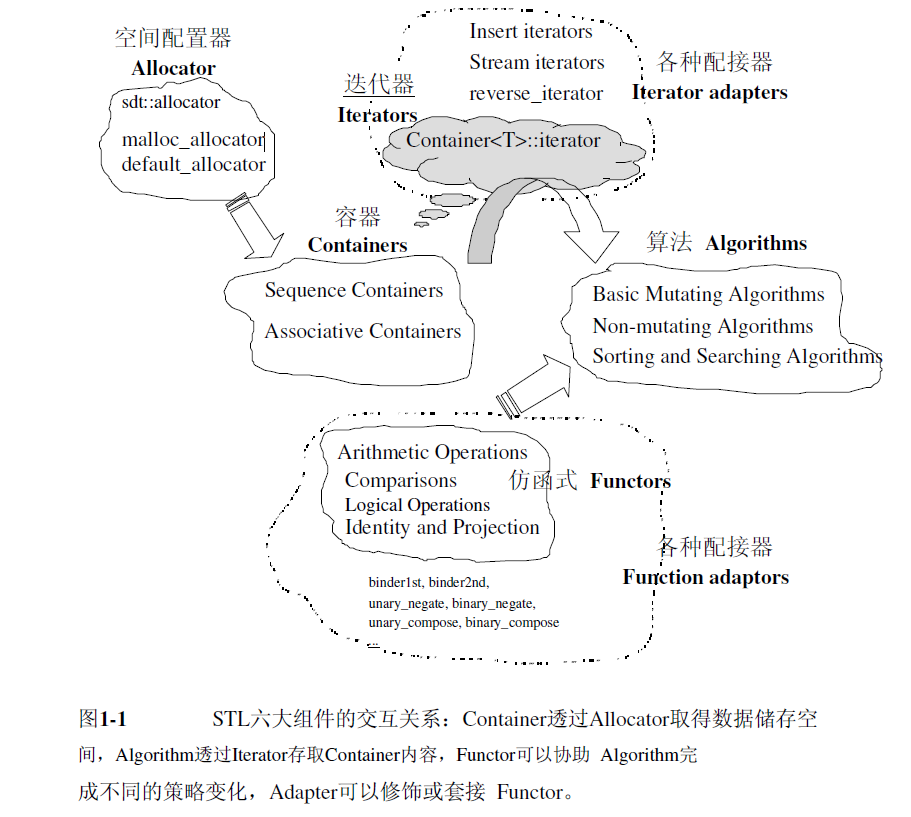
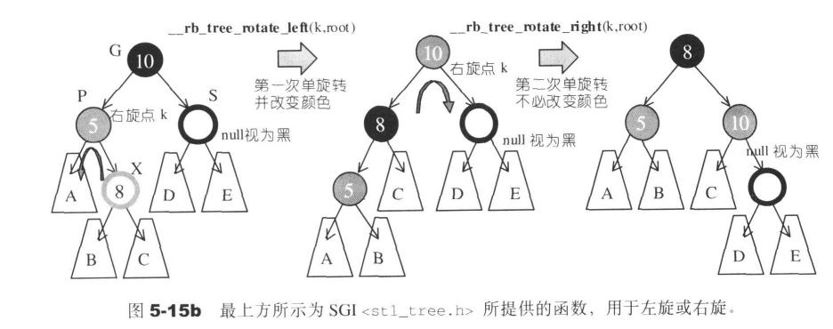
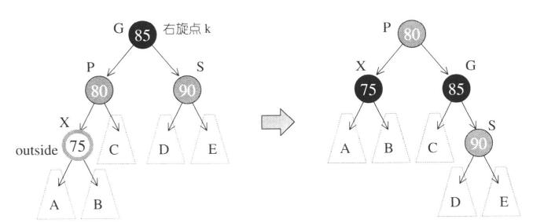
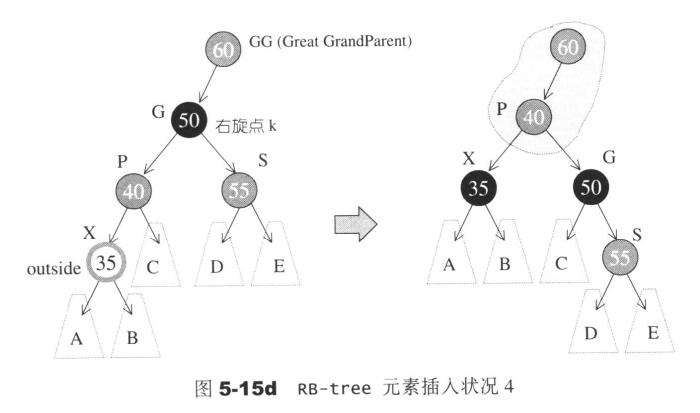
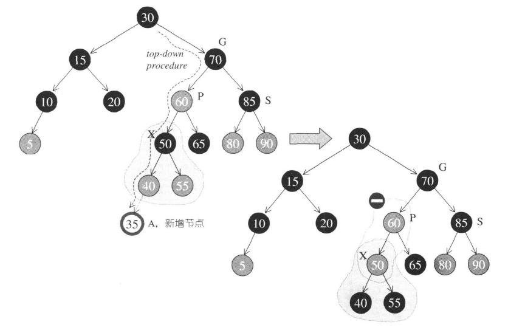
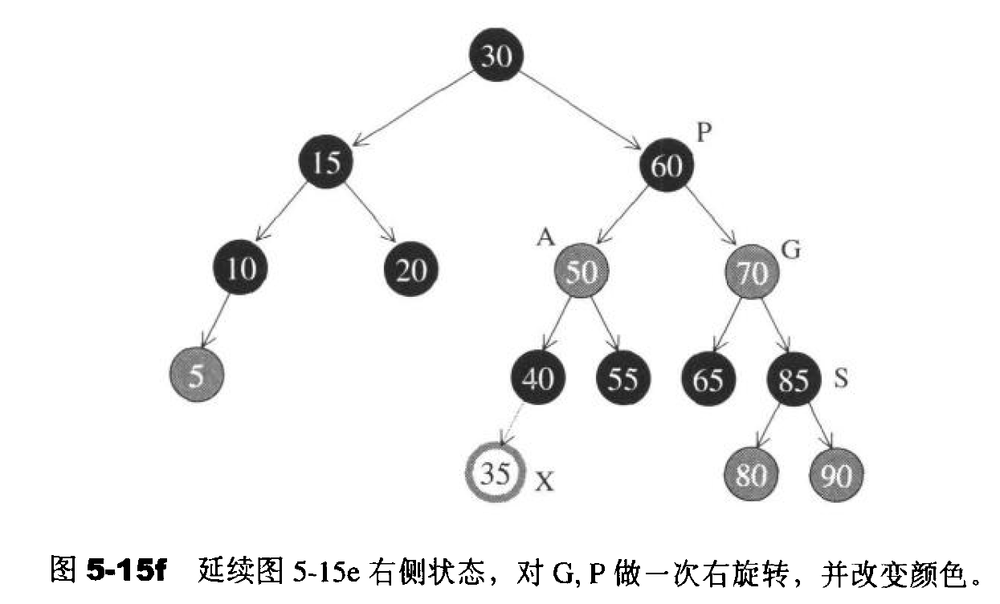
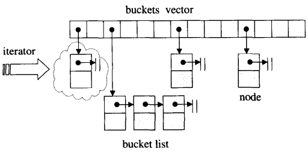

# 第一章 STL概论与版本简介
1. STL提供六大组件，彼此可以组合套用：  
    1.1 容器:各种数据结构，如vector、list、deque、set、map用来存放数据      
    1.2 算法:各种常用算法如sort，search，copy，erase...     
    1.3 迭代器      
    1.4 仿函式(functors):行为类似函式，可作为算法的某种策略。从实作的角度看，仿函式是一种重载了operator()的class或class template。      
    1.5 配接器(adapters):一种用来修饰容器或仿函式或迭代器接口的东西。例如STL提供的queue和stack，虽然看似容器，其实只能算是一种容器配接器，因为他们的底部完全借重deque，所有动作都由底层的deque供应。        
    1.6 配置器(allocators):负责空间配置和管理。从实作的角度看，配置器是一个实现了动态空间配置、空间管理、空间释放的class template。      
    
# 第二章 空间配置器
1. **ptrdiff_t**:两个指针相减的结果的类型为ptrdiff_t,它是一种有符号整数类型。减法运算的值为两个指针在内存中的距离（以数组元素的长度为单位，而非字节），因为减法运算的结果将除以数组元素类型的长度。所以该结果与数组中存储的元素的类型无关。 

2. 
```
template <class T>
inline T* allocate(ptrdiff_t size, T*) {
    set_new_handler(0);
    T* tmp = (T*)(::operator new((size_t)(size * sizeof(T))));
    if (tmp == 0) {
        cerr << "out of memory" << endl;
        exit(1);
    }
    return tmp;
}

template <class T>
    inline void deallocate(T* buffer) {
        ::operator delete(buffer);
}
```
3. 一个不常用的new操作placement new，在使用时需要我们传入一个指针，此时会在该指针指向的内存空间构造该对象，该指针指向的地址可以使堆空间，栈空间，也可以是静态存储区。
## 1、SGI 特殊的空间配置器，std::alloc
SGI STL 的配置器与众不同，也与标准规范不同，其名称是 alloc 而非 allocator ，而且不接受任何参数。

我们所习惯的c++内存配置操作和释放操作如下：
```
class Foo { ... };
Foo* pf = new Foo; // 配置内存，然后构造对象
delete pf; // 将对象析构，然后释放内存
```
这其中的new 操作符（new operator）包含两阶段操作：
```
（1）调用operator new配置内存
（2）调用Foo::Foo( )构造函数构造对象内容。
```
delete操作符包含两阶段操作：
```
（1）调用Foo::~Foo( )析构函数将对象析构。
（2）调用operator delete释放内存
```
注：如果只是进行空间分配操作，那么使用operator new就可以了，就好比C的malloc函数；如果已经分配好了空间，想在上面构造一个对象，那么可以使用placement new。

STL allocator 将这两阶段操作区分开来。内存配置操作由 alloc::allocate() 负责，内存释放操作由 alloc::deallocate() 负责；对象构造操作由 ::construct() 负责，对象析构操作由 ::destroy() 负责。

内存空间的配置/释放与对象内容的构造/析构，分别着落在<stl_alloc.h>和<stl_construct.h>这两个文件身上。此外还有一个文件<stl_uninitialized.h>，这里定义了一些全局函数，用来填充(fill)或复制(copy)大块内存数据，它们也都隶属于STL标准规范。

总结：      
STL空间配置器主要分三个文件实现：       
（1）<stl_construct.h> ：这里定义了全局函数construct()和destroy()，负责对象的构造和析构。   
（2）<stl_alloc.h>：文件中定义了一、二两级配置器，彼此合作，配置器名为alloc。   
（3）<stl_uninitialized.h>：这里定义了一些全局函数，用来填充(fill)或复制(copy)大块内存数据，他们也都隶属于STL标准规范。     

STL提供了五个全局函数用于处理空间，分别为：
```
1. construct 用于构造；
2. destroy 用于析构；
3. uninitialized_copy(first, last, result) 将[first,last)
范围内的对象复制到result处；
4. uninitiated_fill(first, last, X) 将[first,last)范围内的内
存用对象X的副本填充；
5. uninitiated_fill_n(first, n, X) 将first开始的n个连续的内存
空间用X的副本填充；
```
## 2、std::alloc如何以高效率淘汰前面的allocator的
简单来说，alloc主要在如下方面超越了allocator
```
1.通过内存池技术提升了分配效率:
2.对小内存频繁分配所可能造成的内存碎片问题的处理
3.对内存不足时的处理
```
## 3、两级空间配置器
SGI STL在<stl_alloc.h>中定义了两级配置器。第一级空间配置器使用malloc/free函数，当分配的空间大小超过128 bytes的时候使用第一级空间配置器；第二级空间配置器使用了内存池技术，当分配的空间大小小于128 bytes的时候，将使用第二级空间配置器。

当用户申请大区块时，它将其交予第一级配置器。当用户申请小区块时，将与内存池打交道，内存池通过自由链表(free-list)来管理小区块，当内存池不足时，会一次性向堆中申请足够大的空间。用户可以通过宏来控制使用哪一级配置器(默认为二级配置器)。
```
static void* allocate(size_t __n)
  {
    void* __ret = 0;
    // 如果大于128 bytes，则使用第一级空间配置器
    if (__n > (size_t) _MAX_BYTES) {
      __ret = malloc_alloc::allocate(__n);
    }
    else {
      // 通过大小取得free-list数组下标，随后取得对应节点的指针
      // 相当于&_S_free_list[_S_freelist_index(__n)]
      _Obj* __STL_VOLATILE* __my_free_list = _S_free_list + _S_freelist_index(__n);
      _Obj* __RESTRICT __result = *__my_free_list;
      // 如果没有可用的节点，则通过_S_refill分配新的节点
      if (__result == 0)
        __ret = _S_refill(_S_round_up(__n));
      else {
        // 将当前节点移除，并当做结果返回给用户使用
        *__my_free_list = __result -> _M_free_list_link;
        __ret = __result;
      }
    }

    return __ret;
  };
```

大量分配小块的内存空间会带来问题：一是从运行库的堆管理器中取得的内存（如通过malloc获得），会有一部分空间用于存储管理信息，用于管理各个内存块，导致内存的使用率降低；二是过多的小块内存会带来内存碎片问题；采用合适的内存池技术可以避免这些问题。

配置器除了负责配置，也负责回收。为了管理方便，SGI第二级配置器会主动将任何小额区块的内存需求量上调至8的倍数。并维护16个free-lists，各自管理大小分别为8，16，24，32，40，48，56，64，72，80，88，96，104， 112，120，128 字节的小额区块。当申请小于等于128字节时就会检查对应的free list，如果free-list中有可用的区块，就直接拿来，如果没有，就准备通过refill为对应的free-list 重新填充空间。free-list的节点结构如下：
```
union obj
{
    union obj* free_list_link;
    char client_data[1];
};
```

这里使用union结构，是为了节省空间。 
空间的回收，则是把内存重新加入到free-list对应的节点链表上去。

4、refill的机制
前面提到，如果free-list中没有可用的区块，就通过refill为对应的free-list 重新填充空间。此时refill进行了怎样的操作呢？

默认操作是通过_S_chunk_alloc从内存池中取得20个新的节点添加到free-list链表中，而如果内存池中的内存不够用，这时候能分多少就分多少节点，返回的相应的节点数。再万一内存池一个节点都提供不了，就给内存池新增空间，如果失败，再抛出bad_alloc异常。
```
template <bool __threads, int __inst>
void*
__default_alloc_template<__threads, __inst>::_S_refill(size_t __n)
{
    int __nobjs = 20;
    // 通过内存池分配内存，第二个参数为传引用方式
    char* __chunk = _S_chunk_alloc(__n, __nobjs);
    _Obj* __STL_VOLATILE* __my_free_list;
    _Obj* __result;
    _Obj* __current_obj;
    _Obj* __next_obj;
    int __i;
    // 如果只分配了一个节点，那么直接返回给用户就是了
    if (1 == __nobjs) return(__chunk);
    // 如果分配了不止一个节点，那么多余的我们要放到free-list里面去
    __my_free_list = _S_free_list + _S_freelist_index(__n);

    /* Build free list in chunk */
      __result = (_Obj*)__chunk;
      *__my_free_list = __next_obj = (_Obj*)(__chunk + __n);
      for (__i = 1; ; __i++) {
        __current_obj = __next_obj;
        __next_obj = (_Obj*)((char*)__next_obj + __n);
        if (__nobjs - 1 == __i) {
            // 最后一个节点的_M_free_list_link指针指向NULL，并跳出循环
            __current_obj -> _M_free_list_link = 0;
            break;
        } else {
            __current_obj -> _M_free_list_link = __next_obj;
        }
      }
    return(__result);
}
```
## 5、内存池
通过_S_chunk_alloc，从内存池中分配空间给free-list。_S_chunk_alloc的流程总结如下：
```
1、 内存池有足够大小的空间，则分配申请的空间；
2、 内存池没有足够大小的空间，但是至少还能分配一个节点的空间，则能分多少分多少；
3、 内存池一个节点都腾不出来，向系统的heap申请2倍于要求大小的空间，在
此之间，如果内存池剩余有空间，则放到free-list中去；
4、 如果向heap申请空间失败，那么只能看free-list中更大的节点是否有可
用空间了，有则用之，同时递归调用自身修正__nobjs；
5、 如果free-list也没有可用节点了，那么转向第一级空间配置器申请空间；
6、 再不行，第一级空间配置器就抛出bad_alloc异常。
```
如果有需求的话，内存池中会不断的通过malloc申请新的内存，最后内存池所拥有的内存也会越来越大，当然最后进程结束的时候，这些内存都会由操作系统收回。
# 第三章 迭代器
## 1、迭代器设计思维-STL关键所在
迭代器：就是提供一种方法，在不需要暴露某个容器的内部表现形式情况下，使之能依次访问该容器中的各个元素。

STL的中心思想在于：将数据容器（containers）和算法（algorithms）分开，彼此独立设计，最后再以一帖粘合剂将它们撮合在一起。只要对算法给予不同的迭代器，就可以对不同容器进行相同的操作。

以算法find( )为例，它接受2个迭代器和1个”搜寻目标”：
```
// 摘自SGI <stl_algo.h>
template <class InputIterator, class T>
InputIterator find(InputIterator first,InputIterator last,const T& value)
{
    while (first != last && *first != value)
        ++first;
    return first;
}
```
只要给予不同的迭代器，find()便能够对不同的容器进行查找操作：
```
#include <vector>
#include <list>
#include <deque>
#include <algorithm>
#include <iostream>
using namespace std;
int main()
{
    const int arraySize = 7;
    int ia[arraySize] = { 0,1,2,3,4,5,6 };
    vector<int> ivect(ia, ia+arraySize);
    list<int> ilist(ia, ia+arraySize);
    deque<int> ideque(ia, ia+arraySize);
    vector<int>::iterator it1 = find(ivect.begin(), ivect.end(), 4);
    if (it1 == ivect.end())
        cout << "4 not found." << endl;
    else // 結果：4 found. 4
        cout << "4 found. " << *it1 << endl;

    list<int>::iterator it2 = find(ilist.begin(), ilist.end(), 6);
    if (it2 == ilist.end())
        cout << "6 not found." << endl;
    else// 結果：6 found. 6
        cout << "6 found. " << *it2 << endl;

    deque<int>::iterator it3 = find(ideque.begin(), ideque.end(), 8);
    if (it3 == ideque.end())
        cout << "8 not found." << endl;
    else// 結果：8 not found.
        cout << "8 found. " << *it3 << endl;

    return 0;
}
```
## 2、迭代器是一种智能指针
迭代器是一种行为类似指针的对象，而指针的各种行为中最常见也最重要的便是内容提领（dereference）和成员访问（member access），因此，迭代器最重要的编程工作就是对 operator* 和 operator-> 进行重载（overloading）工作。

使得所有实现细节得以封装起来，不被使用者看到，是每一种STL容器都提供有专属迭代器的缘故。

## 3、Traits编程技法——STL源代码门钥
迭代器所指对象的型别，称为迭代器的value type。

我们知道： 
（1）通过函数模板的参数类型推导解决函数体内声明变量的问题   
（2）进一步，函数模板的参数类型推导推而导之的只是参数，无法推导函数的返回值型别。这时，如果需要返回类型是迭代器所指对象的类型，解决办法就是内嵌类型声明，即在迭代器内部添加一种“特性”，通过这种“特性”，算法可以很容易地获知迭代器所指对象的类型。

但是，问题来了，并不是所有迭代器都是class type。原生指针是迭代器，但它不是一种类类型，无法定义内嵌类型。怎么办？针对原生指针做特殊化的处理，利用模板偏特化就可以做到了。

利用模板偏特化解决原生指针不能内嵌类型的问题，iterator_traits就是关键。

在STL实现中，traits编程技术利用了“内嵌类型”的编程技巧与C++的template参数推导功能，弥补了C++类型识别方面的不足。通过traits，算法可以原汁原味的将迭代器的属性萃取出来，帮助算法正确高效的运行。

所谓traits，其意义是，如果template < class I>中的I定义有自己的value type，那么通过这个traits的作用，萃取出来的value_type就是I::value_type。traits就像一台”特性萃取机”，萃取出各个迭代器的特性。

## 4、迭代器基本框架
最常用到的迭代器相应型别有五类：value type, difference type, pointer, reference, iterator catagoly。

STL提供的iterator class如下。它不含任何成员，纯粹只是型别定义。
```
template <class Category,
          class T,
          class Distance = ptrdiff_t,
          class Pointer = T*,
          class Reference = T&>
struct iterator {
    typedef Category    iterator_category;
    typedef T           value_type;
    typedef Distance    difference_type;
    typedef Pointer     pointer;
    typedef Reference   reference;
};
```
特性萃取机traits会很原汁原味的榨取出来：
```
template <class I>
struct iterator_traits {
  typedef typename I::iterator_category iterator_category;
  typedef typename I::value_type        value_type;
  typedef typename I::difference_type   difference_type;
  typedef typename I::pointer           pointer;
  typedef typename I::reference         reference;
};
```
这些类型所表示的意义如下：
```
value type 表示迭代器所指对象的型别；
difference type 表示两个迭代器之间的距离；也可表示一个容器最大容量
reference 为引用类型；
pointer 为指针类型；
iterator_category 表明迭代器的类型；
```
根据迭代器移动特性与施行动作，迭代器被分为五类：
```
1、Input Iterator：这种迭代器所指对象，不允许外界改变，只读（read 
only）；
2、Output Iterator：唯写（write only）；
3、Forward Iterator：允许「写入型」算法（例如 replace()）在此种迭
代器所形成的区间上做读写动作；
4、Bidirectional Iterator：可双向移动。某些算法需要逆向走访某个迭
代器区间（例如逆向拷贝某范围内的元素），就可以使用 Bidirectional 
Iterators；
5、Random Access Iterator：前四种迭代器都只供应一部份指标算术能力
（前3种支持 operator++ ，第4种再加上 operator--），第5种则涵盖所
有指标算术能力，包括 p+n, p-n, p[n], p1-p2, p1<p2.
```
# 第四章 序列式容器
## 1、vector
1. vector特性

（1）vector有自动扩容操作，每次扩容伴随着“配置新空间 / 移动旧数据 / 释放旧空间”的操作，因此有一定时间成本。 
（2）vector提供了reserve接口，如果能够对元素个数有大概了解，可以一开始就分配合适的空间。 
（3）vector的内存空间是连续的，对插入元素的操作而言，在vector尾部插入才是合适的选择。维护的是一个连续线性空间，所以vector支持随机存取。 
（4）vector动态增加大小时，并不是在原空间之后持续新空间（无法保证原空间之后尚有可供配置的空间），而是以原大小的2倍另外配置一块较大的空间，接着将原内容拷贝过来，然后才开始在原内容之后构造新元素，并释放原空间。因此，对vector的任何操作，一旦引起空间重新配置，指向原vector的所有迭代器就都失效了。

2. vector与array的区别

vector与array非常相似。两者的唯一区别在于空间运用的灵活性。array是静态空间，一旦配置了就不能改变；vector是动态空间，随着元素的加入，它的内部机制会自行扩充空间以容纳新元素。因此，vector的运用对于内存的合理利用与运用的灵活性有很大的帮助。

3. vector迭代器和数据结构

vector的迭代器是普通指针。因为vector迭代器需要的操作行为，如operator*,operator->,operator++,operator+,operator+= 
等，普通指针天生具备；vector支持随机存取，普通指针正有这种能力。所以vector提供的是Random Access Iterators。

vector所采用的数据结构非常简单：线性连续空间。为了降低空间配置时的速度成本，vector实际配置的大小可能比客户端需求量更大一些，以备将来可能的扩充，这便是容量的观念。增加新元素时，如果容量不足，则扩充至2倍（若原大小为0，则配置为1），2倍容量仍不足，就扩充至足够大的容量。

部分操作示例：
```
#include <vector>
#include <algorithm>
#include <iostream>
using namespace std;
int main()
{
    vector<int> iv(2,9);
    cout << "size=" << iv.size()<< endl;  // size=2
    cout << "capacity=" << iv.capacity()<< endl;  // capacity=2
    iv.push_back(1);
    cout << "size=" << iv.size() << endl;  // size=3
    cout << "capacity=" << iv.capacity() << endl;  // capacity=4
    iv.push_back(2);
    cout << "size=" << iv.size() << endl;  // size=4
    cout << "capacity=" << iv.capacity() << endl;  // capacity=4
    //支持指定位置存取。下面示例随机存。
    vector<int>::iterator ite  = find(iv.begin(), iv.end(), 1);
    if (ite != iv.end()) 
        iv.insert(ite,3,7);//在指针ite处，加入3个7
    cout << "size=" << iv.size() << endl;  // size=7
    cout << "capacity=" << iv.capacity() << endl;  // capacity=8
    for(int i=0; i<iv.size(); ++i)
        cout << iv[i] << ' ';  // 9 9 7 7 7 1 2
    cout << endl;
    iv.clear();//清空
    cout << "size=" << iv.size() << endl;  // size=0
    cout << "capacity=" << iv.capacity() << endl;  // capacity=8
    return 0;
}
```
## 2、list
1. list特性

（1）相较于vector的连续线性空间，list就显得复杂许多。 
（2）它的好处是每次插入或删除一个元素，就配置或释放一个元素空间。因此，list对于空间的运用有绝对的精准，一点也不浪费。 
（3）对于任何位置的元素插入或元素移除，list永远是常数时间。 
（4）list不仅是一个双向链表，而且还是一个环状双向链表。它只需要一个指针便可完整表现整个链表。 
（5）插入操作和接合操作都不会造成原有的list迭代器失效，这在vector是不成立的。因为vector的插入操作可能造成记忆体重新配置，导致原有的迭代器全部失效。甚至list的元素删除操作（erase），也只有“指向被删除元素”的那个迭代器失效，其他迭代器不受任何影响。 
（6）list不再能够像vector那样以普通指针作为迭代器，因为其节点不保证在储存空间中连续。list提供的是Bidirectional Iterators。

2. list的构造与内存管理

list缺省使用alloc作为空间配置器，并据此定义了一个list_node_allocator，以节点大小为配置单位。
```
#include <list>
#include <iostream>
#include <algorithm>
using namespace std;

int main()
{
    list<int> ilist;
    cout << "size=" << ilist.size() << endl;  // size=0
    ilist.push_back(0);
    ilist.push_back(1);
    ilist.push_back(2);
    ilist.push_back(3);
    ilist.push_back(4);
    cout << "size=" << ilist.size() << endl;  // size=5
    list<int>::iterator ite;//声明迭代器
    for(ite = ilist.begin(); ite != ilist.end(); ++ite)
        cout << *ite << ' ';  // 0 1 2 3 4
    cout << endl;
    //插入和接合操作不会造成原迭代器失效
    ite = find(ilist.begin(), ilist.end(), 3);
    if (ite != ilist.end())
        ilist.insert(ite, 99);//在以前3的位置处插入一个数99，
                              //插入完成后，新节点位于ite所指节点前方
    cout << "size=" << ilist.size() << endl;  // size=6
    cout << *ite << endl;  // 3 ！！！！

    for(ite = ilist.begin(); ite != ilist.end(); ++ite)
        cout << *ite << ' ';  // 0 1 2 99 3 4
    cout << endl;
    //删除操作时，指向被删除元素的那个迭代器失效，其他不受影响
    ite = find(ilist.begin(), ilist.end(), 1);
    if (ite != ilist.end())
        cout << *(ilist.erase(ite)) << endl;// 2 ！！！
    cout<<*ite<<endl;// 1 ！！！
    cout<<*(ite++)<<endl;// 1 ！！！
    for(ite = ilist.begin(); ite != ilist.end(); ++ite)
        cout << *ite << ' ';  // 0 2 99 3 4
    cout << endl;

    return 0;
}
```
3. list的元素操作
```
(1)push_front, push_back, 
(2)erase(iterator position), //移除迭代器position所指节点
(3)pop_front, pop_back,
(4)clear, 
(5)remove(const T& value), //将数值为value的所有元素移除
(6)unique, //移除数值相同的连续元素，只剩下一个。注意相同而连续。
(7)splice, //接合操作。将某连续范围的元素从一个list移动到另一个(或同一个)list的某个定点。
(8)merge, //将x合并到*this身上。两个lists内容必须先递增排序。
(9)reverse, 
(10)sort()//list不能使用STL算法sort(),必须使用自己的sort()成员函数,因为STL算法sort()只接受RamdonAccessIterator。list中sort()函数采用quick sort。
```
splice()、reverse()、sort()操作示例：
```
int iv[5] = { 5,6,7,8,9 };
list<int> ilist2(iv, iv+5);
// 目前，ilist 的內容为0 2 99 3 4
ite = find(ilist.begin(), ilist.end(), 99);//在99前面插入
ilist.splice(ite,ilist2);  // 0 2 5 6 7 8 9 99 3 4
ilist.reverse(); // 4 3 99 9 8 7 6 5 2 0
ilist.sort(); // 0 2 3 4 5 6 7 8 9 99
```
## 3、deque
1. deque与vector的区别

（1）vector是单向开口的连续线性空间，用户只能在vector尾部进行插入删除操作（也允许在某个pos处插入，但由于vector的底层实现是数组，过多非队尾位置的插入会有性能上的消耗）。而deque是一种双向开口的连续线性空间，允许在头尾两端分别做插入和删除操作。

（2）deque允许在常数时间内对起头端进行元素的插入或移除操作。

（3）deque没有所谓容量概念。它是动态地用分段连续的空间组合而成，随时可以增加一段新的空间并连接起来。没有必要提供所谓的空间保留（reserve）功能。

（4）deque的最大任务，便是在这些分段的定量连续空间上，维护其整体连续的假象，并提供随机存取的接口。避开了“重新配置、复制、释放”的轮回，代价则是复杂的迭代器架构。

（5）既是分段连续线性空间，就必须有中央控制，而为了维持整体连续的假象，数据结构的设计及迭代器前进后退等操作都颇为繁琐。deque的实现代码分量远比vector或list都多得多。所以，我们应尽可能选择vector而非deque。

2. deque的中控器

deque采用一块所谓的map（注意，不是STL的map容器）作为主控。这里所谓map是一小块连续空间，其中每个元素（此处称为一个节点，node）都是指针，指向另一段（较大的）连续线性空间，称为缓冲区。缓冲区才是deque的储存空间主体。SGI STL 允许我们指定缓冲区大小，默认值0表示将使用512 bytes 缓冲区。

总结：

（1）map是块连续空间，其内的每个元素都是一个指针，指向一块缓冲区。 
（2）进一步发现，map其实是一个T**,也就是说它是一个指针，所指之物又是一个指针，指向型别为T的一块空间。

3. deque的迭代器

deque是分段连续空间。维持其”整体连续”假象的任务，落在了迭代器的operator++和operator–两个运算子身上。

deque的迭代器应该具备什么结构： 
（1）它必须能够指出分段连续空间（亦即缓冲区）在哪里 
（2）它必须能够判断自己是否已经处于其所在缓冲区的边缘，如果是，一旦前进或后退就必须跳跃至下一个或上一个缓冲区。为了能够正确跳跃，deque必须随时掌握管控中心（map）。

所以在迭代器中需要定义：当前元素的指针，当前元素所在缓冲区的起始指针，当前元素所在缓冲区的尾指针，指向map中指向所在缓冲区地址的指针。

deque在效率上不如vector，因此有时候在对deque进行sort的时候，需要先将元素移到vector再进行sort，然后移回来。

4. deque的构造与内存管理

由于deque的设计思想就是由一块块的缓存区连接起来的，因此它的内存管理会比较复杂。插入的时候要考虑是否要跳转缓存区、是否要新建map节点（和vector一样，其实是重新分配一块空间给map，删除原来空间）、插入后元素是前面元素向前移动还是后面元素向后面移动（谁小移动谁）。而在删除元素的时候，考虑是将前面元素后移覆盖需要移除元素的地方还是后面元素前移覆盖（谁小移动谁）。移动完以后要析构冗余的元素，释放冗余的缓存区。
```
#include <deque>
#include <iostream>
#include <algorithm>

using namespace std;
int main()
{
    deque<int,alloc,32> ideq(20,9);  // 注意，alloc 只適用於G++
    cout << "size=" << ideq.size() << endl;  // size=20
    // 现在，已经构造了一个deque，有20个int元素，初值皆为9
    //每个缓冲区大小为32 bytes
    for(int i=0; i<ideq.size(); ++i)
        ideq[i]= i;
    for(int i=0; i<ideq.size(); ++i)
        cout << ideq[i] << ' ';  // 0 1 2 3 4 5 6...19
    cout << endl;
    // 在最尾端增加3個元素，其值為0,1,2
    for(int i=0;i<3;i++)
        ideq.push_back(i);
    for(int i=0; i<ideq.size(); ++i)
        cout << ideq[i] << ' ';  // 0 1 2 3 ... 19 0 1 2
    cout << endl;
    cout << "size=" << ideq.size() << endl;  // size=23
    // 在最尾端增加1個元素，其值為3
    ideq.push_back(3);
    for(int i=0; i<ideq.size(); ++i)
        cout << ideq[i] << ' ';  // 0 1 2 3 ... 19 0 1 2 3
    cout << endl;
    cout << "size=" << ideq.size() << endl;  // size=24
    // 在最前端增加1個元素，其值為99
    ideq.push_front(99);
    for(int i=0; i<ideq.size(); ++i)
        cout << ideq[i] << ' ';  // 99 0 1 2 3...19 0 1 2 3
    cout << endl;
    cout << "size=" << ideq.size() << endl;  // size=25
    // 在最前端增加2個元素，其值分別為98,97
    ideq.push_front(98);
    ideq.push_front(97);
    for(int i=0; i<ideq.size(); ++i)
        cout << ideq[i] << ' ';  // 97 98 99 0 1 2 3...19 0 1 2 3
    cout << endl;
    cout << "size=" << ideq.size() << endl;  // size=27
    // 搜尋數值為99的元素，並列印出來。
    deque<int,alloc,32>::iterator itr;
    itr = find(ideq.begin(), ideq.end(), 99);
    cout << *itr << endl;  // 99
    cout << *(itr.cur) << endl;  // 99
    return 0;
}
```
另外，deque 的元素操作也包括pop_back, pop_front, clear, erase, insert等。
## 4、stack
stack是一种先进后出的数据结构，只有一个出口。允许新增元素、移除元素、取得最顶端元素。不允许有遍历行为。

在SGI STL的源码<stl_stack.h>的设计中，它是基于某种容器作为底部结构的，默认容器是deque容器，用户也可以自己指定容器的类型。

stack不提供走访功能，也不提供迭代器。

stack源码如下：
```
template <class T, class Sequence = deque<T> >
class stack {
    // 以下的__STL_NULL_TMPL_ARGS 會開展為<>，見1.9.1 節
    friend bool operator==__STL_NULL_TMPL_ARGS (const stack&, const stack&);
    friend bool operator<__STL_NULL_TMPL_ARGS (const stack&, const stack&);
public:
    typedef typename Sequence::value_type value_type;
    typedef typename Sequence::size_type size_type;
    typedef typename Sequence::reference reference;
    typedef typename Sequence::const_reference const_reference;
protected:
    Sequence c; // 底層容器
public:
    // 以下完全利用Sequence c 的操作，完成stack 的操作。
    bool empty() const { return c.empty(); }
    size_type size() const { return c.size(); }
    reference top() { return c.back(); }
    const_reference top() const { return c.back(); }
    // deque 是兩頭可進出，stack 是末端進，末端出（所以後進者先出）。
    void push(const value_type& x) { c.push_back(x); }
    void pop() { c.pop_back(); }
};
template <class T, class Sequence>
bool operator==(const stack<T, Sequence>& x, const stack<T, Sequence>& y)
{
    return x.c == y.c;
}
template <class T, class Sequence>
bool operator<(const stack<T, Sequence>& x, const stack<T, Sequence>& y)
{
    return x.c < y.c;
}
```

除了deque外，list也是双向开口的数据结构。若以list作为底部结构并封闭其头端开口，也能轻易形成一个stack。下面是做法示范：
```
#include <stack>
#include <list>
#include <iostream>
#include <algorithm>
using namespace std;
int main()
{
    stack<int,list<int>> istack;
    istack.push(1);
    istack.push(3);
    istack.push(5);
    istack.push(7);
    cout << istack.size() << endl;  // 4
    cout << istack.top() << endl;  // 7
    istack.pop(); cout << istack.top() << endl;// 5
    istack.pop(); cout << istack.top() << endl;// 3
    istack.pop(); cout << istack.top() << endl;// 1
    cout << istack.size() << endl;  // 1
    return 0;
}
```
## 5、queue
queue是一种先进先出的数据结构。有两个出口，允许新增、移除元素、从最底端加入、取得最顶端元素。不允许遍历行为。

deque是双向队列，而queue是单向队列。

deque是双向开口的数据结构，若以deque为底部结构并封闭其底端出口和前端入口，便轻而易举的形成了一个queue。因此，SGI STL以deque作为缺省情况下的queue底部结构。

queue不提供遍历功能，也不提供迭代器。

除了deque外，list也是双向开口的数据结构。若以list作为底部结构并封闭其某些接口，也能轻易形成一个queue。下面是做法示范：
```
#include <queue>
#include <list>
#include <iostream>
#include <algorithm>
using namespace std;
int main()
{
    queue<int,list<int>> iqueue;
    iqueue.push(1);
    iqueue.push(3);
    iqueue.push(5);
    iqueue.push(7);
    cout << iqueue.size() << endl;  // 4
    cout << iqueue.front() << endl;  // 1
    iqueue.pop(); cout<<iqueue.front()<<endl;// 3
    iqueue.pop(); cout<<iqueue.front()<<endl;// 5
    iqueue.pop(); cout<<iqueue.front()<< endl;// 7
    cout << iqueue.size() << endl;  // 1
    return 0;
}
```
## 6、优先队列（基于heap）
STL中优先队列priority_queue是基于堆实现的。所谓优先队列即元素具有优先级的队列，在最大优先级队列中，队列最前面的元素具有最高的优先级（数值最高），最大优先级队列基于最大堆（max-heap）实现，适合作为其底层机制。STL供应的是最大堆。

priority_queue是一个拥有权值观念的queue。只允许在底部加入新元素，顶部取出元素，除此之外别无他法。priority_queue中的元素自动依照元素的权值排列，最高者排前面。

缺省情况下利用一个最大堆完成，后者是一个以vector表现的完全二叉树。最大堆可满足priority_queue需要的”依照权值高低自动递减排序”的特性。

1. 堆的介绍

二叉堆是一颗完全二叉树，整棵二叉树除了最底层的叶节点之外是填满的，而最底层的叶节点从左至右不得有空隙。

（1）max_heapify 最大堆性质的维护：时间复杂度为O(lgN)
```
void maxheapify(int a[], int i, int heapsize)
{
    int l = (i<<1);//左孩子
    int r = (i<<1) + 1;//右孩子
    int largest = i;

    if (l <= heapsize && a[l] > a[largest])
    {
        largest = l;
    }
    if (r <= heapsize && a[r] > a[largest])
    {
        largest = r;
    }
    if (largest != i)
    {
        swap(a[largest], a[i]);
        maxheapify(a, largest, heapsize);
    }
}
```
(2)建堆：时间复杂度O(N)

我们可以从后往前扫描数组，对每一个节点都进行maxheapify操作，这样就建立了一个堆。但是对于叶子节点而言，调用maxheapify操作是没有意义的。对于拥有n个节点的堆而言，其叶子节点的下标为[n/2]+1, [n/2]+2, …, n。因此，我们可以从n/2开始往前进行maxheapify操作。
```
void build_heap(int a[], int n)
{
    for (int i = n/2; i >= 1; --i)
    {
        max_heapify(a, i, n);
    }
}
```
(3)堆排序

建好一个堆后，堆排序就比较简单了。每次把第一个节点和最后一个节点的值交换，然后对第一个节点调用maxheapify操作，直到堆的元素个数减小到1。堆排序的时间复杂度为O(NlgN)，因为maxheapify中，前面两个if语句（也就是从左右子节点取得最大值节点）的顺序是可以随意安排的，所以堆排序不是稳定排序。
```
void heap_sort(int a[], int n)
{
    build_heap(a, n);
    for (int i = n; i >= 2; --i)
    {
        swap(a[1], a[i]);
        max_heapify(a, 1, i-1);
    }
}
```
2. STL heap算法
```
（1）push_heap：将新节点加入到堆的尾端，并调整为新堆。为满足
最大堆的条件，执行上溯过程：将新节点与父节点比较，如果键值key
比父节点大，就父子对换位置。如此一直上溯，直到不需对换或直到根
节点为止。
执行该操作之前，要确保新元素已经加入到底部容器（vector）的最尾端。

（2）pop_heap：取走根节点，并调整为新堆（此处的取走，只是从堆
中取走，并放置在底部容器尾端）。为满足最大堆的条件，执行下溯过
程：将空间节点和其较大子节点对调，并持续下放，直至叶节点为止。
执行过程即是：将最下层最右边的叶节点拿出，先将其放置在根节点位
置，然后不断执行下溯，直至满足最大堆。
注：执行pop_heap之后，最大元素只是被放置在底部容器最尾端，尚
未被取走。要取其值可使用底部容器（vector）提供的back()函数。
要移除它可使用底部容器（vector）提供的pop_back()函数。

（3）sort_heap：该算法不断对heap进行pop操作，达到排序的效
果。排序过后，原来的堆就不是一个合法的堆了。

（4）make_heap：该算法将一段现有数据转化为一个heap。
```
heap不提供遍历功能，也不提供迭代器。 
heap测试实例：
```
#include <vector>
#include <iostream>
#include <algorithm> // heap algorithms
using namespace std;
int main()
{
    //(1)test heap (底層以vector 完成)
    int ia1[9] = {0,1,2,3,4,8,9,3,5};
    vector<int> ivec(ia1, ia1+9);
    make_heap(ivec.begin(), ivec.end());//转化为堆
    for(int i=0; i<ivec.size(); ++i)
        cout << ivec[i] << ' ';// 9 5 8 3 4 0 2 3 1
    cout << endl;
    ivec.push_back(7);
    push_heap(ivec.begin(), ivec.end());//加入，并调整为新堆
    for(int i=0; i<ivec.size(); ++i)
        cout<<ivec[i] << ' ';// 9 7 8 3 5 0 2 3 1 4
    cout << endl;

    pop_heap(ivec.begin(), ivec.end());//取到根节点，并调整为堆
    cout<<ivec.back()<<endl;// 9.return but no remove.
    ivec.pop_back();//remove last elem and no return
    for(int i=0; i<ivec.size(); ++i)
        cout << ivec[i] << ' ';// 8 7 4 3 5 0 2 3 1
    cout << endl;

    sort_heap(ivec.begin(), ivec.end());
    for(int i=0; i<ivec.size(); ++i)
        cout << ivec[i] << ' ';// 0 1 2 3 3 4 5 7 8
    cout << endl;

    //(2)test heap (底层以array 完成)
    int ia[9] = {0,1,2,3,4,8,9,3,5};
    make_heap(ia, ia+9);
    // array 无法动态改变大小，因此不可以对满载的array 做push_heap() 操作。
    // 因为那得先在array 尾端增加一个元素。
    sort_heap(ia, ia+9);
    for(int i=0; i<9; ++i)
        cout << ia[i] << ' ';// 0 1 2 3 3 4 5 8 9
    cout << endl;
    // 经过排序之后的heap，不再是个合法的heap
    // 重新再做一个heap
    make_heap(ia, ia+9);
    pop_heap(ia, ia+9);
    cout << ia[8] << endl;  // 9

    //(3)test heap (底层以array 完成)
    int ia2[6] = {4,1,7,6,2,5};
    make_heap(ia2, ia2+6);
    for(int i=0; i<6; ++i)
        cout << ia2[i] << ' ';// 7 6 5 1 2 4
    cout << endl;

    return 0;
}
```
3. priority_queue

STL priority_queue往往不被归类为container（容器），而被归类为 container adapter。

priority_queue的所有元素，进出都有一定规则，只有最顶端的元素才有机会被外界取用。priority_queue不提供遍历功能，也不提供迭代器。 
priority_queue测试实例：
```
#include <queue>
#include <iostream>
#include <algorithm>
using namespace std;
int main()
{
    // test priority queue...
    int ia[9] = {0,1,2,3,4,8,9,3,5};
    priority_queue<int> ipq(ia, ia+9);
    cout << "size=" << ipq.size() << endl;  // size=9
    for(int i=0; i<ipq.size(); ++i)
        cout << ipq.top() << ' ';  // 9 9 9 9 9 9 9 9 9
    cout << endl;
    while(!ipq.empty())
    {
        cout << ipq.top() << ' ';  // 9 8 5 4 3 3 2 1 0
        ipq.pop();
    }
    cout << endl;
    ipq.push(1);
    ipq.push(2);
    cout<<ipq.size()<<endl;// 2
    return 0;
}
```
## 7、slist
slist与list的区别：

（1）STL list是双向链表，而slist是单向链表。 
（2）STL list的迭代器是双向的Bidirectional Iterator，而slist的迭代器是单向的Forward Iterator。 
（3）单向链表所耗用的空间更小，某些操作更快。 
（4）两者有一个共同特点：插入（insert）、删除（erase）、接合（splice）等操作不会造成原油迭代器的失效。（指向被移除元素的那个迭代器，在移除操作后肯定会失效）。 
（5）因为单链表只能往前迭代，所以很多操作都没有提供，即使提供了，也是非常低效的操作，需要从头结点开始遍历。     
除了slist起点处附近的区域之外，在其他位置上采用insert或erase操作函数，都属不智之举，这便是slist相较于list的大缺点。 
（6）slist迭代器是单向的Forward Iterator，因此除了迭代器的基本操作之外，只实现了operator++操作。
（7）比较两个slist迭代器是否等同时（例如我们常在循环中比较某个迭代器是否等同于slist.end()，由于_slist_iterator并未对operator== 实施多载化，所以会唤起_slist_iterator_base::operator==。根据其中之定义，我么知道，两个迭代器是否等同，视其_slist_node_base* node是否等同而定。
# 第五章 关联式容器
## 1、关联式容器概述
所谓关联式容器，观念上类似于关联式数据库：每笔数据都有一个键值（key）和一个实际值（value）。当元素被插入容器时，内部机制根据键值，按着一定的规则将元素置于特定的位置。关联式容器没有所谓头尾的概念（只有最大元素，最小元素），所以不会有类似push_back()，push_front()，pop_back()，pop_front，begin()，end()这样的操作。

标准的stl关联式容器分为set（集合）和map（映射表）两大类，以及这两大类的衍生体multiset（多键集合）和multimap（多键映射表），这些容器的底层机制均以RB-tree来实现，RB-tree也是一个独立容器，并不开放给外界使用。

此外，SGI STL还提供了一个不在标准之内的关联式容器hash table，以及以此为底层机制而完成的hash_set（散列集合）,hash_map（散列映射表）,hash_multiset（散列多键集合）,hash_multimap（散列多键映射表）。

## 2、AVL树
AVL树属于二叉查找树，二叉查找树的查找和插入操作在最坏情况下复杂度为O(N)，而AVL树最坏时仍然为O(lgN)。

AVL树的插入和删除操作需要借助于节点的旋转来保持树的高度平衡。AVL树平衡被破坏时采用的调整规则： 
（1）单旋转：用来修正外侧插入导致的不平衡。 
（2）双旋转：用来修正内侧插入导致的不平衡。可以利用两次单旋完成。

节点的插入结果可以分为四种情况。节点插入之后如果AVL树的平衡遭到破坏，那么，令X为平衡状态被破坏的节点中最深（下方）的节点。
```
1. 插入点位于X的左子结点的左子树——左左；（外侧插入，单旋）右旋
2. 插入点位于X的左子结点的右子树——左右；（内测插入，双旋）左旋右旋
3. 插入点位于X的右子结点的左子树——右左；（内测插入，双旋）右旋左旋
4. 插入点位于X的右子结点的右子树——右右；（外侧插入，单旋）左旋
```
## 3、红黑树（RB-tree）
```
红黑树规则：
1. 每个节点不是红色就是黑色
2. 根节点为黑色
3. 如果节点为红，其子节点必须为黑
4. 任一节点至NULL（树尾端）的任何路径，所含之黑节点数必须相同
*为求方便，我们视NULL为黑节点
```
由红黑树规则知：新增节点必须为红色；新增节点之父节点必须为黑色。

当新增节点根据二叉搜索树的规则到达其插入点，却未能符合红黑树的规则时，就必须调整颜色并旋转树形。

>为了方便讨论，假设：新节点为X，其父节点为P，祖父节点为G，伯父节点（父节点的兄弟节点）为S，曾祖父节点为GG。现在根据二叉搜索树的规则，新节点X必为叶节点。根据红黑树规则4，必为红。若P为红（这就违反了规则3，必须调整树形），则G必为黑（因为RB-tree，必须遵循规则3）。于是，根据X的插入位置及外围节点（S和GG）的颜色，有了以下4种考虑：
1. 状况1：S为黑且X为外侧插入。对此情况，我们先对P,G做一次单旋转，再更改P,G颜色，即可重新满足红黑树的规则3,如下图：

>注意，此时可能产生不平衡状态(高度相差1以上)。例如图中的A和B为null，D或E部位null。这倒没关系，因为RB-tree的平衡性本来就比AVL-tree弱。然而RB-tree通常能够导致良好的平衡状态。是的，经验告诉我们，RB-tree的搜寻平均效率和AVL-tree几乎相等。
2. 状况2：S为黑且X为内侧插入。对此情况，我们必须先对P，X做一次单旋转并更改G,X颜色，再将结果对G做一次单旋转，即可再次满足红黑树规则3，见下图：

3. 状况3：S为红且X为外侧插入。对此情况，先对P和G做一次单旋转，并改变X的颜色，此时如果GG为黑，一切搞定，如下图。但如果GG为红，则问题就比较大些，唔...见状况4。

4. 状况4：S为红且X为外侧插入。对此情况，先对P和G做一次单旋转，并改变X的颜色，此时如果GG为红，还得持续往上做，直到不再有父子连续为红的情况。

5. 为了避免状况4“父子节点皆为红色”的情况持续向RB-tree的上层结构发展，形成处理时效上的瓶颈，我们可以施行一个由上而下的程序(top-down procedure)：假设新增节点为A，那么久沿着A的路径，只要看到有某节点X的两个子节点皆为红色，就把X改为红色，并把两个子节点改为黑色，如下图

但是如果A的父节点P亦为红色（注意，此时S绝不可能为红），就得像状况1一样做一次单旋转并改变颜色，或是像状况2一样做一次双旋转并改变颜色。   
在此之后，节点35的插入就很单纯了：要么直接插入，要么插入后再一次单旋转即可，如下图


为了更大的弹性，SGI将RB-tree迭代器实现为两层。RB-tree迭代器，但不具备随机定位功能，其提领(dereference)操作和成员访问操作与list十分近似，较为特殊的是其前进和后退操作。前进操作调用了基层迭代器的increment()，后退操作调用了基层迭代器的decrement()。

RB-tree有定义专属的空间配置器，每次配置一个节点。RB-tree的构造方式有两种，一种是以现有RB-tree复制一个新的RB-tree，另一种是产生一颗空空如也的树。
## 4、set和multiset
set的特性： 
（1）所有元素都会根据元素的键值自动被排序。 
（2）set是集合，它的元素的键值就是实值，实值就是键值，不允许两个元素有相同的值。 
（3）不可以通过set的iterator来改变元素的值，因为set的元素值就是键值，改变键值会违反元素排列的规则。 
>set<T>::iterator被定义为底层RB-tree的const_iterator，杜绝写入操作

（4）在客户端对set进行插入或删除操作后，之前的迭代器依然有效。当然，被删除的元素的迭代器是个例外。 
（5）它的底层机制是RB-tree。几乎所有的操作都只是转调用RB-tree的操作行为而已。

multiset和set几乎一样，唯一的区别是，multiset允许键值重复。因此set使用底层RB-tree的insert_unique()实现插入，而multiset插入采用的是RB-tree的insert_equal()而非insert_unique()。 
测试实例：
```
#include <set>
#include <iostream>

using namespace std;
int main()
{
    int ia[5] = {0,1,2,3,4};
    int n = sizeof(ia)/sizeof(ia[0]);
    cout<<n<<endl;// 5
    set<int> iset(ia, ia+n);
    cout<<"size="<<iset.size() << endl;// size=5
    cout<<iset.count(3)<<endl;// 1
    iset.insert(3);//插入无效，元素不允许重复
    cout<<"size="<<iset.size() << endl;// size=5
    cout<<iset.count(3)<<endl;// 2

    iset.erase(1);
    cout<<iset.count(1)<<endl;// 0

    set<int>::iterator ite1=iset.begin();
    set<int>::iterator ite2=iset.end();
    for(; ite1 != ite2; ++ite1)
        cout<<*ite1<<" ";
    cout<<endl;//0 2 3 4

    //关联式容器，应采用其所提供的find函数搜寻元素，会比使用
    //STL算法find()更优效率！因STL find()只是循序搜寻。
    ite1 = iset.find(3);//使用自身提供的find函数
    if(ite1 != iset.end())
        cout<<"3 found!"<<endl;
    else
        cout<<"3 not found!"<<endl;
    //企图通过迭代器改变set元素，是不被允许的
    //*ite1 = 9;//error !
    return 0;
}
```
## 5、map和multimap
map的特性： 
（1）所有元素都会根据元素的键值自动被排序。 
（2）map的所有元素都是pair，第一个值是键值，第二个是实值。 
（3）map不允许两个元素拥有相同的键值。 
（4）可以通过map的迭代器来改变元素的实值，但不可以改变键值，那样会违反元素的排列规则。 
（5）在客户端对map进行插入或删除操作后，之前的迭代器依然有效。当然，被删除的元素的迭代器是个例外。 
（6）它的底层机制是RB-tree。几乎所有的操作都只是转调用RB-tree的操作行为而已。

multimap和map几乎一样，唯一的区别是，multimap允许键值重复。因此map使用底层RB-tree的insert_unique()实现插入，而multimap插入采用的是RB-tree的insert_equal()而非insert_unique()。

## 6、hashtable
1. hashtable概述

hashtable可以提供对任意有名项的存取和删除操作，这种结构的用意在于提供常数时间的的基本操作，而不依赖于插入元素的随机性，是以统计为基础的。

散列函数（hash function）：负责将某一元素映射为一个”大小可接受之索引”。简而言之，就是将大数映射为小数。

使用hash function带来的问题：可能有不同元素映射到相同的位置（相同索引）。这便是碰撞或冲突问题。解决碰撞问题的方法：线性探测（linear probing），二次探测（quadratic probing），开链（separate chaining）等。stl hashtable采用的hash方式是开链法。

（1）线性探测：当hash function计算出某个元素的插入位置，而该位置空间不再可用时，怎么做?最简单的办法就是循序往下一一寻找，知道找到一个可用空间为止。

需要两个假设：a.表格足够大。b.每个元素都能够独立。

线性探测会造成主集团（primary clustering）问题：平均插入成本的成长幅度，远高于负载系数的成长幅度。

（2）二次探测：主要用来解决主集团问题。解决碰撞的方程式为F(i) = i^2。如果hash function计算出新元素的位置为H,而该位置实际上已被使用，那么就依次尝试H+1^2,H+2^2,H+3^2,H+4^2,....,H+i^2，而不像线性探测尝试的是H+1,H+2,H+3,H+4,....,H+i。

二次探测可以消除主集团，却可能造成次集团（secondary clustering）：两个元素经hash function计算出来的位置若相同，则插入时所探测的位置也相同，形成某种浪费。消除次集团的方法如复式散列。

（3）开链：这种做法是在每一个表格元素中维护一个list。hash function为我们分配某一个list，然后我们在哪个list身上执行元素的插入、搜寻、删除等操作。若list够短，速度还是够快。

使用开链法，表格的负载系数将大于1。SGI STL hashtable便采用的是开链法。

2. hashtable结构

hashtable表格内的每个单元，涵盖的不只是个节点（元素），而可能是一桶节点，因此称为bucket。 
SGI STL中hash table使用的是开链法进行的冲突处理，其结构如图所示： 

bucket所维护的linked list不采用STL的list或者slist，而是自行维护hash table node。而至于buckets聚合体，则使用vector来完成，以便有动态扩容能力。

STL中的hash迭代器，是一种forward迭代器，只能+。有指向当前节点的指针和指向对应的vector的指针，没有后退操作，也就是没有所谓的逆向迭代器。

hashtable以质数来设计表格大小，预先计算好了28个质数，以备随时访问，大约都是两倍的关系递增，同时提供一个函数，查询28个质数中，“最接近某数且大于某数”的质数作为vector的长度，如果需要重新分配，则分配下一个质数长度的vector。

stl hash table扩张表格的触发条件是：当元素的数目大于或等于表格的大小。（这个条件应该是为了保证常数操作时间，在统计基础上得出的）。

insert分为insert_unique和insert_equal操作，前者保证插入的数不能有重复，后者可以插入键值相同的数。可以先用unique之后再用equal。insert_unique：先调用resize函数，看是否需要增大vector，然后插入，vector的索引通过取余得到。resize：如果已有元素的个数大于vector的size，需要根据得到的最新质数，分配新的空间，将在旧空间的元素，重新计算hash，复制到新的空间，最后旧空间与新空间swap一下即可。insert_equal:也是先调用resize，遍历找到和他相同的节点，在该节点的前面插入。

hashtable有一些无法处理的型别，比如string，double，float。除非用户为那些型别写了相应的hash function。

## 7、hash_set，hash_map，hash_multiset，hash_multimap
这些容器和前面介绍的一一对应，只不过这些都是以hash_tabel为底层实现机制的。

底层机制决定了这两组容器的区别：

>RB-tree组对元素实现排序，而hashtable组没有； 
RB-tree组的查找时间复杂度为lg(n)，而hashtable组为常数时间； 
RB-tree组在空间利用上，不会浪费结点，而hashtable组可能会有一些空置桶。 
hash_multiset和hash_multimap插入使用的是inset_equal。其它操作与multiset和multimap相同。
# 第六章 算法
## 1、算法概观
1. 质变算法——改变操作对象的值，比如排序拷贝删除等   
   非质变算法——不改变操作对象，比如计数，find等
2. 所有泛型算法的前两个参数都是一对迭代器，t通常称为first、last，用来标示算法的操作区间；STL习惯采用前开后闭区间，如果first==last那就是个空区间。这个区间的必要条件是——必须能通过累加(increment)操作符的反复运用从first到达last。
## 2、算法的泛化过程
就是使用模板    
另外注意这里说道了迭代器就是一种智能指针
## 3、数值算法<stl_numeric.h>
欲使用它们，客户端必须包含表头<numeric>
SGI将它们实现于<stl_numeric.h>中
accumulate:计算某个区间内的元素和，累加到初值上。
```
template <class InputIterator, class T>
T accumulate(InputIterator first, InputIterator last, T init)
```
adjacent_difference:计算区间内相邻元素的差值，储存第一元素的值，然后储存后继元素的差值，如1,2,3,4,5的计算结果是1,1,1,1,1。
```
template <class InputIterator, class OutputIterator>
OutputIterator adjacent_difference(InputIterator first, InputIterator last, OutputIterator result)
```
inner_product:计算两个序列的内积，加到初值上
```
template <class InputIterator1, class InputIterator2, class T>
T inner_product(InputIterator1 first1, InputIterator1 last1, InputIterator2 first2, T init)
````
partial_sum:计算区间内的局部和，例如1,2,3,4,5的计算结果就是1,3,6,10,15.
```
template <class InputIterator, class OutputIterator>
OutputIterator partial_sum(InputIterator first, InputIterator last, OutputIterator result)
```
power:计算某数的n次幂方。这里的n幂次是指自己对自己进行某种运算n次，如果指定为乘法，就是乘幂。此算法不在STL标准之列，由SGI专属。
```
template <class T, class Integer>
inline T power(T x, Integer n)
```
iota:在区间内填入value, value+1, value+2…
```
template <class ForwardIterator class T>
void iota(ForwardIterator first, ForwardIterator last, T value)
```
## 4、基本算法
基本算法位于头文件<stl_algobase.h>中
equal:判断两个序列是否相等 
要求第二个序列要比第一个序列多。
```
template <class InputIterator1, class InputIterator2>
inline bool equal(InputIterator1 first1, InputIterator1 last1, InputIterator2 first2)
```
fill:将序列内的元素改填新值。
```
template <class ForwardIterator, class T>
void fill(ForwardIterator first, ForwardIterator last, const T& value)
```
fill_n:将序列内的前n个元素改填新值；返回的迭代器指向最后一个填入的元素的下一位置。 
要求操作区间不能超越容器的大小，否则就要使用有插入功能的迭代器如inserter().
```
template <class OutputIterator, class Size, class T>
OutputIterator fill_n(OutputIterator first, size n, const T& value)
```
iter_swap:交换两个迭代器所指的对象。 
使用value_type()可以获取迭代器的类型
```
template <class ForwardIterator1, class ForwardIterator2>
inline void iter_swap(ForwardIterator1 a, ForwardIterator2 b)
```
lexicographical_compare:以字典排列方式比较两个序列 
第一个序列较小时返回true
所有元素都匹配返回false
匹配到最后时，第一列如果短，返回true
注意：大写字母的ADCII码小于小写字母。
```
template <class InputIterator1, class InputIterator2>
bool lexicographical_compare(InputIterator1 first1, Inuterator1 last1, Inuterator2 first2, Inuterator2 last2)
```
max:获取两个对象中的较大值
```
template <class T>
inline const T& max(const T& a, const T& b)
```
min:获取两个对象中的较小值
```
template <class T>
inline const T& min(const T& a, const T& b)
```
mismatch:平行比较两个序列，返回一对迭代器，分别指出两个序列中的不匹配点 
如果全部匹配，分别返回尾后迭代器
第二个序列的长度必须比第一个长，否则结果未可预期。
```
template <class InputIterator1, class InputIterator2>
pair<InputIterator1, InputIterator2> mismatch(InputIterator1 first1, InputIterator1 last1, InputIterator2 first2)
```
swap:交换两个对象的内容
```
template <class T>
inline void swap(T& a, T& b)
```
copy:将一个区间的元素拷贝到另一个区间 
如果输出区间的末尾与输入区间的起头重叠，可以使用copy
如果输出区间的起头与输入区间的末尾重叠，可能会出现错误。因为copy是一一进行元素的赋值操作，这样会使输入区间的尾部被覆盖。但是copy有时会根据迭代器的特性调用memmove()，它是先将整个输入区间完整复制下来再操作。
copy是为输出区间的元素赋予新值，而不是产生新元素，所以不能将元素插入空的迭代器中。
如果指针所指对象拥有trival assignment operator(平凡赋值运算符)，可以直接使用内存拷贝（memmove()）的方式,而不是逐个赋值的方式
完全泛化版本
```
template <class Inputerator, class OutputIterator>
inline OutputInterator copy(InputIterator first, InputIterator last, OutputIterator result)
```
copy_backward:以逆行的方向赋值区间内的每个元素到以result-1为起点的区间上。意思就是把区间复制到result的前面。 
迭代器必须是双向迭代器。
如果输出区间尾部与输入区间的头部重合，可能会出现错误。因为输入区间的头部可能已经被覆盖。
其他的特性和copy类似。
```
template <class BidirectionalIterator1, class BidirectionalIterator2>
inline BidirectionIterator2 copy_backward(BidirectionalIterator1 first, BidirectionalIterator1 last, BidirectionalIterator2 result)
```
## 5、set相关算法
STL中定义的set要求元素不得重复且已经排序。而set算法要求的都是有序区间（输出也是有序的），但元素可以重复出现。

STL提供了4个set相关的算法，分别是并集（union）、交集（intersection）、差集（difference）和对称差集（symmetric difference），这4个算法接受的set必须是有序区间，都至少接受4个参数，分别表示两个set区间。一般而言，set算法前4个参数分别表示两个区间，第五个参数表示存放结果的区间的起始位置。

1. set_union
求两个集合的并集，能够造出S1 U S2，此集合内含S1或S2内的每一个元素。如果某个值在S1出现n次，在S2出现m次，那么该值在输出区间中会出现max(m, n)次。

返回值为一个迭代器，指向输出区间的尾端。

是一种稳定操作，输入区间内的每个元素相对顺序都不会改变。
```
//并集，求存在于[first1, last1)或存在于[first2, last2)内的所有元素  
//注意：输入区间必须是已排序  
//版本一,默认是operator<操作的排序方式  
template <class InputIterator1, class InputIterator2, class OutputIterator>  
OutputIterator set_union(InputIterator1 first1, InputIterator1 last1,  
    InputIterator2 first2, InputIterator2 last2,  
    OutputIterator result) {  
    //两个区间都尚未到达区间尾端，执行以下操作  
    while (first1 != last1 && first2 != last2) {  
        /*在两区间内分别移动迭代器，首先将元素较小者(假设为A区)记录在目标区result，
        移动A区迭代器使其前进；同时另一个区的迭代器不变。然后进行一次新的比较， 
        记录较小值，移动迭代器...直到两区间中有一个到达尾端。
        若元素相等， 默认取第一区间元素到目标区result，同时移动两个迭代器.*/  
        if (*first1 < *first2) {  
            *result = *first1;  
            ++first1;  
        }  
        else if (*first2 < *first1) {  
            *result = *first2;  
            ++first2;  
        }  
        else {  
            *result = *first1;  
            ++first1;  
            ++first2;  
        }  
        ++result;  
    }  
    /*只要两区间之中有一个区间到达尾端，就结束上面的while循环
    以下将尚未到达尾端的区间剩余的元素拷贝到目标区 
    此刻，[first1, last1)和[first2, last2)至少有一个是空区间*/  
    return copy(first2, last2, copy(first1, last1, result));  
}  
//版本二,用户根据仿函数comp指定排序规则  
template <class InputIterator1, class InputIterator2, class OutputIterator,class Compare>  
OutputIterator set_union(InputIterator1 first1, InputIterator1 last1,  
    InputIterator2 first2, InputIterator2 last2,  
    OutputIterator result, Compare comp) {  
    while (first1 != last1 && first2 != last2) {  
        if (comp(*first1, *first2)) {  
            *result = *first1;  
            ++first1;  
        }  
        else if (comp(*first2, *first1)) {  
            *result = *first2;  
            ++first2;  
        }  
        else {  
            *result = *first1;  
            ++first1;  
            ++first2;  
        }  
        ++result;  
    }  
    return copy(first2, last2, copy(first1, last1, result));  
}  
```
      

2. set_intersection     
求两个集合的交集，此集合内含同时出现于S1和S2内的每一个元素。如果某个值在S1出现n次，在S2出现m次，那么该值在输出区间中会出现min(m, n)次，并且全部来自S1。

返回值为一个迭代器，指向输出区间的尾端。

是一种稳定操作，输入区间内的每个元素相对顺序都不会改变。
```
//交集，求存在于[first1, last1)且存在于[first2, last2)内的所有元素  
//注意：输入区间必须是已排序  
//版本一,默认是operator<操作的排序方式  
template <class InputIterator1, class InputIterator2, class OutputIterator>  
OutputIterator set_intersection(InputIterator1 first1, InputIterator1 last1,  
    InputIterator2 first2, InputIterator2 last2,  
    OutputIterator result) {  
    //若两个区间都尚未到达尾端，则执行以下操作  
    while (first1 != last1 && first2 != last2)  
        //在两个区间分别移动迭代器，直到遇到相等元素，记录到目标区  
        //继续移动迭代器...直到两区间之中有一区到达尾端  
        if (*first1 < *first2)  
            ++first1;  
        else if (*first2 < *first1)  
            ++first2;  
        else {  
            *result = *first1;  
            ++first1;  
            ++first2;  
            ++result;  
        }  
    return result;  
}  
//版本二,用户根据仿函数comp指定排序规则  
//略。
```
 

3. set_difference
求两个集合的差集，此集合内含出现于S1但不出现于S2内的元素。如果某个值在S1出现n次，在S2出现m次，那么该值在输出区间中会出现max(n-m, 0)次，并且全部来自S1。

返回值为一个迭代器，指向输出区间的尾端。

是一种稳定操作，输入区间内的每个元素相对顺序都不会改变。
```
//差集，求存在于[first1, last1)且不存在于[first2, last2)内的所有元素  
//注意：输入区间必须是已排序  
//版本一，默认是operator<操作的排序方式  
template <class InputIterator1, class InputIterator2, class OutputIterator>  
OutputIterator set_difference(InputIterator1 first1, InputIterator1 last1,  
    InputIterator2 first2, InputIterator2 last2,  
    OutputIterator result) {  
    //若两个区间都尚未到达尾端，则执行以下操作  
    while (first1 != last1 && first2 != last2)  
        /*在两个区间分别移动迭代器，当第一区间元素等于第二区
        间元素时，表示两区间共同存在该元素，则同时移动迭代器； 
        当第一区间元素大于第二区间元素时，就让第二区间迭代器前进； 
        第一区间元素小于第二区间元素时，把第一区间元素记录到目标区 
        继续移动迭代器...直到两区间之中有到达尾端*/  
        if (*first1 < *first2) {  
            *result = *first1;  
            ++first1;  
            ++result;  
        }  
        else if (*first2 < *first1)  
            ++first2;  
        else {  
            ++first1;  
            ++first2;  
        }  
    //把第一区间剩余的元素(若有剩余)复制到目标区
    return copy(first1, last1, result);  
}  
//版本二，用户根据仿函数comp指定排序规则  
//略.
```
 

4. set_symmetric_difference
求两个集合的对称差集(s1-s2)∪(s2-s1)，此集合内含出现于S1但不出现于S2内的元素，以及出现于S2但不出现于S1内的每一个元素。如果某个值在S1出现n次，在S2出现m次，那么该值在输出区间中会出现|n-m|次。

返回值为一个迭代器，指向输出区间的尾端。

是一种稳定操作，输入区间内的每个元素相对顺序都不会改变。
```
//对称差集，求存在于[first1, last1)但不存在于[first2, 
//last2)内的所有元素以及出现在[first2, last2)但不出现在
//[first1, last1)的所有元素  
//注意：输入区间必须是已排序  
//版本一，默认是operator<操作的排序方式  
template <class InputIterator1, class InputIterator2, class OutputIterator>  
OutputIterator set_symmetric_difference(InputIterator1 first1,  
    InputIterator1 last1,  
    InputIterator2 first2,  
    InputIterator2 last2,  
    OutputIterator result) {  
    //若两个区间都尚未到达尾端，则执行下面的操作  
    while (first1 != last1 && first2 != last2)  
        /*在两区间内分别移动迭代器。当两区间内的元素相等，就让两区同时前进； 
        当两区间内的元素不等，就记录较小值于目标区，并令较小值所在区间前进*/  
        if (*first1 < *first2) {  
            *result = *first1;  
            ++first1;  
            ++result;  
        }  
        else if (*first2 < *first1) {  
            *result = *first2;  
            ++first2;  
            ++result;  
        }  
        else {  
            ++first1;  
            ++first2;  
        }  
    return copy(first2, last2, copy(first1, last1, result));  
}     
//版本二，用户根据仿函数comp指定排序规则
//略。
```


5. 应用实例：
```
#include<algorithm>  
#include<set>  
#include<iterator>  
#include<iostream>  
using namespace std;  

template<typename T>  
struct display{  
    void operator()(const T& x) const{  
        cout << x << " ";  
    }  
};  

int main(){  
    int ia[] = { 1, 3, 5, 7, 9, 11 };  
    int ib[] = { 1, 1, 2, 3, 5, 8, 13 };  
    multiset<int> s1(begin(ia), end(ia));  
    multiset<int> s2(begin(ib), end(ib));  

    for_each(s1.begin(), s1.end(), display<int>());  
    cout << endl;  
    for_each(s2.begin(), s2.end(), display<int>());  
    cout << endl;  

    multiset<int>::iterator first1 = s1.begin();  
    multiset<int>::iterator last1 = s1.end();  
    multiset<int>::iterator first2 = s2.begin();  
    multiset<int>::iterator last2 = s2.end();  

    cout << "union of s1 and s2:";  
    set_union(first1, last1, first2, last2, ostream_iterator<int>(cout, " "));  
    cout << endl;  

    cout << "intersection of s1 and s2:";  
    set_intersection(first1, last1, first2, last2, ostream_iterator<int>(cout, " "));  
    cout << endl;  

    cout << "difference of s1 and s2:";  
    set_difference(first1, last1, first2, last2, ostream_iterator<int>(cout, " "));  
    cout << endl;  

    cout << "symmetric differenceof s1 and s2:";  
    set_symmetric_difference(first1, last1, first2, last2, ostream_iterator<int>(cout, " "));  
    cout << endl;  
    return 0;  
}  
```
## 6、heap算法
4.7.2节已经介绍过了四种堆算法：make_heap(), pop_heap(), push_heap(), sort_heap().
算法所在的头文件<stl_algo.h>包含了<stl_heap.h>
## 7、其他算法
1. 单纯的数据处理
adjacent_find: 
找出第一组满足条件的相邻元素。
```
template <class ForwardIterator>
ForwardIterator adjacent_find(ForwardIterator first, ForwardIterator last)
```
count: 
查找某个元素出现的数目。
```
template <class InputIterator, class T>
typename iterator_traits<InputIterator>::difference_type count(InputIterator first, InputIterator last, const T& value)
```
count_if: 
返回仿函数计算结果为true的元素的个数
```
template <class InputIterator, class Predicate>
typename iterator_traits<InputIterator>::difference_type count_if(InputIterator first, InputIterator last, Predicate pred)
```
find: 
查找第一个匹配的元素
```
template <class InputIterator, class T>
InputIterator find(InputIterator first, InputIterator last, const T& value)
```
find_if: 
查找第一个使仿函数为true的元素。
```
template <class InputIterator, class Predicate>
InputIterator find_if(InputIterator first, InputIterator last, Predicate pred)
```
find_end: 
在序列一的区间内查找序列二的最后一次出现点。
要求完全匹配的序列，即连续出现的序列2.
可以利用正向查找，每次向后查找，记录上次找的的位置，最后没有找到了，那么上次找到的位置就是最后一次。
也可以利用逆向迭代器从后向前找到第一次出现的位置。
```
template <class ForwardIterator1, class ForwardIterator2>
inline ForwardIterator1 find_end(ForwardIterator1 first, ForwardIterator1 last, ForwardIterator2 first2, ForwardIterator2 last2) 
```
find_first of: 
找到序列2中的任何一个元素在序列一中出现的位置。
不需要完全配匹配序列2，任何一个元素出现都可以。
```
template <class InputIterator, class ForwardIterator>
InputIterator find_first_of(InputIterator first1, InputIterator last1, ForwardIterator first2, ForwardIterator last2)
```
for_each: 
将仿函数施加于区间内的每个元素之上。
不能够改变元素内容
返回值被忽略。
可以用于打印元素的值等。。。
```
template <class InputIterator, class Function>
Function for_each(InputIterator first, InputIterator last, Function f)
```
generate: 
将仿函数的运算结果赋值给区间内的每一个元素
```
template <class ForwardIterator, class Generator>
void generate(ForwardIterator first, ForwardIterator last, Generator gen)
```
generate_n: 
将仿函数的运算结果赋值给迭代器first开始的n个元素上
```
template <class OutputIterator, class Size, class Generator>
void generate(OutputIterator first, Size n, Generator gen)
```
includes: 
判断序列2是否包含于序列1
不要求序列1中连续，只要都出现了序列2的元素就行。
两个区间都是有序的
相等：s1元素不小于s2且s2元素不小于s1, 或者s1元素不大于s2且s2元素不大于s1，即为相等。
```
template <class InputIterator1, class InputIterator2>
bool includes(InputIterator1 first1, InputIterator1 last1, InputIterator2 first2, InputIterator last2)
```
max_element: 
返回区间内最大的元素。
```
template <class ForwardIterator>
ForwardIterator max_element(ForwardIterator first, ForwardIterator last)
```
merge: 
将两个序列融合成一个序列
三个序列都是有序的
返回指向结果序列的尾后元素
```
template <class InputIterator1, class InputIterator2, class OutputIterator>
OutputIterator merge(InputIterator1 first1, InputIterator1 last1, InputIterator2 first2, InputIterator2 last2, OutputIterator result)
```
min_element: 
返回序列中数值最小的元素
```
template <class ForwardIterator>
ForwardIterator min_element(ForwardIterator first, ForwardIterator last)
```
partition: 
对区间进行重新排列，所有被仿函数判定为true的元素被放倒区间的前端，被判定为false的元素被放到区间的后端。
这个算法并不保留元素的原始相对位置。需要保留原始相对位置，应使用stable_partition.
算法实现类似于快排，先从前向后找到一个false,再从后向前找到一个true，然后交换。
```
template <class BidirectionIterator, class Predicate>
BidirectionIterator partition(BidirectionIterator first, BidirectionIterator last, Predicate pred)
```
remove: 
移除区间内与value相等的元素
并不是真正移除，容器大小并未改变。只是将不相等的元素重新赋值到原区间上，所以会在原来去就爱你解围有多余的元素
返回在重新整理后的元素的下一位置
erase()可以用来删除多余的元素
```
template <class ForwardIterator, class T>
ForwardIterator remove(ForwardIterator first, ForwardIterator last, const T& value)
```
remove_copy: 
与remove类似，只不过复制到其他容器上
新容器可以与原容器重叠
```
template <class ForwardIterator, class OutputIterator, class T>
ForwardIterator remove_copy(ForwardIterator first, ForwardIterator last, OutputIterator result, const T& value)
```
remove_if: 
移除区间内被仿函数判定为true的元素
原理与remove类似
```
template <class ForwardIterator, class Predicate>
ForwardIterator remove_if(ForwardIterator first, ForwardIterator last, Predicate pred)
```
remove_copy_if: 
remove_copy与remove_if的结合
```
template <class ForwardIterator, class OutputIterator, class Predicate>
ForwardIterator remove_copy_if(ForwardIterator first, ForwardIterator last, OutputIterator result, Predicate pred)
```
replace: 
将区间内的所有元素用新元素取代
```
template <class ForwardIterator, class T>
void replace(ForwardIterator first, ForwardIterator last, const T& old_value, const T& new_value)
```
replace_copy: 
与replace类似，只不过复制到其他容器上
新容器可以与原容器重叠
```
template <class ForwardIterator, class OutputIterator, class T>
void replace_cpoy(ForwardIterator first, ForwardIterator last, OutputIterator result, const T& old_value, const T& new_value)
```
replace_if: 
移除区间内被仿函数判定为true的元素
原理与replace类似
```
template <class ForwardIterator, class Predicate, class T>
void replace_if(ForwardIterator first, ForwardIterator last, Predicate pred, const T& new_value)
```
replace_copy_if: 
replace_if和replace_copy的结合
```
template <class Iterator, class OutputIterator, class T>
void replace_cpoy(Iterator first, Iterator last, OutputIterator result, Predicate pred, const T& new_value)
```
reverse: 
将序列的元素在原容器中颠倒重排。
```
template <class BidirectionIterator>
inline void reverse(BidirectionIterator first, BidirectionIterator last)
```
reverse_copy: 
将序列颠倒重排，将结果置于另一序列
```
template <class BidirectionIterator, class OutputIterator>
inline void reverse(BidirectionIterator first, BidirectionIterator last, OutputIterator result)
```
rotate: 
以middle为中心将序列旋转，middle所指的元素将会变成第一个元素。
rotate()可以交换两个长度不同的区间，swap_range()只能交换长度相同的。
template <class ForwardIterator>
```
inline void rotate(ForwardIterator first, ForwardIterator middle, ForwardIterator last)
```
rotate_copy: 
和rotate类似
将结果置于另一序列
```
template <class ForwardIterator， class OutputIterator>
inline void rotate(ForwardIterator first, ForwardIterator middle, ForwardIterator last, OutputIterator result)
```
search: 
在序列1中查找序列2的首次出现点
序列1中要求序列2完全匹配，不能间隔。
不存在就返回last1
```
template <class ForwardIterator1, class ForwardIterator2>
inline ForwardIterator1 search(ForwardIterator1 first1, ForwardIterator1 last1, ForwardIterator2 first2, ForwardIterator2 last2)
```
search_n: 
和search类似
查找连续n个符合条件的元素形成的子序列。
```
template <class ForwardIterator, class Integer, class T>
ForwardIterator search_n(ForwardIterator first, ForwardIterator last, Integer count, const T& value)
```
swap_range: 
将两个长度相同的序列交换
两个序列可以在同一容器，也可在不同容器
如果第一个序列长度小于第二个或者两个序列有重叠，结果不可预期。
返回第二个序列最后一个交换元素的下一位置
```
template <class ForwardIterator1, class ForwardIterator2>
ForwardIterator2 swap_range(ForwardIterator1 first1, ForwardIterator1 last1, ForwardIterator2 first2)
```
transform: 
将仿函数作用于每一个元素身上，并以其结果产生出一个新序列
```
template <class InputIterator, class OutputIterator, class UnaryOperation>
OutputIterator transform(InputIterator first, InputIterator last, OutputIterator result, UnaryOperation op)
```
unique: 
移除相邻的重复元素
类似于remove，并不是真正移除，而是将不重复的元素重新赋值于区间上。
因为区间大小并未改变，所以尾部会有残余数据
算法是稳定的，所有你保留下来的元素其相对位置不变
```
template <class ForwardIterator>
ForwardIterator unique(ForwardIterator first, ForwardIterator last)
```
unique_copy: 
与unique类似
将结果复制到另一区间
```
template <class ForwardIterator， class OutputIterator>
inline OutputIterator unique(ForwardIterator first, ForwardIterator last, OutputIterator result)
```
2.  lower_bound
在不破坏排序状态的原则下，可插入value的第一个位置
区间为有序的
如果存在与value相等的元素，返回其迭代器
如果不存在，返回第一个不小于value的元素，即这样的元素存在时应该出现的位置。
```
template <class ForwardIterator , class T>
inline ForwardIterator lower_bound(ForwardIterator first, ForwardIterator last, const T& value)
```
3. upper_bound
在不破坏排序原则的情侣况下，可插入value的最后一个位置
区间为有序的
如果存在value相等的元素，返回其迭代器的下一个位置，为不是其本身。
如果不存在，返回第一个不小于value的元素，即这样的元素存在时应该出现的位置
```
template <class ForwardIterator , class T>
inline ForwardIterator upper_bound(ForwardIterator first, ForwardIterator last, const T& value)
```
4. binary_search
二分查找法，查找元素
利用lower_bound查找位置，再比较该位置上的值与value的值
```
template <class ForwardIterator, class T>
bool binary_search(ForwardIterator first, ForwardIterator last, const T& value)
```
5. next_permutation
下一个排列组合
先从尾端开始往前寻找两个相邻元素，其中前面的小于后面的，前面的为i,后面的为ii;然后从尾端向前查找第一个大于i的元素j;交换i和j；再将ii后面的元素反转排列（不包括ii）。
```
template <class BidirctionalIterator>
bool next_permutation(BidirctionalIterator first, BidirctionalIterator last)
```
6. prev_permutation
上一个排列组合
先从尾端开始往前寻找两个相邻元素，其中前面的大于后面的，前面的为i,后面的为ii;然后从尾端向前查找第一个小于i的元素j;交换i和j；再将ii后面的元素反转排列（不包括ii）。
```
template <class BidirctionalIterator>
bool prev_permutation(BidirctionalIterator first, BidirctionalIterator last)
```
7. random_shuffle
将区间内的元素次序随机重排
产生一个均匀分布，任何一个排列被选中的概率都是1/(N!)。
有两个版本，一个使用内部随机数产生器；一个使用会产生随机随机数的仿函数，仿函数的传递方式是传引用，因为随机随机数产生器拥有局部状态，每次被调用都会有所改变。
```
template <class RandomAccessIterator>
inline void random_shuffle(RandomAccessIterator first, RandomAccessIterator last)
```
8. partial_sort
接受一个middle迭代器，使真个序列中的前middle小的元素排序，后面的不管；即对前n小的元素排序。
采用heap_sort来完成。 
首先将前n个元素组成最大堆
再将后面的元素一一插入堆中，仍保持堆只有n个元素。
最后对堆排序。
```
template <class RandomAccessIterator>
inline void partial_sort(RandomAccessIterator first, RandomAccessIterator middle, RandomAccessIterator last)
```
9. sort
Insertion Sort: 
外层遍历整个序列，每次迭代决定一个区间
内层遍历子区间，将区间内的逆序对倒转过来
逆序对就是对于迭代器i,j;i
```
template <class RandomAccessIterator>
void _insertion_sort<RandomAccessIterator first, RandomAccessIterator last>
```
Quick Sort: 
Median-of-Three:取头中尾三个位置的元素，选出值在中间的元素作为枢纽元。
为了能够快速选出中间位置的元素，迭代器必须能够随机定位，必须是个
RandomAccessIterator。
Partitioning:从左到右找到大于枢纽元的，从右到左找到小于枢纽元的，交换。
final insertion sort:当几近排序但尚未排好的情况下，使用插入排序。
introsort:introspective sort,内省式排序，当分割行为有恶化为二次行为的倾向时，能够自我侦测，使用heap sort.
SGI STL sort使用introsort;当分割超过10层就使用堆排序partial_sort。
```
template <class RandomAccessIterator>
inline void sort<RandomAccessIterator first, RandomAccessIterator last>
```
10. equal_range
在已排序的区间内找到value所在的区间，返回一对迭代器，即区间的开始与结束。
是二分查找法。
使用的是lower_bound和upper_bound.
```
template <class ForwardIterator, class T>
inline pair<ForwardIterator, ForwardIterator>
equal_range(ForwardIterator first, ForwardIterator last, const T& value)
```
11. inplace_merge
将两个连在一起的已排序序列first-middle, middle-last,结合成一个单一序列。
子序列中元素的相对次序不会改变。
有相同的元素时，第一个序列的元素排在第二个的之前。
排序时会使用缓冲区，当缓冲区比较大，可以容纳下某一个序列，就可以使用merge()来完成排序。
当缓冲区比较小，就将较长的序列对半分，取得那个点的迭代器，看这个点能插入到较短序列的哪个地方，这样两个序列就都被分割成两部分，将长序列的前部分与短序列的后部分交换，最后分别递归inplace_merge. 
```
template <class BidirectionalIterator>
inline void inplace_merge(BidirectionalIterator first, BidirectionalIterator middle, BidirectionalIterator last)
```
12. nth_element
对区间重新排序，保证第n个位置上的元素和完全排序时该位置上的元素值相同，n左边的元素小于n,右边的元素大于n.
类似于一次partition,只不过partition是保证中间位置上的元素
方法是：使用partition，但是每次只在n所在的区间内操作，最后当元素少于3个时使用插入排序。
```
template <class RandomAccessIterator>
inline void nth_element(RandomAccessIterator first, RandomAccessIterator nth, RandomAccessIterator last)
```
13. merge sort
一直将区间递归对半分，直到只剩1个或0个(即该小段自动完成了排序)，使用inplace_merge()融合。
```
template <class RandomAccessIterator>
void mergesort(RandomAccessIterator first, RandomAccessIterator last)
```
# 第七章 仿函数，另名函数对象
# 第八章 配接器