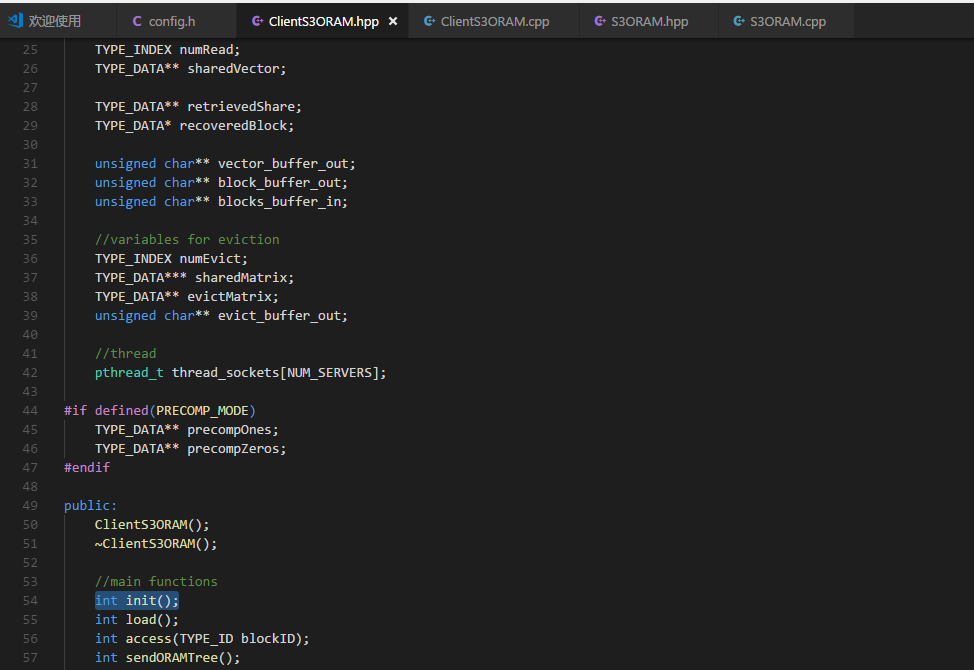
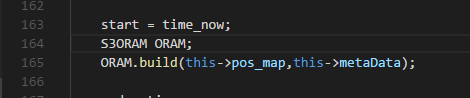
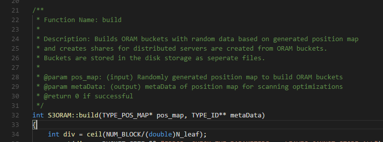
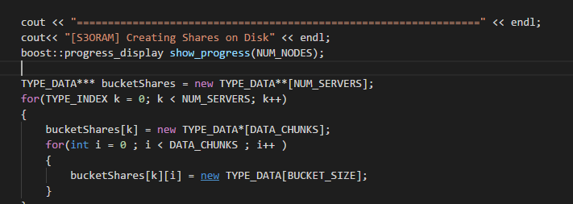
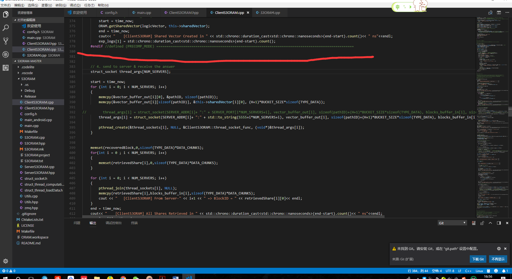

# 2018年3月26日
1. C++primer看到了异常处理
2. 弄懂了驱逐（eviction）的过程；看了点NTL库的接口，写在了config.h的代码旁边
3. 代码到  
---
  
---
  
---
  
---
 
--- 
4. 学习unity3D的2D动画制作入门，2Dgamekit第一课完成  
5. 回去后一个leetcode ,表示类型的最大值最小值可以用INT_MIN   INT_MAX   LONG_MAX等等；还有取余结果的符号取决于被除数的符号；
# 2018年3月27日 
1. C++primer看到了19章控制内存分配  
2. 看代码ing  
3. floor(x)返回的是小于或等于x的最大整数。ceil(x)返回的是大于x的最小整数
4. assert(div <= BUCKET_SIZE && "ERROR: CHECK THE PARAMETERS => LEAVES CANNOT STORE ALL"); //assert能这样用吗？
---
 
---
4.	帮同学看论文
5.	今天因为杂事耽搁了很多时间(；´д｀)ゞ   
# 2018年3月28日
1.	帮同学看论文
2.	下午去处理私事，又要浪费好多时间啊￣へ￣
# 2018年3月29日
1.	初步看完c++primer
2.	Tcp/ip第一章
# 2018年3月30日
今天翘班啥也没干，好罪恶啊，毕不了业了
# 2018年3月31日
今天去出租了，好麻烦，后面还要跑几天
# 2018年4月1日
1.	好麻烦啊，居然浪费了了2天
2.	愚人节开始认真学（hua）习（水）
3.	Tcp/ip第二章，第三章
4.	肯德基好好吃desi
5.	Leetcode 3道题，好菜啊，做过的题都不会写
# 2018年4月2日
1.	Tcp/ip第4章，ARP协议
2.	Tcp/ip第5章，RARP协议    作为用户进程，与系统绑定，ARP最为内核实现的一部分，在硬件层上广播，每个网络有多个RARP服务器
3.	Tcp/ip第6章，ICMP
4.	看完了S3ORAM.cpp,没弄懂那个bucket的初始化是咋回事
5.	驱逐操作的细节代码没有仔细看，代码推荐参考  
***Optimizing ORAM and using it efficiently for secure computation***
6. 秘密分享的代码有点短，那个预处理也不是很懂，得去再去看下论文
开始看clientORAM
7.	晚上继续学习2D-Game-Kit的使用
# 2018年4月3日
1.	Tcp/ip第7章 ping程序
2.	Tcp/ip第8章 traceroute程序
3.	Tcp/ip第9章 ip选路
4.	感谢作者讲解了bucket的初始化。
5.  弄懂了树高H的问题；
今天看到了
---
 
---
6.	2dgamekit小学习，leetcode2题（超水的，没看懂题目）
# 2018年4月4日
1.	帮师兄看论文
2.	看代码看代码
3.  S3ORAM的client部分看完了
4.  学习了下下github desktop在win10上的使用和markdown的写作，蛮好用的（开始用这个写我的小日记）
# 2018年4月5日
1. 今天下大雨休息一天，做了几道题
# 2018年4月6日
1. 今天又跑去房子那里了，还被鸽了，垃圾美的吃枣药丸
# 2018年4月7日
1. 垃圾美的咕咕咕我，要不是看你便宜打死也不买你家产品
2. 帮别人看下论文，感觉毕业好难哦
3. 今天开始看serverS3ORAM的代码
# 2018年4月8日
1. tcp/ip第10章 动态选路协议
    1. routed路由守护程序只使用RIP协议通信
2. 第11章UDP：用户数据报协议
3. 第12章广播和多播
4. 
    